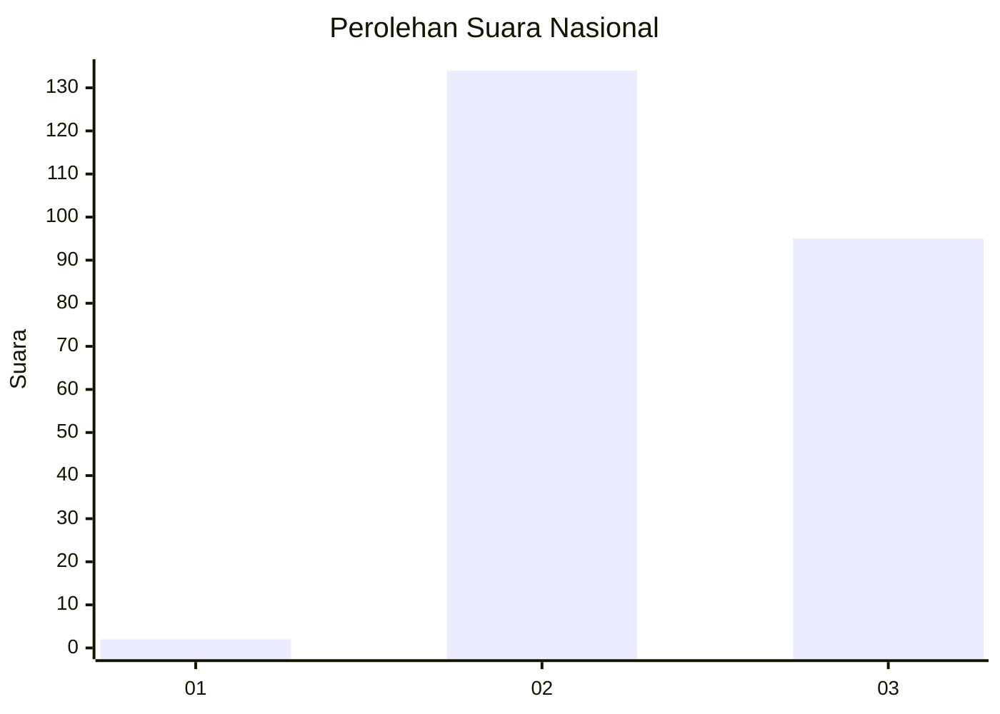
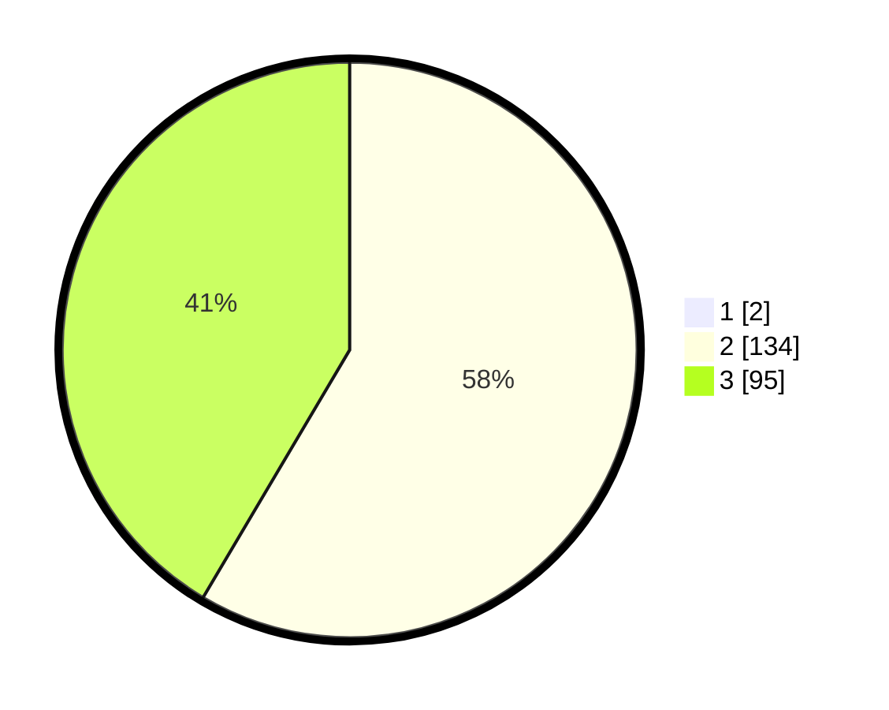

# Hasil

## Grafik

## Tabel

| No. | Nama Paslon    | Suara | Suara (raw) | Persentase |
|:--- |:-------------- | -----:| -----------:| ----------:|
| 1   | ANIES MUHAIMIN | 2     | [2][p-1]    | 0,87       |
| 2   | PRABOWO GIBRAN | 134   | [134][p-2]  | 58,01      |
| 3   | GANJAR MAHFUD  | 95    | [95][p-3]   | 41,13      |

[p-1]: https://github.com/gigit-pemilu/pemilu-2024/blob/main/pilpres/hitung-suara/sub/51-bali/sub/01-jembrana/sub/05-jembrana/sub/2004-batu-agung/sub/021-tps/sub/paslon-1.txt
[p-2]: https://github.com/gigit-pemilu/pemilu-2024/blob/main/pilpres/hitung-suara/sub/51-bali/sub/01-jembrana/sub/05-jembrana/sub/2004-batu-agung/sub/021-tps/sub/paslon-2.txt
[p-3]: https://github.com/gigit-pemilu/pemilu-2024/blob/main/pilpres/hitung-suara/sub/51-bali/sub/01-jembrana/sub/05-jembrana/sub/2004-batu-agung/sub/021-tps/sub/paslon-3.txt

## Foto C Plano

https://sirekap-obj-formc.kpu.go.id/be5b/pemilu/ppwp/51/01/05/20/04/5101052004021-20240214-141358--0a4d746a-a682-4e2b-81c8-5ccc00793019.jpg

https://sirekap-obj-formc.kpu.go.id/be5b/pemilu/ppwp/51/01/05/20/04/5101052004021-20240214-141500--55f35608-f9d5-404b-98cf-7a8f8d37c665.jpg

https://sirekap-obj-formc.kpu.go.id/be5b/pemilu/ppwp/51/01/05/20/04/5101052004021-20240214-205623--7c20f691-4f2b-4264-ba05-2c1b1fcfb8d9.jpg

## Metadata

| Key        | Value               |
| ---------- | ------------------- |
| Time Stamp | 2024-02-15 00:41:44 |

## DATA PEMILIH TETAP

Jumlah pemilih dalam DPT: **272**.
 * L: **131**.
 * P: **141**.

## DATA PENGGUNA HAK PILIH

Jumlah pengguna hak pilih dalam DPT: **238**.
 * L: **112**.
 * P: **126**.

Jumlah pengguna hak pilih dalam DPTb: **1**.
 * L: **0**.
 * P: **1**.

Jumlah pengguna hak pilih dalam DPK: **0**.
 * L: **0**.
 * P: **0**.

Jumlah pengguna hak pilih: **239**.
 * L: **112**.
 * P: **127**.

## JUMLAH SUARA SAH DAN TIDAK SAH

JUMLAH SELURUH SUARA SAH: **231**.

JUMLAH SUARA TIDAK SAH: **8**.

JUMLAH SELURUH SUARA SAH DAN SUARA TIDAK SAH: **239**.

