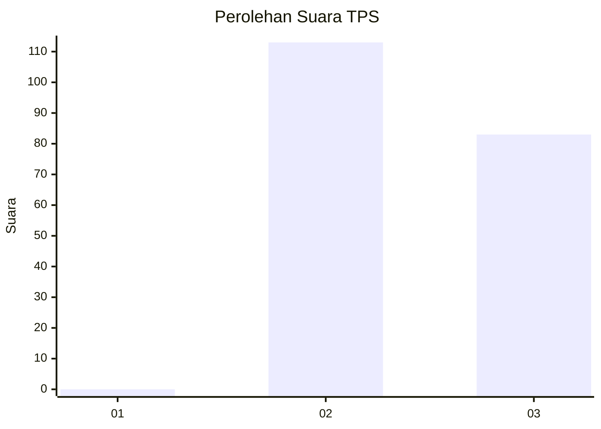
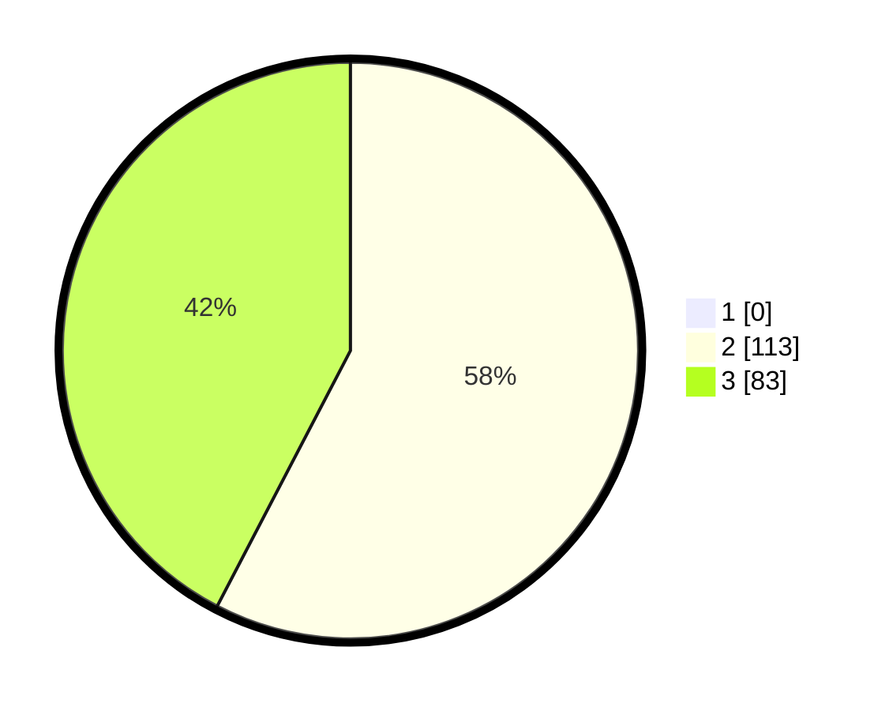

# Hasil

## Grafik

## Tabel

| No. | Nama Paslon    | Suara | Suara (raw) | Persentase |
|:--- |:-------------- | -----:| -----------:| ----------:|
| 1   | ANIES MUHAIMIN | 0     | [0][p-1]    | 0,00       |
| 2   | PRABOWO GIBRAN | 113   | [113][p-2]  | 57,65      |
| 3   | GANJAR MAHFUD  | 83    | [83][p-3]   | 42,35      |

[p-1]: https://github.com/gigit-pemilu/pemilu-2024-51-bali/blob/main/pilpres/hitung-suara/sub/51-bali/sub/01-jembrana/sub/05-jembrana/sub/2004-batu-agung/sub/022-tps/sub/paslon-1.txt
[p-2]: https://github.com/gigit-pemilu/pemilu-2024-51-bali/blob/main/pilpres/hitung-suara/sub/51-bali/sub/01-jembrana/sub/05-jembrana/sub/2004-batu-agung/sub/022-tps/sub/paslon-2.txt
[p-3]: https://github.com/gigit-pemilu/pemilu-2024-51-bali/blob/main/pilpres/hitung-suara/sub/51-bali/sub/01-jembrana/sub/05-jembrana/sub/2004-batu-agung/sub/022-tps/sub/paslon-3.txt

## Foto C Plano

https://sirekap-obj-formc.kpu.go.id/210d/pemilu/ppwp/51/01/05/20/04/5101052004022-20240214-141256--eda383bf-d191-4659-910e-2f19d278d085.jpg

https://sirekap-obj-formc.kpu.go.id/210d/pemilu/ppwp/51/01/05/20/04/5101052004022-20240214-141347--d2012eae-93be-43dd-8a86-43690897d5d5.jpg

https://sirekap-obj-formc.kpu.go.id/210d/pemilu/ppwp/51/01/05/20/04/5101052004022-20240214-141539--775942be-a672-49b5-9052-5eaf2320e405.jpg

## Metadata

| Key        | Value               |
| ---------- | ------------------- |
| Time Stamp | 2024-02-14 21:46:01 |

## DATA PEMILIH TETAP

Jumlah pemilih dalam DPT: **243**.
 * L: **116**.
 * P: **127**.

## DATA PENGGUNA HAK PILIH

Jumlah pengguna hak pilih dalam DPT: **200**.
 * L: **101**.
 * P: **99**.

Jumlah pengguna hak pilih dalam DPTb: **0**.
 * L: **0**.
 * P: **0**.

Jumlah pengguna hak pilih dalam DPK: **0**.
 * L: **0**.
 * P: **0**.

Jumlah pengguna hak pilih: **200**.
 * L: **101**.
 * P: **99**.

## JUMLAH SUARA SAH DAN TIDAK SAH

JUMLAH SELURUH SUARA SAH: **196**.

JUMLAH SUARA TIDAK SAH: **4**.

