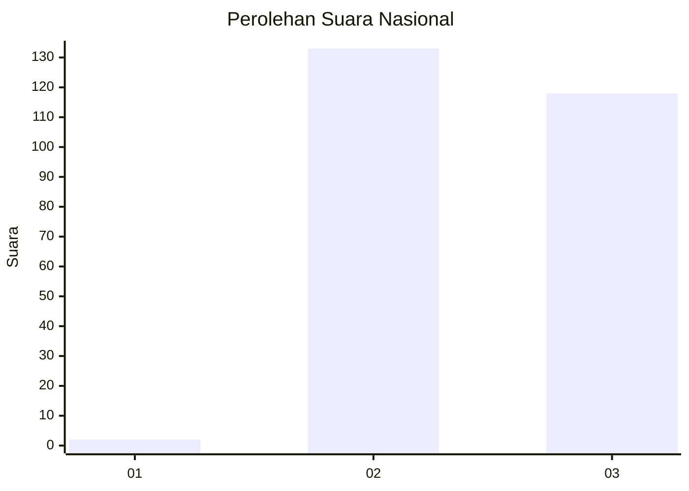
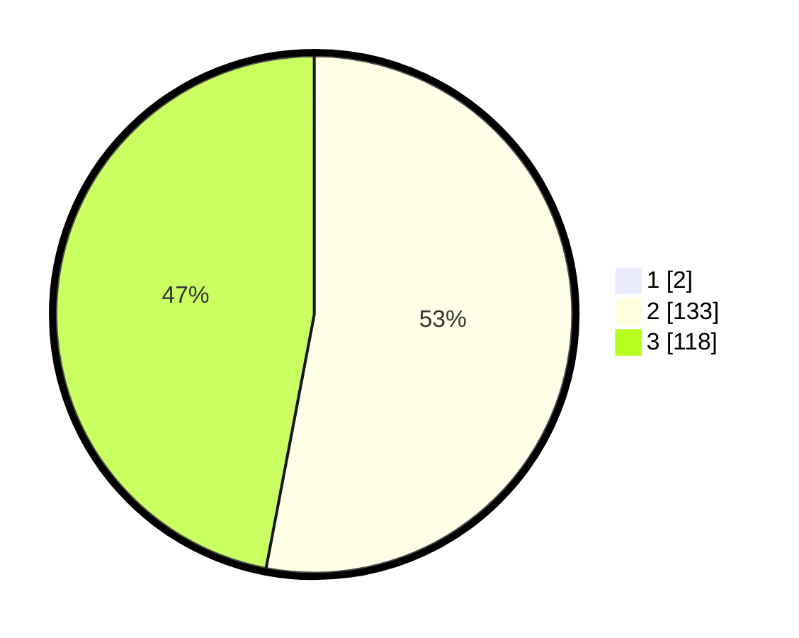

# Hasil

## Grafik

## Tabel

| No. | Nama Paslon    | Suara | Suara (raw) | Persentase |
|:--- |:-------------- | -----:| -----------:| ----------:|
| 1   | ANIES MUHAIMIN | 2     | [2][p-1]    | 0,79       |
| 2   | PRABOWO GIBRAN | 133   | [133][p-2]  | 52,57      |
| 3   | GANJAR MAHFUD  | 118   | [118][p-3]  | 46,64      |

[p-1]: https://github.com/gigit-pemilu/pemilu-2024/blob/main/pilpres/hitung-suara/sub/51-bali/sub/01-jembrana/sub/05-jembrana/sub/2006-budeng/sub/001-tps/sub/paslon-1.txt
[p-2]: https://github.com/gigit-pemilu/pemilu-2024/blob/main/pilpres/hitung-suara/sub/51-bali/sub/01-jembrana/sub/05-jembrana/sub/2006-budeng/sub/001-tps/sub/paslon-2.txt
[p-3]: https://github.com/gigit-pemilu/pemilu-2024/blob/main/pilpres/hitung-suara/sub/51-bali/sub/01-jembrana/sub/05-jembrana/sub/2006-budeng/sub/001-tps/sub/paslon-3.txt

## Foto C Plano

https://sirekap-obj-formc.kpu.go.id/818c/pemilu/ppwp/51/01/05/20/06/5101052006001-20240214-220055--76a2de7c-0f51-4ff4-99b5-87f01c28c66a.jpg

https://sirekap-obj-formc.kpu.go.id/818c/pemilu/ppwp/51/01/05/20/06/5101052006001-20240214-220247--7bb7ddc6-720e-4e9b-a8f6-b872a259e02a.jpg

https://sirekap-obj-formc.kpu.go.id/818c/pemilu/ppwp/51/01/05/20/06/5101052006001-20240214-141919--c257904b-1b56-4c18-920e-73cee2a4ef4a.jpg

## Metadata

| Key        | Value               |
| ---------- | ------------------- |
| Time Stamp | 2024-02-15 15:30:25 |

## DATA PEMILIH TETAP

Jumlah pemilih dalam DPT: **283**.
 * L: **139**.
 * P: **144**.

## DATA PENGGUNA HAK PILIH

Jumlah pengguna hak pilih dalam DPT: **258**.
 * L: **126**.
 * P: **132**.

Jumlah pengguna hak pilih dalam DPTb: **0**.
 * L: **0**.
 * P: **0**.

Jumlah pengguna hak pilih dalam DPK: **1**.
 * L: **0**.
 * P: **1**.

Jumlah pengguna hak pilih: **259**.
 * L: **126**.
 * P: **133**.

## JUMLAH SUARA SAH DAN TIDAK SAH

JUMLAH SELURUH SUARA SAH: **253**.

JUMLAH SUARA TIDAK SAH: **6**.

JUMLAH SELURUH SUARA SAH DAN SUARA TIDAK SAH: **259**.

