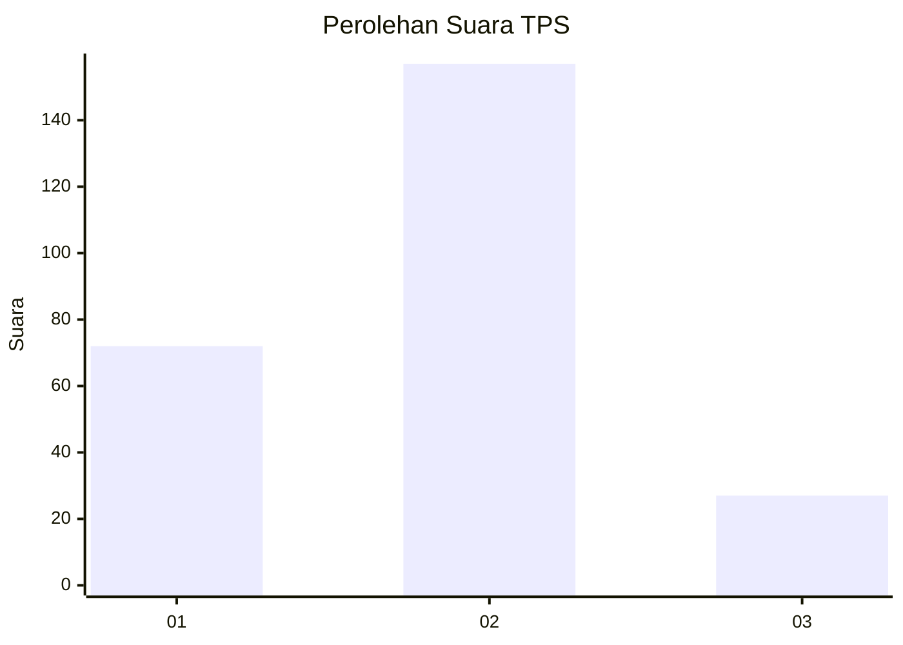
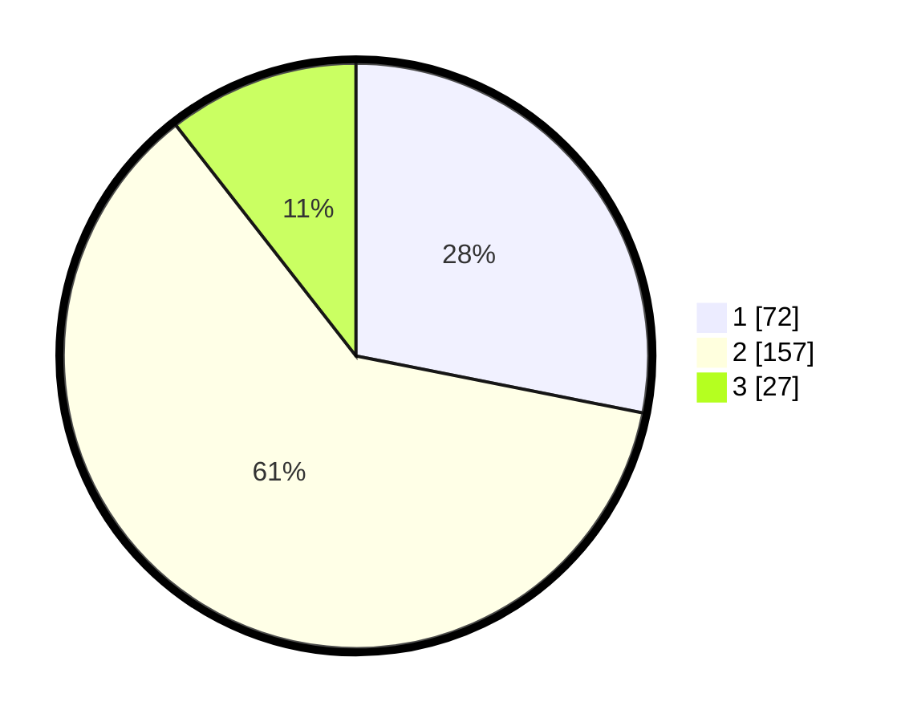

# Hasil

## Grafik

## Tabel

| No. | Nama Paslon    | Suara | Suara (raw) | Persentase |
|:--- |:-------------- | -----:| -----------:| ----------:|
| 1   | ANIES MUHAIMIN | 72    | [72][p-1]   | 28,13      |
| 2   | PRABOWO GIBRAN | 157   | [157][p-2]  | 61,33      |
| 3   | GANJAR MAHFUD  | 27    | [27][p-3]   | 10,55      |

[p-1]: https://github.com/gigit-pemilu/pemilu-2024-51-bali/blob/main/pilpres/hitung-suara/sub/51-bali/sub/01-jembrana/sub/05-jembrana/sub/2007-air-kuning/sub/001-tps/sub/paslon-1.txt
[p-2]: https://github.com/gigit-pemilu/pemilu-2024-51-bali/blob/main/pilpres/hitung-suara/sub/51-bali/sub/01-jembrana/sub/05-jembrana/sub/2007-air-kuning/sub/001-tps/sub/paslon-2.txt
[p-3]: https://github.com/gigit-pemilu/pemilu-2024-51-bali/blob/main/pilpres/hitung-suara/sub/51-bali/sub/01-jembrana/sub/05-jembrana/sub/2007-air-kuning/sub/001-tps/sub/paslon-3.txt

## Foto C Plano

https://sirekap-obj-formc.kpu.go.id/5384/pemilu/ppwp/51/01/05/20/07/5101052007001-20240215-052210--97f5cd04-8976-459e-9bc7-a032bcda4f9d.jpg

https://sirekap-obj-formc.kpu.go.id/5384/pemilu/ppwp/51/01/05/20/07/5101052007001-20240215-052805--0084f3e3-11f6-418d-a2a3-9706741a444c.jpg

https://sirekap-obj-formc.kpu.go.id/5384/pemilu/ppwp/51/01/05/20/07/5101052007001-20240215-052958--cf53a488-8171-4ad1-90ca-d52a9f3d09e9.jpg

## Metadata

| Key        | Value               |
| ---------- | ------------------- |
| Time Stamp | 2024-02-16 06:30:27 |

## DATA PEMILIH TETAP

Jumlah pemilih dalam DPT: **277**.
 * L: **143**.
 * P: **134**.

## DATA PENGGUNA HAK PILIH

Jumlah pengguna hak pilih dalam DPT: **1**.
 * L: **1**.
 * P: **0**.

Jumlah pengguna hak pilih dalam DPTb: **0**.
 * L: **0**.
 * P: **0**.

Jumlah pengguna hak pilih dalam DPK: **0**.
 * L: **0**.
 * P: **0**.

Jumlah pengguna hak pilih: **262**.
 * L: **137**.
 * P: **125**.

## JUMLAH SUARA SAH DAN TIDAK SAH

JUMLAH SELURUH SUARA SAH: **256**.

JUMLAH SUARA TIDAK SAH: **6**.

JUMLAH SELURUH SUARA SAH DAN SUARA TIDAK SAH: **262**.

