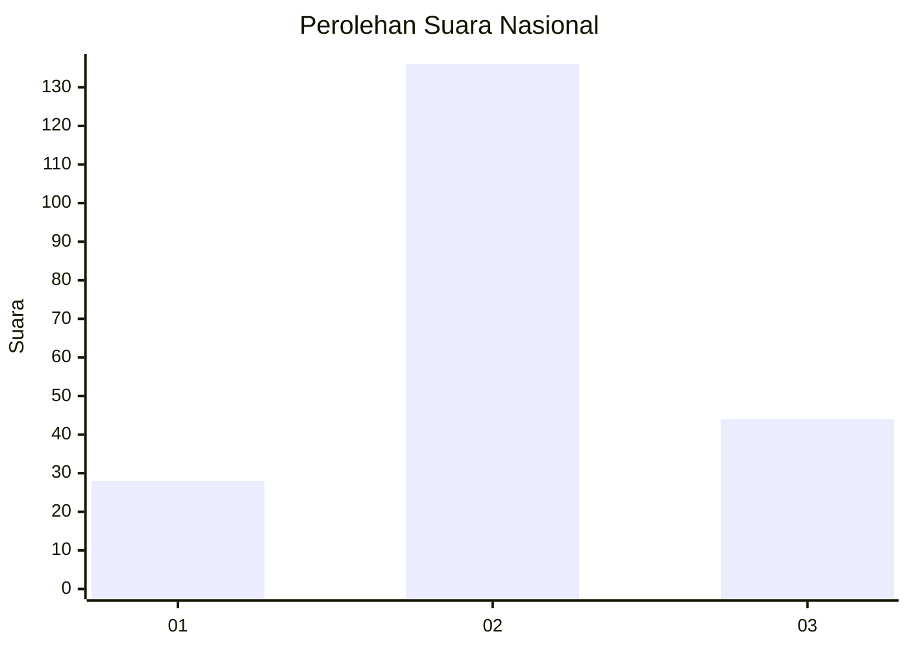
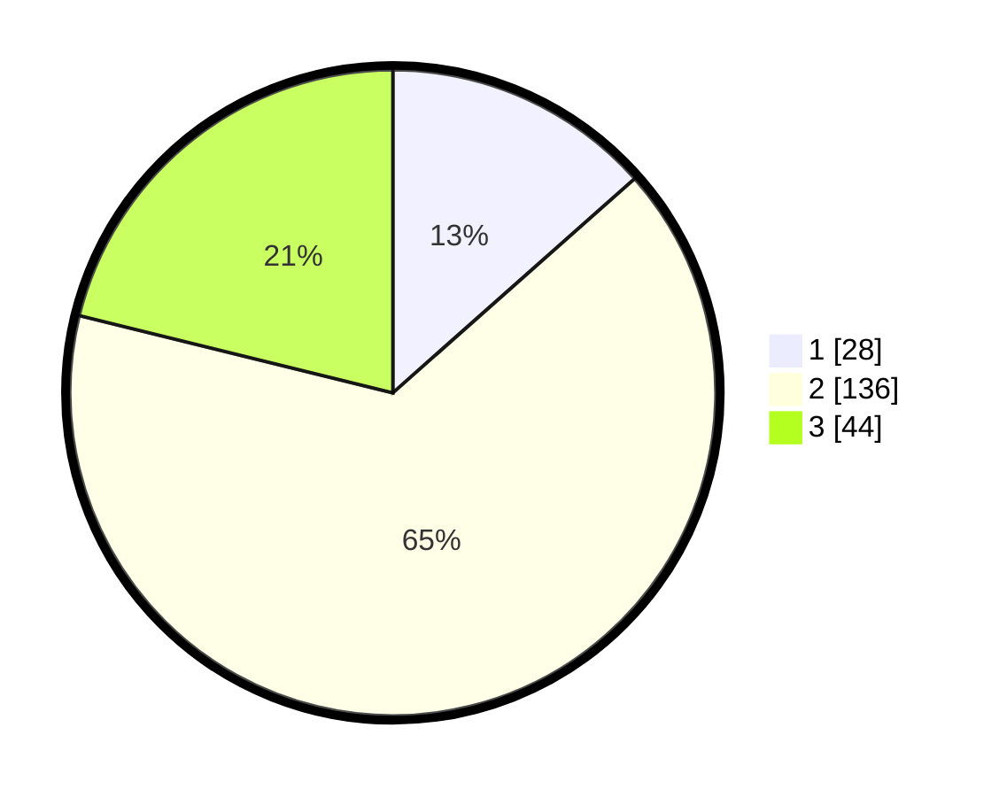

# Hasil

## Grafik

## Tabel

| No. | Nama Paslon    | Suara | Suara (raw) | Persentase |
|:--- |:-------------- | -----:| -----------:| ----------:|
| 1   | ANIES MUHAIMIN | 28    | [28][p-1]   | 13,46      |
| 2   | PRABOWO GIBRAN | 136   | [136][p-2]  | 65,38      |
| 3   | GANJAR MAHFUD  | 44    | [44][p-3]   | 21,15      |

[p-1]: https://github.com/gigit-pemilu/pemilu-2024/blob/main/pilpres/hitung-suara/sub/51-bali/sub/01-jembrana/sub/05-jembrana/sub/2007-air-kuning/sub/005-tps/sub/paslon-1.txt
[p-2]: https://github.com/gigit-pemilu/pemilu-2024/blob/main/pilpres/hitung-suara/sub/51-bali/sub/01-jembrana/sub/05-jembrana/sub/2007-air-kuning/sub/005-tps/sub/paslon-2.txt
[p-3]: https://github.com/gigit-pemilu/pemilu-2024/blob/main/pilpres/hitung-suara/sub/51-bali/sub/01-jembrana/sub/05-jembrana/sub/2007-air-kuning/sub/005-tps/sub/paslon-3.txt

## Foto C Plano

https://sirekap-obj-formc.kpu.go.id/47b7/pemilu/ppwp/51/01/05/20/07/5101052007005-20240214-141102--2ba01ea0-2a6e-48ed-b8e7-be855b120f30.jpg

https://sirekap-obj-formc.kpu.go.id/47b7/pemilu/ppwp/51/01/05/20/07/5101052007005-20240214-141335--6e688a14-d693-486c-8cbb-9ba04a2c2ede.jpg

https://sirekap-obj-formc.kpu.go.id/47b7/pemilu/ppwp/51/01/05/20/07/5101052007005-20240214-141502--bd5b5805-5a4a-46bf-8c25-70a5b1fe7827.jpg

## Metadata

| Key        | Value               |
| ---------- | ------------------- |
| Time Stamp | 2024-02-14 21:46:01 |

