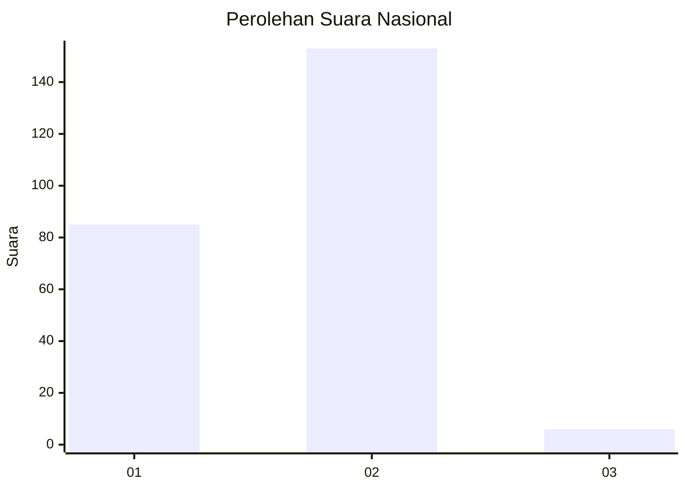
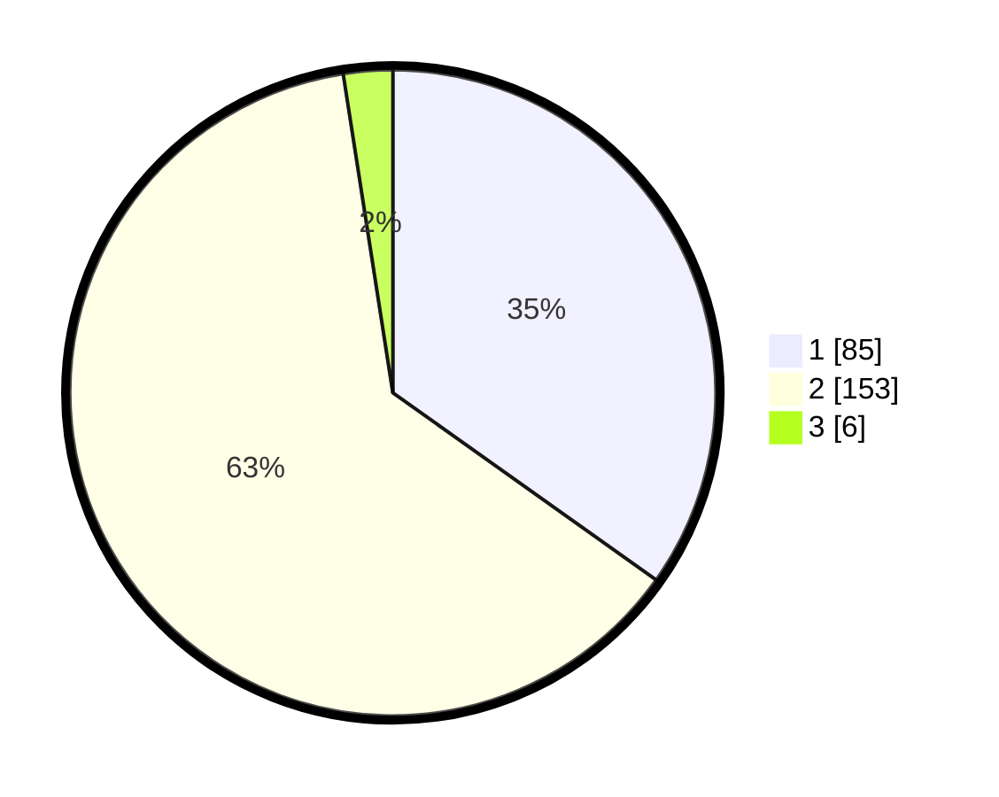

# Hasil

## Grafik

## Tabel

| No. | Nama Paslon    | Suara | Suara (raw) | Persentase |
|:--- |:-------------- | -----:| -----------:| ----------:|
| 1   | ANIES MUHAIMIN | 85    | [85][p-1]   | 34,84      |
| 2   | PRABOWO GIBRAN | 153   | [153][p-2]  | 62,70      |
| 3   | GANJAR MAHFUD  | 6     | [6][p-3]    | 2,46       |

[p-1]: https://github.com/gigit-pemilu/pemilu-2024/blob/main/pilpres/hitung-suara/sub/51-bali/sub/01-jembrana/sub/05-jembrana/sub/2007-air-kuning/sub/007-tps/sub/paslon-1.txt
[p-2]: https://github.com/gigit-pemilu/pemilu-2024/blob/main/pilpres/hitung-suara/sub/51-bali/sub/01-jembrana/sub/05-jembrana/sub/2007-air-kuning/sub/007-tps/sub/paslon-2.txt
[p-3]: https://github.com/gigit-pemilu/pemilu-2024/blob/main/pilpres/hitung-suara/sub/51-bali/sub/01-jembrana/sub/05-jembrana/sub/2007-air-kuning/sub/007-tps/sub/paslon-3.txt

## Foto C Plano

https://sirekap-obj-formc.kpu.go.id/2266/pemilu/ppwp/51/01/05/20/07/5101052007007-20240214-141306--83355162-0df2-4197-bdf2-38ce48f55896.jpg

https://sirekap-obj-formc.kpu.go.id/2266/pemilu/ppwp/51/01/05/20/07/5101052007007-20240214-185148--f4027e7a-360e-4b9c-8ad8-54d1e06bdcab.jpg

https://sirekap-obj-formc.kpu.go.id/2266/pemilu/ppwp/51/01/05/20/07/5101052007007-20240214-202338--b8bb0d6a-8852-4532-9981-2b81d9b9c4bb.jpg

## Metadata

| Key        | Value               |
| ---------- | ------------------- |
| Time Stamp | 2024-02-14 21:46:01 |

