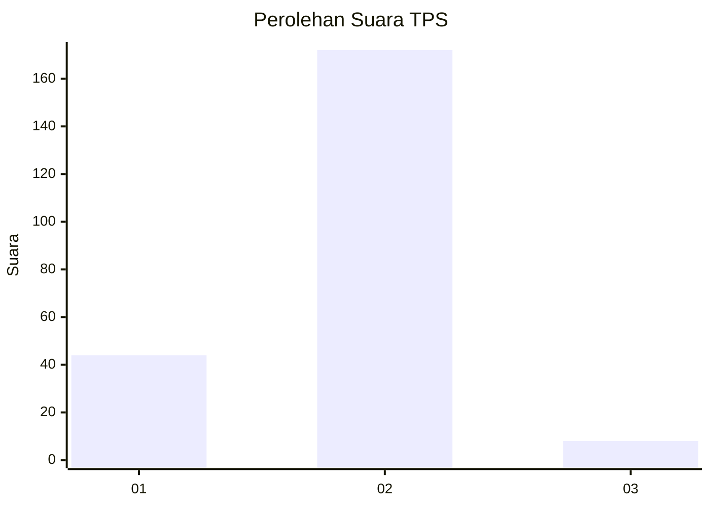
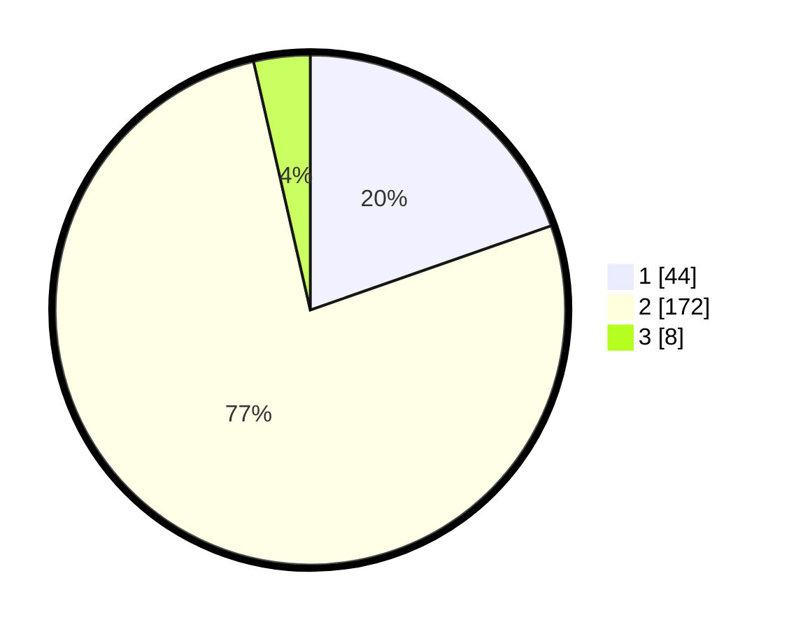

# Hasil

## Grafik

## Tabel

| No. | Nama Paslon    | Suara | Suara (raw) | Persentase |
|:--- |:-------------- | -----:| -----------:| ----------:|
| 1   | ANIES MUHAIMIN | 44    | [44][p-1]   | 19,64      |
| 2   | PRABOWO GIBRAN | 172   | [172][p-2]  | 76,79      |
| 3   | GANJAR MAHFUD  | 8     | [8][p-3]    | 3,57       |

[p-1]: https://github.com/gigit-pemilu/pemilu-2024-51-bali/blob/main/pilpres/hitung-suara/sub/51-bali/sub/01-jembrana/sub/05-jembrana/sub/2007-air-kuning/sub/010-tps/sub/paslon-1.txt
[p-2]: https://github.com/gigit-pemilu/pemilu-2024-51-bali/blob/main/pilpres/hitung-suara/sub/51-bali/sub/01-jembrana/sub/05-jembrana/sub/2007-air-kuning/sub/010-tps/sub/paslon-2.txt
[p-3]: https://github.com/gigit-pemilu/pemilu-2024-51-bali/blob/main/pilpres/hitung-suara/sub/51-bali/sub/01-jembrana/sub/05-jembrana/sub/2007-air-kuning/sub/010-tps/sub/paslon-3.txt

## Foto C Plano

https://sirekap-obj-formc.kpu.go.id/7a96/pemilu/ppwp/51/01/05/20/07/5101052007010-20240214-141508--dc0925d2-e002-4f41-85e0-f58dfcda8942.jpg

https://sirekap-obj-formc.kpu.go.id/7a96/pemilu/ppwp/51/01/05/20/07/5101052007010-20240214-141618--63f51d65-39d6-418f-b82b-b295d33f7dc2.jpg

https://sirekap-obj-formc.kpu.go.id/7a96/pemilu/ppwp/51/01/05/20/07/5101052007010-20240214-141605--6b097f09-2424-43bd-a9cb-bf42100596e0.jpg

## Metadata

| Key        | Value               |
| ---------- | ------------------- |
| Time Stamp | 2024-02-14 21:46:01 |

