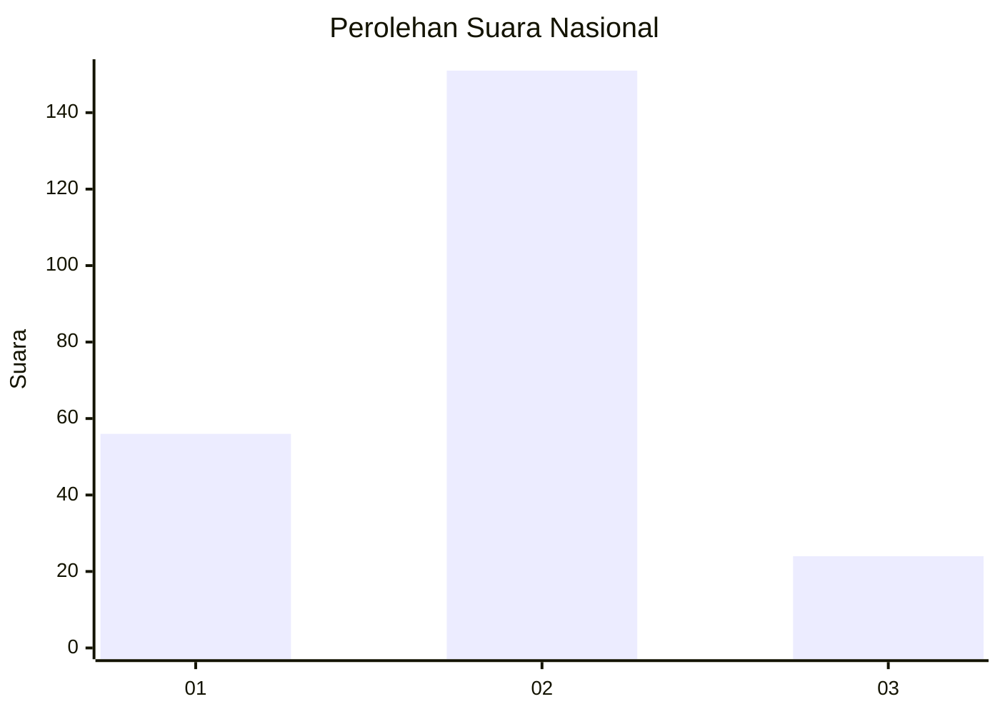
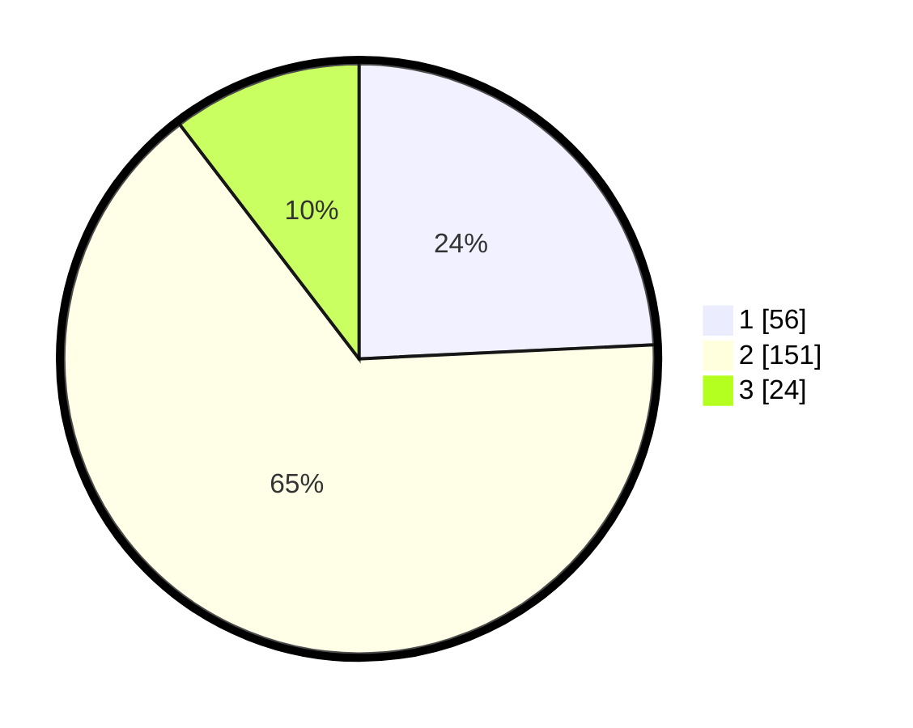

# Hasil

## Grafik

## Tabel

| No. | Nama Paslon    | Suara | Suara (raw) | Persentase |
|:--- |:-------------- | -----:| -----------:| ----------:|
| 1   | ANIES MUHAIMIN | 56    | [56][p-1]   | 24,24      |
| 2   | PRABOWO GIBRAN | 151   | [151][p-2]  | 65,37      |
| 3   | GANJAR MAHFUD  | 24    | [24][p-3]   | 10,39      |

[p-1]: https://github.com/gigit-pemilu/pemilu-2024/blob/main/pilpres/hitung-suara/sub/51-bali/sub/01-jembrana/sub/05-jembrana/sub/2007-air-kuning/sub/012-tps/sub/paslon-1.txt
[p-2]: https://github.com/gigit-pemilu/pemilu-2024/blob/main/pilpres/hitung-suara/sub/51-bali/sub/01-jembrana/sub/05-jembrana/sub/2007-air-kuning/sub/012-tps/sub/paslon-2.txt
[p-3]: https://github.com/gigit-pemilu/pemilu-2024/blob/main/pilpres/hitung-suara/sub/51-bali/sub/01-jembrana/sub/05-jembrana/sub/2007-air-kuning/sub/012-tps/sub/paslon-3.txt

## Foto C Plano

https://sirekap-obj-formc.kpu.go.id/271d/pemilu/ppwp/51/01/05/20/07/5101052007012-20240214-160055--db4992a1-5328-41de-8632-9a820194e349.jpg

https://sirekap-obj-formc.kpu.go.id/271d/pemilu/ppwp/51/01/05/20/07/5101052007012-20240214-193012--8d2651ed-b212-4d28-8028-588aeaa62ec3.jpg

https://sirekap-obj-formc.kpu.go.id/271d/pemilu/ppwp/51/01/05/20/07/5101052007012-20240214-193023--e0bfa166-67bc-4d26-a219-f9179d5b7287.jpg

## Metadata

| Key        | Value               |
| ---------- | ------------------- |
| Time Stamp | 2024-02-15 12:00:28 |

## DATA PEMILIH TETAP

Jumlah pemilih dalam DPT: **277**.
 * L: **146**.
 * P: **131**.

## DATA PENGGUNA HAK PILIH

Jumlah pengguna hak pilih dalam DPT: **238**.
 * L: **123**.
 * P: **115**.

Jumlah pengguna hak pilih dalam DPTb: **3**.
 * L: **1**.
 * P: **2**.

Jumlah pengguna hak pilih dalam DPK: **0**.
 * L: **0**.
 * P: **0**.

Jumlah pengguna hak pilih: **241**.
 * L: **124**.
 * P: **117**.

## JUMLAH SUARA SAH DAN TIDAK SAH

JUMLAH SELURUH SUARA SAH: **231**.

JUMLAH SUARA TIDAK SAH: **10**.

JUMLAH SELURUH SUARA SAH DAN SUARA TIDAK SAH: **241**.

