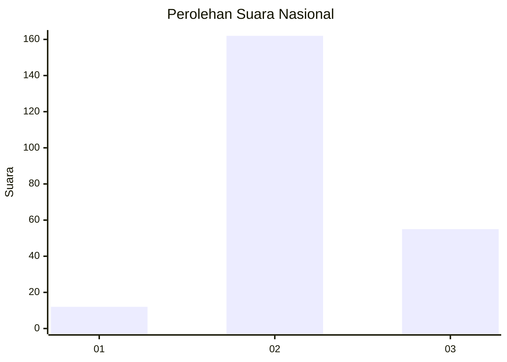
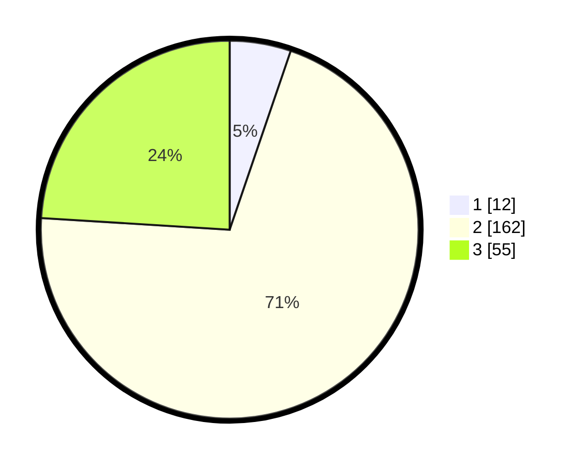

# Hasil

## Grafik

## Tabel

| No. | Nama Paslon    | Suara | Suara (raw) | Persentase |
|:--- |:-------------- | -----:| -----------:| ----------:|
| 1   | ANIES MUHAIMIN | 12    | [12][p-1]   | 5,24       |
| 2   | PRABOWO GIBRAN | 162   | [162][p-2]  | 70,74      |
| 3   | GANJAR MAHFUD  | 55    | [55][p-3]   | 24,02      |

[p-1]: https://github.com/gigit-pemilu/pemilu-2024/blob/main/pilpres/hitung-suara/sub/51-bali/sub/01-jembrana/sub/05-jembrana/sub/2008-yehkuning/sub/002-tps/sub/paslon-1.txt
[p-2]: https://github.com/gigit-pemilu/pemilu-2024/blob/main/pilpres/hitung-suara/sub/51-bali/sub/01-jembrana/sub/05-jembrana/sub/2008-yehkuning/sub/002-tps/sub/paslon-2.txt
[p-3]: https://github.com/gigit-pemilu/pemilu-2024/blob/main/pilpres/hitung-suara/sub/51-bali/sub/01-jembrana/sub/05-jembrana/sub/2008-yehkuning/sub/002-tps/sub/paslon-3.txt

## Foto C Plano

https://sirekap-obj-formc.kpu.go.id/f089/pemilu/ppwp/51/01/05/20/08/5101052008002-20240215-030511--837a65e1-a222-456d-9646-d5bc509c61b8.jpg

https://sirekap-obj-formc.kpu.go.id/f089/pemilu/ppwp/51/01/05/20/08/5101052008002-20240215-030642--25aad430-8b6d-443c-9980-dcbaf97c5bd5.jpg

https://sirekap-obj-formc.kpu.go.id/f089/pemilu/ppwp/51/01/05/20/08/5101052008002-20240215-030834--d40c5fa4-de90-4060-9793-a61bede5a32e.jpg

## Metadata

| Key        | Value               |
| ---------- | ------------------- |
| Time Stamp | 2024-02-15 15:00:29 |

