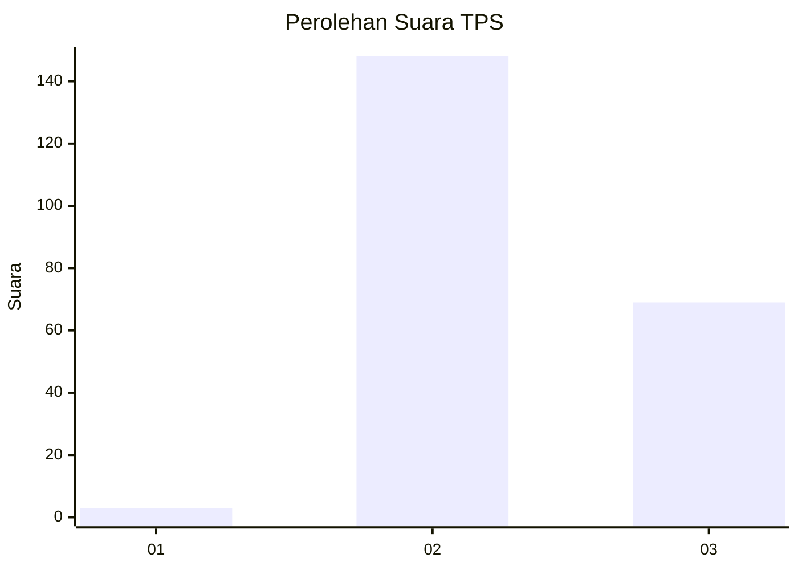
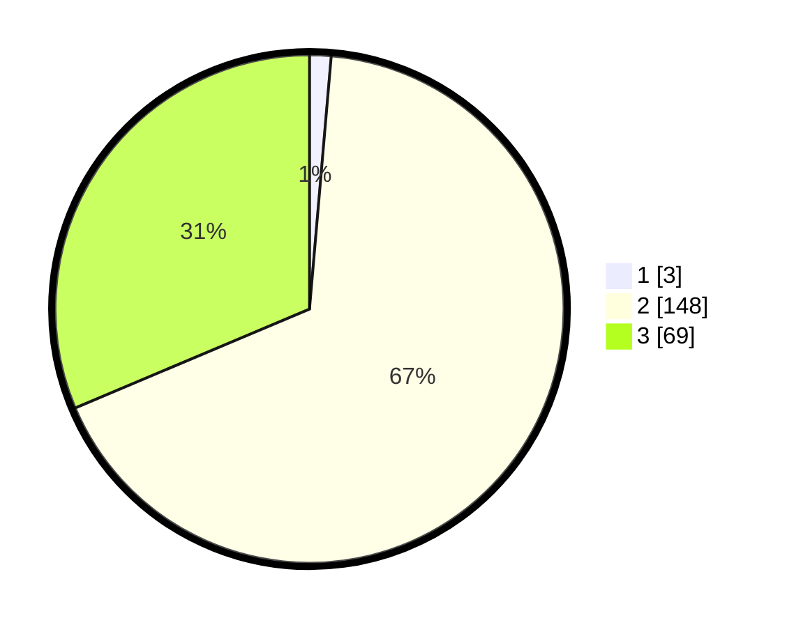

# Hasil

## Grafik

## Tabel

| No. | Nama Paslon    | Suara | Suara (raw) | Persentase |
|:--- |:-------------- | -----:| -----------:| ----------:|
| 1   | ANIES MUHAIMIN | 3     | [3][p-1]    | 1,36       |
| 2   | PRABOWO GIBRAN | 148   | [148][p-2]  | 67,27      |
| 3   | GANJAR MAHFUD  | 69    | [69][p-3]   | 31,36      |

[p-1]: https://github.com/gigit-pemilu/pemilu-2024-51-bali/blob/main/pilpres/hitung-suara/sub/51-bali/sub/01-jembrana/sub/05-jembrana/sub/2008-yehkuning/sub/004-tps/sub/paslon-1.txt
[p-2]: https://github.com/gigit-pemilu/pemilu-2024-51-bali/blob/main/pilpres/hitung-suara/sub/51-bali/sub/01-jembrana/sub/05-jembrana/sub/2008-yehkuning/sub/004-tps/sub/paslon-2.txt
[p-3]: https://github.com/gigit-pemilu/pemilu-2024-51-bali/blob/main/pilpres/hitung-suara/sub/51-bali/sub/01-jembrana/sub/05-jembrana/sub/2008-yehkuning/sub/004-tps/sub/paslon-3.txt

## Foto C Plano

https://sirekap-obj-formc.kpu.go.id/ceb0/pemilu/ppwp/51/01/05/20/08/5101052008004-20240214-195600--c29cb9a5-d0de-4630-b8e2-5dcf7077164d.jpg

https://sirekap-obj-formc.kpu.go.id/ceb0/pemilu/ppwp/51/01/05/20/08/5101052008004-20240214-195603--53236f55-91b7-4ab3-8e31-7172eaba53e3.jpg

https://sirekap-obj-formc.kpu.go.id/ceb0/pemilu/ppwp/51/01/05/20/08/5101052008004-20240214-195608--d73ac754-95da-4170-9542-785e1896835c.jpg

## Metadata

| Key        | Value               |
| ---------- | ------------------- |
| Time Stamp | 2024-02-14 21:46:01 |

## DATA PEMILIH TETAP

Jumlah pemilih dalam DPT: **283**.
 * L: **130**.
 * P: **153**.

## DATA PENGGUNA HAK PILIH

Jumlah pengguna hak pilih dalam DPT: **227**.
 * L: **106**.
 * P: **121**.

Jumlah pengguna hak pilih dalam DPTb: **3**.
 * L: **2**.
 * P: **1**.

Jumlah pengguna hak pilih dalam DPK: **0**.
 * L: **0**.
 * P: **0**.

Jumlah pengguna hak pilih: **230**.
 * L: **108**.
 * P: **122**.

## JUMLAH SUARA SAH DAN TIDAK SAH

JUMLAH SELURUH SUARA SAH: **220**.

JUMLAH SUARA TIDAK SAH: **10**.

JUMLAH SELURUH SUARA SAH DAN SUARA TIDAK SAH: **230**.

