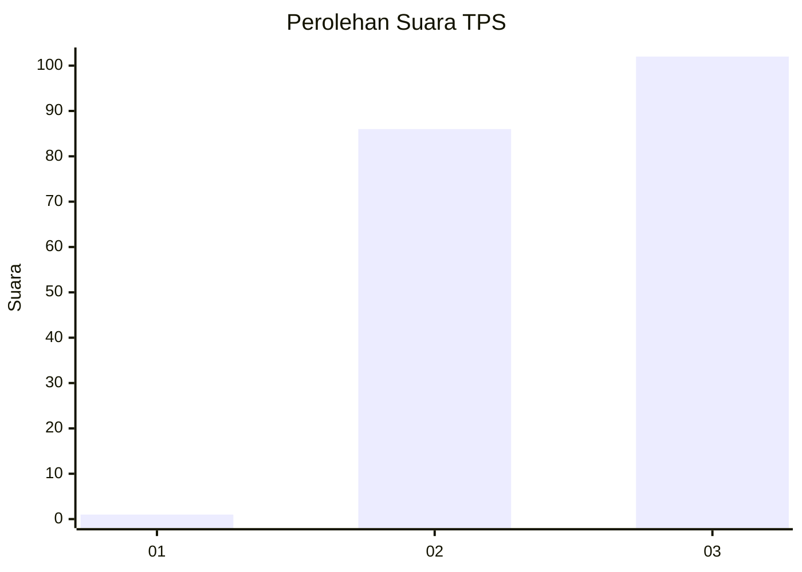
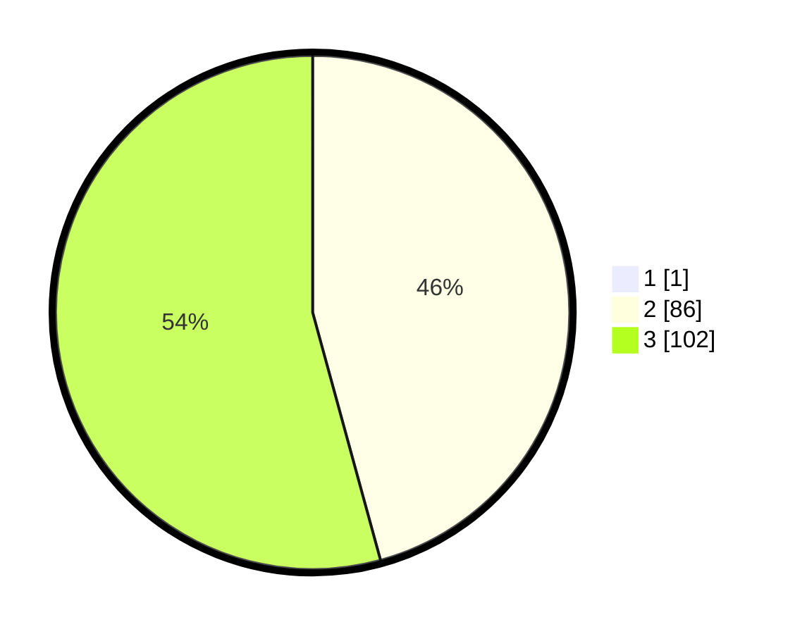

# Hasil

## Grafik

## Tabel

| No. | Nama Paslon    | Suara | Suara (raw) | Persentase |
|:--- |:-------------- | -----:| -----------:| ----------:|
| 1   | ANIES MUHAIMIN | 1     | [1][p-1]    | 0,53       |
| 2   | PRABOWO GIBRAN | 86    | [86][p-2]   | 45,50      |
| 3   | GANJAR MAHFUD  | 102   | [102][p-3]  | 53,97      |

[p-1]: https://github.com/gigit-pemilu/pemilu-2024-51-bali/blob/main/pilpres/hitung-suara/sub/51-bali/sub/01-jembrana/sub/05-jembrana/sub/2008-yehkuning/sub/007-tps/sub/paslon-1.txt
[p-2]: https://github.com/gigit-pemilu/pemilu-2024-51-bali/blob/main/pilpres/hitung-suara/sub/51-bali/sub/01-jembrana/sub/05-jembrana/sub/2008-yehkuning/sub/007-tps/sub/paslon-2.txt
[p-3]: https://github.com/gigit-pemilu/pemilu-2024-51-bali/blob/main/pilpres/hitung-suara/sub/51-bali/sub/01-jembrana/sub/05-jembrana/sub/2008-yehkuning/sub/007-tps/sub/paslon-3.txt

## Foto C Plano

https://sirekap-obj-formc.kpu.go.id/b5e0/pemilu/ppwp/51/01/05/20/08/5101052008007-20240216-085511--4c0a4fdb-2f30-4261-b34c-78340acb2917.jpg

https://sirekap-obj-formc.kpu.go.id/b5e0/pemilu/ppwp/51/01/05/20/08/5101052008007-20240216-085516--07cc1b5d-c4e3-46a7-a861-64ef926d4831.jpg

https://sirekap-obj-formc.kpu.go.id/b5e0/pemilu/ppwp/51/01/05/20/08/5101052008007-20240216-085521--31341511-7f90-431b-8fb6-a5352807f472.jpg

## Metadata

| Key        | Value               |
| ---------- | ------------------- |
| Time Stamp | 2024-02-16 16:25:10 |

