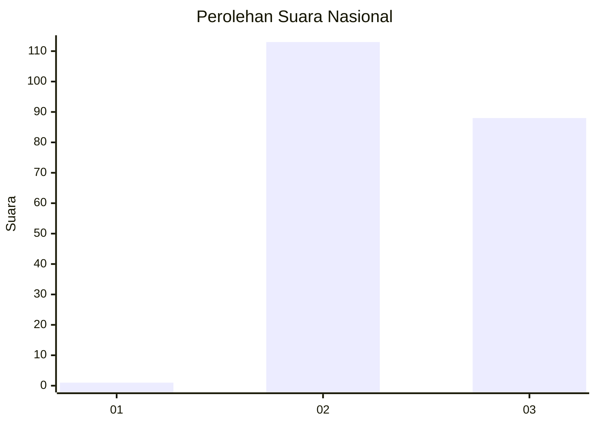
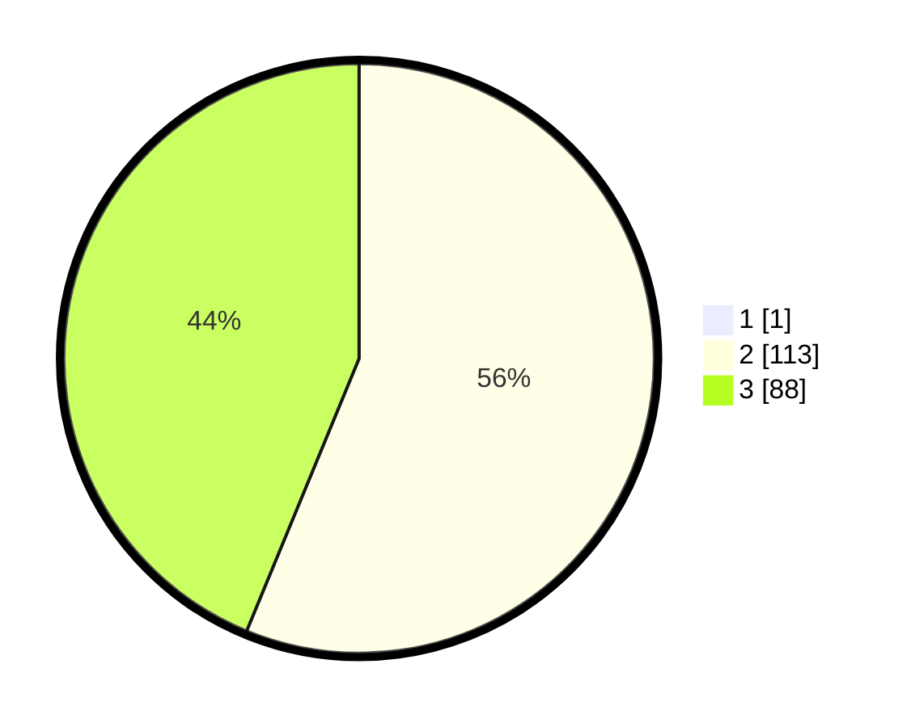

# Hasil

## Grafik

## Tabel

| No. | Nama Paslon    | Suara | Suara (raw) | Persentase |
|:--- |:-------------- | -----:| -----------:| ----------:|
| 1   | ANIES MUHAIMIN | 1     | [1][p-1]    | 0,50       |
| 2   | PRABOWO GIBRAN | 113   | [113][p-2]  | 55,94      |
| 3   | GANJAR MAHFUD  | 88    | [88][p-3]   | 43,56      |

[p-1]: https://github.com/gigit-pemilu/pemilu-2024/blob/main/pilpres/hitung-suara/sub/51-bali/sub/01-jembrana/sub/05-jembrana/sub/2008-yehkuning/sub/008-tps/sub/paslon-1.txt
[p-2]: https://github.com/gigit-pemilu/pemilu-2024/blob/main/pilpres/hitung-suara/sub/51-bali/sub/01-jembrana/sub/05-jembrana/sub/2008-yehkuning/sub/008-tps/sub/paslon-2.txt
[p-3]: https://github.com/gigit-pemilu/pemilu-2024/blob/main/pilpres/hitung-suara/sub/51-bali/sub/01-jembrana/sub/05-jembrana/sub/2008-yehkuning/sub/008-tps/sub/paslon-3.txt

## Foto C Plano

https://sirekap-obj-formc.kpu.go.id/682c/pemilu/ppwp/51/01/05/20/08/5101052008008-20240214-205838--077f3945-17cb-41d0-abe9-767dfa5771a5.jpg

https://sirekap-obj-formc.kpu.go.id/682c/pemilu/ppwp/51/01/05/20/08/5101052008008-20240214-205857--f8c9c541-bfda-4bd9-ab76-e5d33feffc9b.jpg

https://sirekap-obj-formc.kpu.go.id/682c/pemilu/ppwp/51/01/05/20/08/5101052008008-20240214-205921--28b7c14b-52ae-4d13-bfc5-cfc5c667b230.jpg

## Metadata

| Key        | Value               |
| ---------- | ------------------- |
| Time Stamp | 2024-02-15 16:00:26 |

## DATA PEMILIH TETAP

Jumlah pemilih dalam DPT: **258**.
 * L: **123**.
 * P: **135**.

## DATA PENGGUNA HAK PILIH

Jumlah pengguna hak pilih dalam DPT: **203**.
 * L: **95**.
 * P: **108**.

Jumlah pengguna hak pilih dalam DPTb: **2**.
 * L: **1**.
 * P: **1**.

Jumlah pengguna hak pilih dalam DPK: **0**.
 * L: **0**.
 * P: **0**.

Jumlah pengguna hak pilih: **205**.
 * L: **96**.
 * P: **109**.

## JUMLAH SUARA SAH DAN TIDAK SAH

JUMLAH SELURUH SUARA SAH: **202**.

JUMLAH SUARA TIDAK SAH: **3**.

JUMLAH SELURUH SUARA SAH DAN SUARA TIDAK SAH: **205**.

