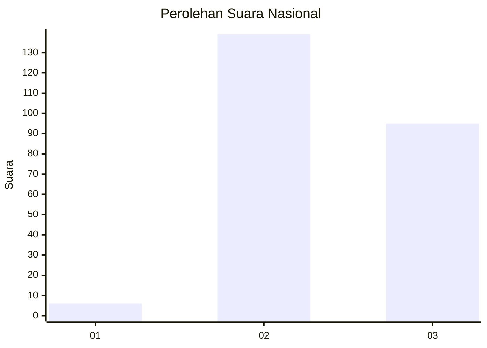
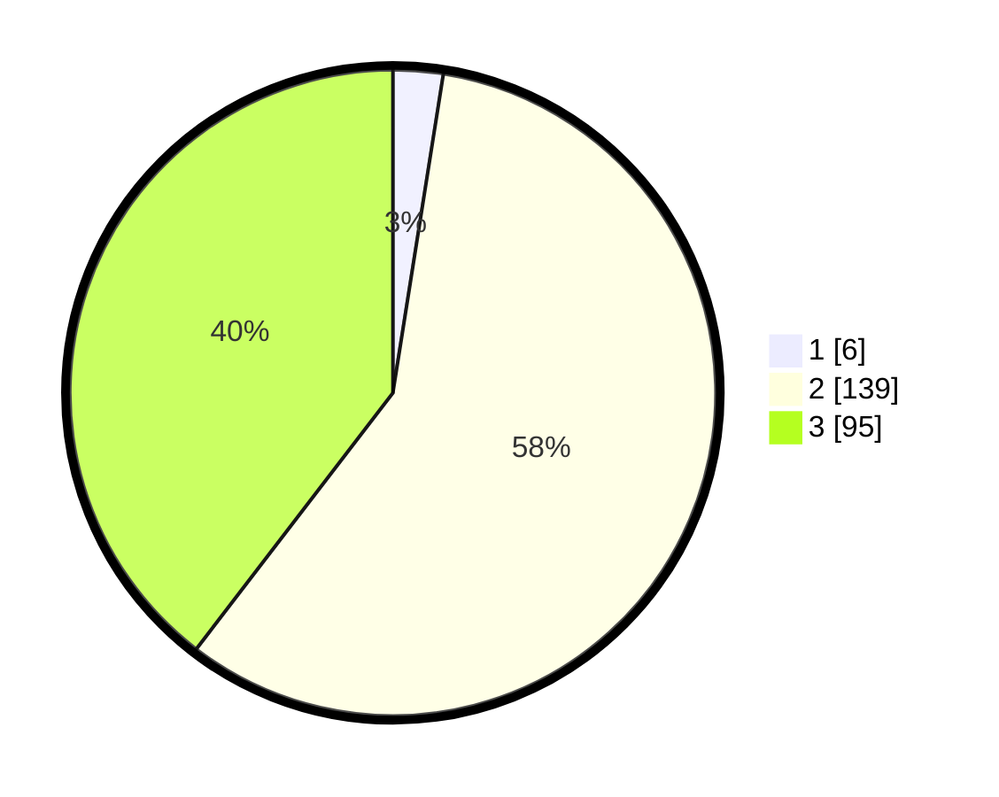

# Hasil

## Grafik

## Tabel

| No. | Nama Paslon    | Suara | Suara (raw) | Persentase |
|:--- |:-------------- | -----:| -----------:| ----------:|
| 1   | ANIES MUHAIMIN | 6     | [6][p-1]    | 2,50       |
| 2   | PRABOWO GIBRAN | 139   | [139][p-2]  | 57,92      |
| 3   | GANJAR MAHFUD  | 95    | [95][p-3]   | 39,58      |

[p-1]: https://github.com/gigit-pemilu/pemilu-2024/blob/main/pilpres/hitung-suara/sub/51-bali/sub/01-jembrana/sub/05-jembrana/sub/2010-dangintukadaya/sub/001-tps/sub/paslon-1.txt
[p-2]: https://github.com/gigit-pemilu/pemilu-2024/blob/main/pilpres/hitung-suara/sub/51-bali/sub/01-jembrana/sub/05-jembrana/sub/2010-dangintukadaya/sub/001-tps/sub/paslon-2.txt
[p-3]: https://github.com/gigit-pemilu/pemilu-2024/blob/main/pilpres/hitung-suara/sub/51-bali/sub/01-jembrana/sub/05-jembrana/sub/2010-dangintukadaya/sub/001-tps/sub/paslon-3.txt

## Foto C Plano

https://sirekap-obj-formc.kpu.go.id/9411/pemilu/ppwp/51/01/05/20/10/5101052010001-20240214-211204--f43b75d3-5244-437c-af4b-6c3c3fafaef3.jpg

https://sirekap-obj-formc.kpu.go.id/9411/pemilu/ppwp/51/01/05/20/10/5101052010001-20240214-184648--1efcfc69-c23f-4ffd-9d30-d2a56581b084.jpg

https://sirekap-obj-formc.kpu.go.id/9411/pemilu/ppwp/51/01/05/20/10/5101052010001-20240214-184511--10b64120-dd02-4132-88db-74cf0697d994.jpg

## Metadata

| Key        | Value               |
| ---------- | ------------------- |
| Time Stamp | 2024-02-15 12:00:28 |

## DATA PEMILIH TETAP

Jumlah pemilih dalam DPT: **288**.
 * L: **129**.
 * P: **159**.

## DATA PENGGUNA HAK PILIH

Jumlah pengguna hak pilih dalam DPT: **235**.
 * L: **108**.
 * P: **127**.

Jumlah pengguna hak pilih dalam DPTb: **5**.
 * L: **1**.
 * P: **4**.

Jumlah pengguna hak pilih dalam DPK: **4**.
 * L: **3**.
 * P: **1**.

Jumlah pengguna hak pilih: **244**.
 * L: **112**.
 * P: **132**.

## JUMLAH SUARA SAH DAN TIDAK SAH

JUMLAH SELURUH SUARA SAH: **240**.

JUMLAH SUARA TIDAK SAH: **4**.

JUMLAH SELURUH SUARA SAH DAN SUARA TIDAK SAH: **244**.

