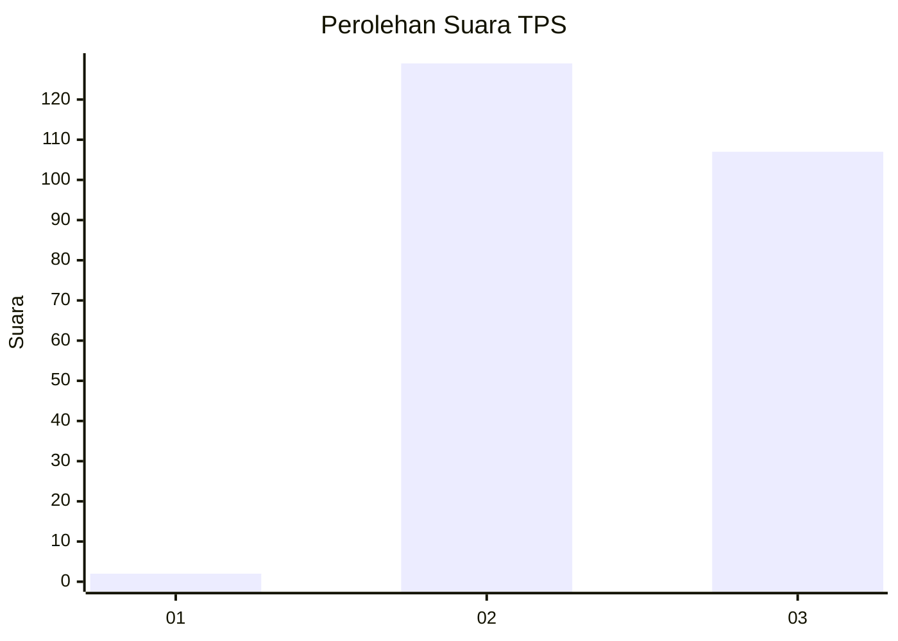
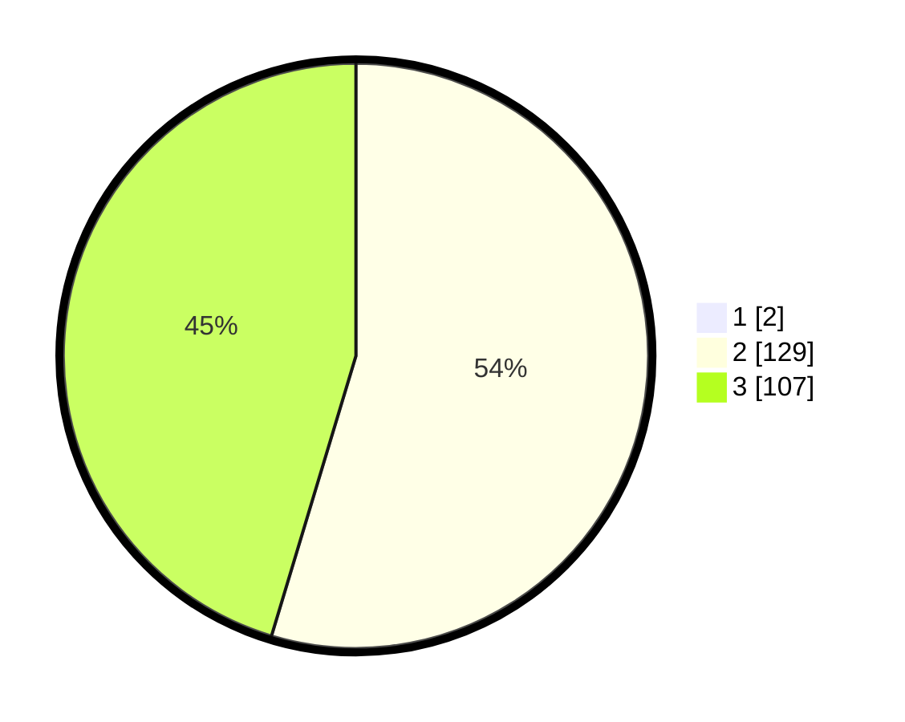

# Hasil

## Grafik

## Tabel

| No. | Nama Paslon    | Suara | Suara (raw) | Persentase |
|:--- |:-------------- | -----:| -----------:| ----------:|
| 1   | ANIES MUHAIMIN | 2     | [2][p-1]    | 0,84       |
| 2   | PRABOWO GIBRAN | 129   | [129][p-2]  | 54,20      |
| 3   | GANJAR MAHFUD  | 107   | [107][p-3]  | 44,96      |

[p-1]: https://github.com/gigit-pemilu/pemilu-2024-51-bali/blob/main/pilpres/hitung-suara/sub/51-bali/sub/01-jembrana/sub/05-jembrana/sub/2010-dangintukadaya/sub/008-tps/sub/paslon-1.txt
[p-2]: https://github.com/gigit-pemilu/pemilu-2024-51-bali/blob/main/pilpres/hitung-suara/sub/51-bali/sub/01-jembrana/sub/05-jembrana/sub/2010-dangintukadaya/sub/008-tps/sub/paslon-2.txt
[p-3]: https://github.com/gigit-pemilu/pemilu-2024-51-bali/blob/main/pilpres/hitung-suara/sub/51-bali/sub/01-jembrana/sub/05-jembrana/sub/2010-dangintukadaya/sub/008-tps/sub/paslon-3.txt

## Foto C Plano

https://sirekap-obj-formc.kpu.go.id/1732/pemilu/ppwp/51/01/05/20/10/5101052010008-20240214-141535--627b74ea-f0fe-42ef-afac-dcc8c2e6ea21.jpg

https://sirekap-obj-formc.kpu.go.id/1732/pemilu/ppwp/51/01/05/20/10/5101052010008-20240214-141024--bf9019bf-2fc4-4edf-bd1a-fe04bb7c1985.jpg

https://sirekap-obj-formc.kpu.go.id/1732/pemilu/ppwp/51/01/05/20/10/5101052010008-20240214-141136--566295d2-6ce9-40e5-957d-28a0c53076e6.jpg

## Metadata

| Key        | Value               |
| ---------- | ------------------- |
| Time Stamp | 2024-02-14 21:46:01 |

## DATA PEMILIH TETAP

Jumlah pemilih dalam DPT: **291**.
 * L: **142**.
 * P: **149**.

## DATA PENGGUNA HAK PILIH

Jumlah pengguna hak pilih dalam DPT: **240**.
 * L: **112**.
 * P: **128**.

Jumlah pengguna hak pilih dalam DPTb: **0**.
 * L: **0**.
 * P: **0**.

Jumlah pengguna hak pilih dalam DPK: **1**.
 * L: **0**.
 * P: **1**.

Jumlah pengguna hak pilih: **241**.
 * L: **112**.
 * P: **129**.

## JUMLAH SUARA SAH DAN TIDAK SAH

JUMLAH SELURUH SUARA SAH: **283**.

JUMLAH SUARA TIDAK SAH: **3**.

