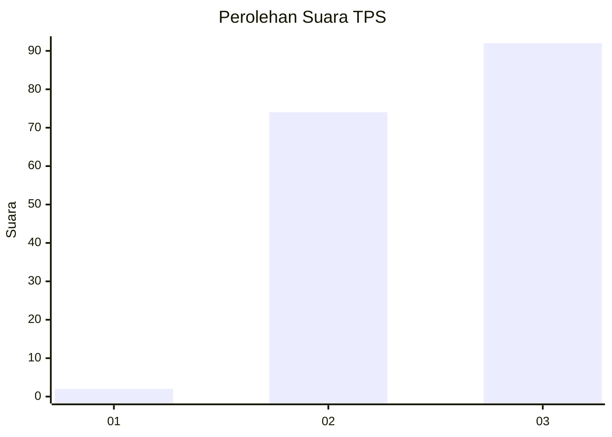
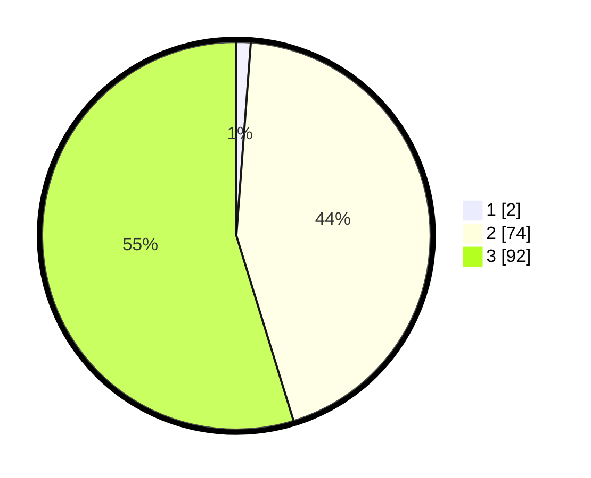

# Hasil

## Grafik

## Tabel

| No. | Nama Paslon    | Suara | Suara (raw) | Persentase |
|:--- |:-------------- | -----:| -----------:| ----------:|
| 1   | ANIES MUHAIMIN | 2     | [2][p-1]    | 1,19       |
| 2   | PRABOWO GIBRAN | 74    | [74][p-2]   | 44,05      |
| 3   | GANJAR MAHFUD  | 92    | [92][p-3]   | 54,76      |

[p-1]: https://github.com/gigit-pemilu/pemilu-2024-51-bali/blob/main/pilpres/hitung-suara/sub/51-bali/sub/01-jembrana/sub/05-jembrana/sub/2010-dangintukadaya/sub/016-tps/sub/paslon-1.txt
[p-2]: https://github.com/gigit-pemilu/pemilu-2024-51-bali/blob/main/pilpres/hitung-suara/sub/51-bali/sub/01-jembrana/sub/05-jembrana/sub/2010-dangintukadaya/sub/016-tps/sub/paslon-2.txt
[p-3]: https://github.com/gigit-pemilu/pemilu-2024-51-bali/blob/main/pilpres/hitung-suara/sub/51-bali/sub/01-jembrana/sub/05-jembrana/sub/2010-dangintukadaya/sub/016-tps/sub/paslon-3.txt

## Foto C Plano

https://sirekap-obj-formc.kpu.go.id/aed1/pemilu/ppwp/51/01/05/20/10/5101052010016-20240214-224053--ff08645e-150c-4ef6-b47c-8c42fff748e9.jpg

https://sirekap-obj-formc.kpu.go.id/aed1/pemilu/ppwp/51/01/05/20/10/5101052010016-20240214-224114--1c70e935-91b2-4e46-9e17-4f6ffdaee342.jpg

https://sirekap-obj-formc.kpu.go.id/aed1/pemilu/ppwp/51/01/05/20/10/5101052010016-20240214-224126--099ce29e-e03b-4116-b6c7-d3a76506f0dc.jpg

## Metadata

| Key        | Value               |
| ---------- | ------------------- |
| Time Stamp | 2024-02-15 09:00:24 |

## DATA PEMILIH TETAP

Jumlah pemilih dalam DPT: **201**.
 * L: **92**.
 * P: **109**.

## DATA PENGGUNA HAK PILIH

Jumlah pengguna hak pilih dalam DPT: **165**.
 * L: **82**.
 * P: **83**.

Jumlah pengguna hak pilih dalam DPTb: **3**.
 * L: **2**.
 * P: **1**.

Jumlah pengguna hak pilih dalam DPK: **3**.
 * L: **1**.
 * P: **2**.

Jumlah pengguna hak pilih: **171**.
 * L: **85**.
 * P: **86**.

## JUMLAH SUARA SAH DAN TIDAK SAH

JUMLAH SELURUH SUARA SAH: **168**.

JUMLAH SUARA TIDAK SAH: **3**.

JUMLAH SELURUH SUARA SAH DAN SUARA TIDAK SAH: **171**.

