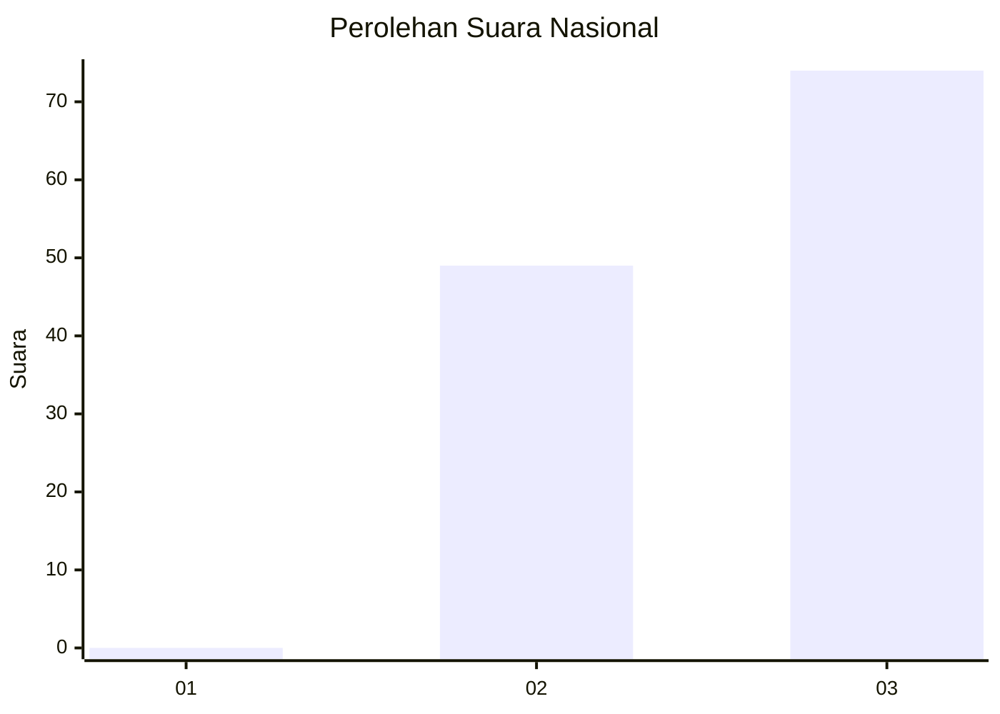
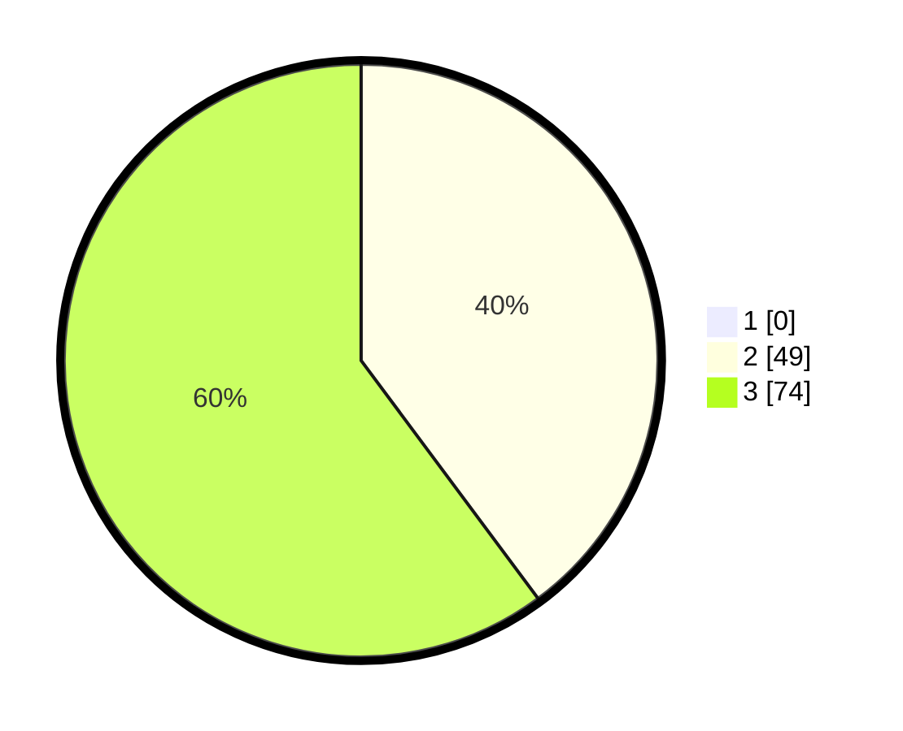

# Hasil

## Grafik

## Tabel

| No. | Nama Paslon    | Suara | Suara (raw) | Persentase |
|:--- |:-------------- | -----:| -----------:| ----------:|
| 1   | ANIES MUHAIMIN | 0     | [0][p-1]    | 0,00       |
| 2   | PRABOWO GIBRAN | 49    | [49][p-2]   | 39,84      |
| 3   | GANJAR MAHFUD  | 74    | [74][p-3]   | 60,16      |

[p-1]: https://github.com/gigit-pemilu/pemilu-2024/blob/main/pilpres/hitung-suara/sub/51-bali/sub/01-jembrana/sub/05-jembrana/sub/2010-dangintukadaya/sub/017-tps/sub/paslon-1.txt
[p-2]: https://github.com/gigit-pemilu/pemilu-2024/blob/main/pilpres/hitung-suara/sub/51-bali/sub/01-jembrana/sub/05-jembrana/sub/2010-dangintukadaya/sub/017-tps/sub/paslon-2.txt
[p-3]: https://github.com/gigit-pemilu/pemilu-2024/blob/main/pilpres/hitung-suara/sub/51-bali/sub/01-jembrana/sub/05-jembrana/sub/2010-dangintukadaya/sub/017-tps/sub/paslon-3.txt

## Foto C Plano

https://sirekap-obj-formc.kpu.go.id/ca7c/pemilu/ppwp/51/01/05/20/10/5101052010017-20240214-185505--a9b7832e-9592-4b8e-8951-5f6137d4184f.jpg

https://sirekap-obj-formc.kpu.go.id/ca7c/pemilu/ppwp/51/01/05/20/10/5101052010017-20240214-185517--9edf29e6-40fb-4192-b488-2a00db2f86ec.jpg

https://sirekap-obj-formc.kpu.go.id/ca7c/pemilu/ppwp/51/01/05/20/10/5101052010017-20240214-185524--b1bd6b7a-f2a7-4bad-bf49-1000730c15fb.jpg

## Metadata

| Key        | Value               |
| ---------- | ------------------- |
| Time Stamp | 2024-02-14 21:46:01 |

## DATA PEMILIH TETAP

Jumlah pemilih dalam DPT: **201**.
 * L: **98**.
 * P: **103**.

## DATA PENGGUNA HAK PILIH

Jumlah pengguna hak pilih dalam DPT: **171**.
 * L: **83**.
 * P: **88**.

Jumlah pengguna hak pilih dalam DPTb: **0**.
 * L: **0**.
 * P: **0**.

Jumlah pengguna hak pilih dalam DPK: **4**.
 * L: **3**.
 * P: **1**.

Jumlah pengguna hak pilih: **175**.
 * L: **86**.
 * P: **89**.

## JUMLAH SUARA SAH DAN TIDAK SAH

JUMLAH SELURUH SUARA SAH: **174**.

JUMLAH SUARA TIDAK SAH: **1**.

JUMLAH SELURUH SUARA SAH DAN SUARA TIDAK SAH: **175**.

