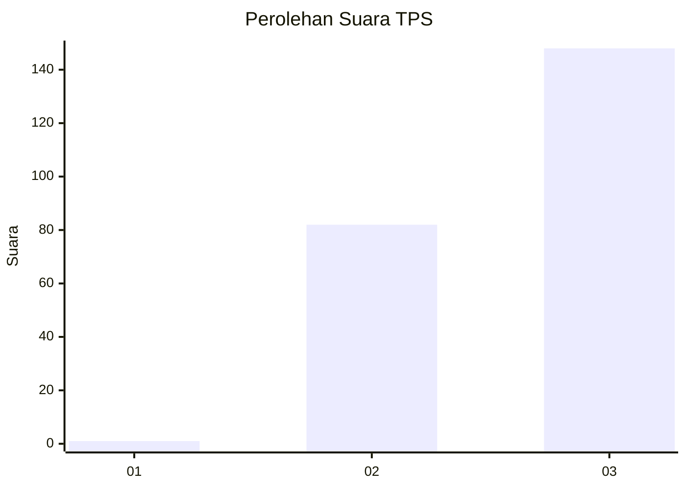
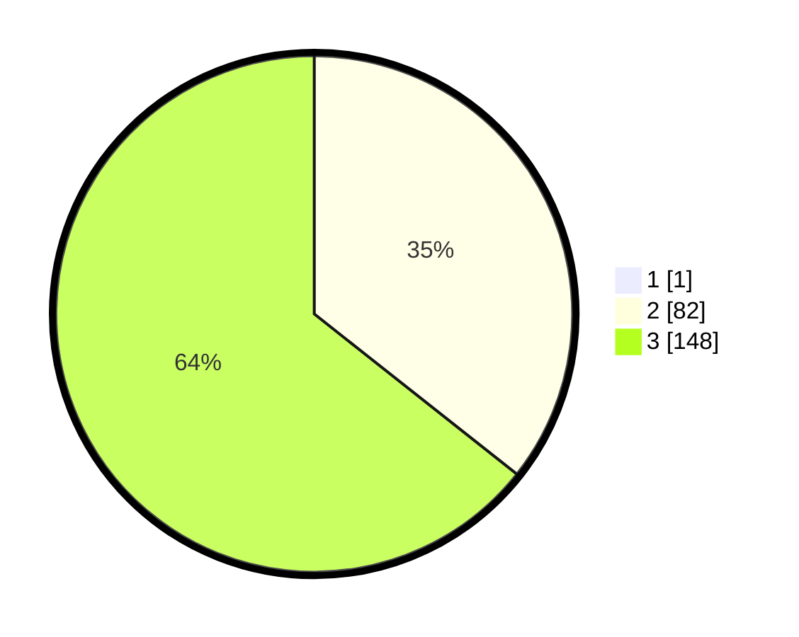

# Hasil

## Grafik

## Tabel

| No. | Nama Paslon    | Suara | Suara (raw) | Persentase |
|:--- |:-------------- | -----:| -----------:| ----------:|
| 1   | ANIES MUHAIMIN | 1     | [1][p-1]    | 0,43       |
| 2   | PRABOWO GIBRAN | 82    | [82][p-2]   | 35,50      |
| 3   | GANJAR MAHFUD  | 148   | [148][p-3]  | 64,07      |

[p-1]: https://github.com/gigit-pemilu/pemilu-2024-51-bali/blob/main/pilpres/hitung-suara/sub/51-bali/sub/02-tabanan/sub/01-selemadeg/sub/2001-bajera/sub/001-tps/sub/paslon-1.txt
[p-2]: https://github.com/gigit-pemilu/pemilu-2024-51-bali/blob/main/pilpres/hitung-suara/sub/51-bali/sub/02-tabanan/sub/01-selemadeg/sub/2001-bajera/sub/001-tps/sub/paslon-2.txt
[p-3]: https://github.com/gigit-pemilu/pemilu-2024-51-bali/blob/main/pilpres/hitung-suara/sub/51-bali/sub/02-tabanan/sub/01-selemadeg/sub/2001-bajera/sub/001-tps/sub/paslon-3.txt

## Foto C Plano

https://sirekap-obj-formc.kpu.go.id/9be2/pemilu/ppwp/51/02/01/20/01/5102012001001-20240214-132844--9887ffb1-e7d7-4446-9680-0c252dc6e5d2.jpg

https://sirekap-obj-formc.kpu.go.id/9be2/pemilu/ppwp/51/02/01/20/01/5102012001001-20240214-132936--15f94094-8322-425f-b483-415392ab808d.jpg

https://sirekap-obj-formc.kpu.go.id/9be2/pemilu/ppwp/51/02/01/20/01/5102012001001-20240215-002205--ca10e1a9-68cc-4423-835f-0b2d16640bda.jpg

## Metadata

| Key        | Value               |
| ---------- | ------------------- |
| Time Stamp | 2024-02-15 09:00:24 |

## DATA PEMILIH TETAP

Jumlah pemilih dalam DPT: **278**.
 * L: **139**.
 * P: **139**.

## DATA PENGGUNA HAK PILIH

Jumlah pengguna hak pilih dalam DPT: **234**.
 * L: **124**.
 * P: **110**.

Jumlah pengguna hak pilih dalam DPTb: **0**.
 * L: **0**.
 * P: **0**.

Jumlah pengguna hak pilih dalam DPK: **0**.
 * L: **0**.
 * P: **0**.

Jumlah pengguna hak pilih: **234**.
 * L: **124**.
 * P: **110**.

## JUMLAH SUARA SAH DAN TIDAK SAH

JUMLAH SELURUH SUARA SAH: **231**.

JUMLAH SUARA TIDAK SAH: **3**.

JUMLAH SELURUH SUARA SAH DAN SUARA TIDAK SAH: **234**.

