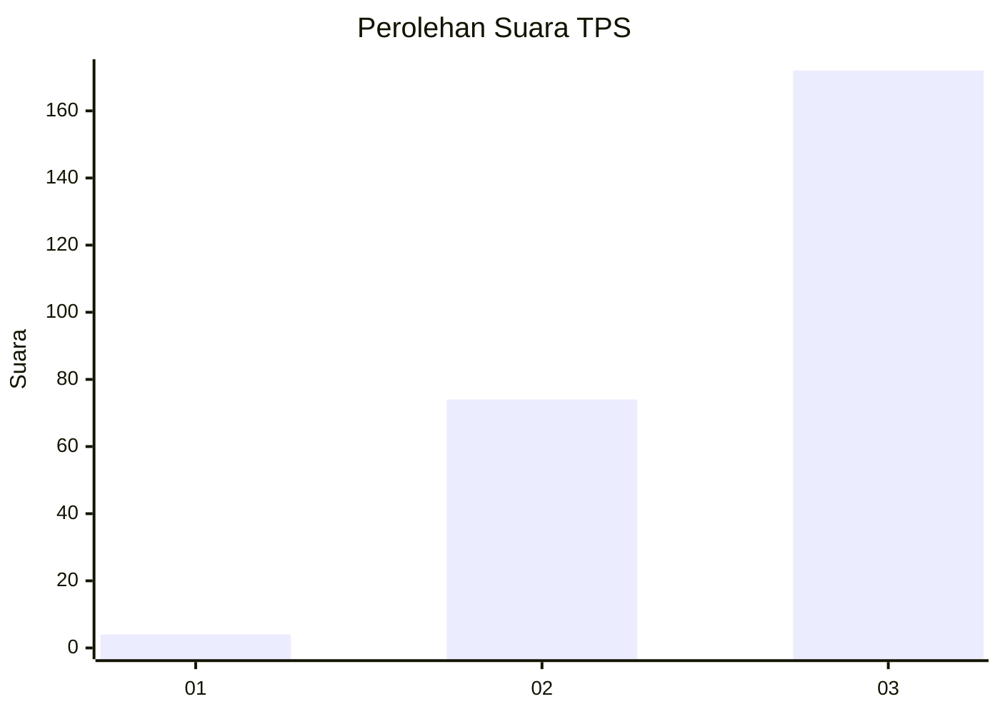
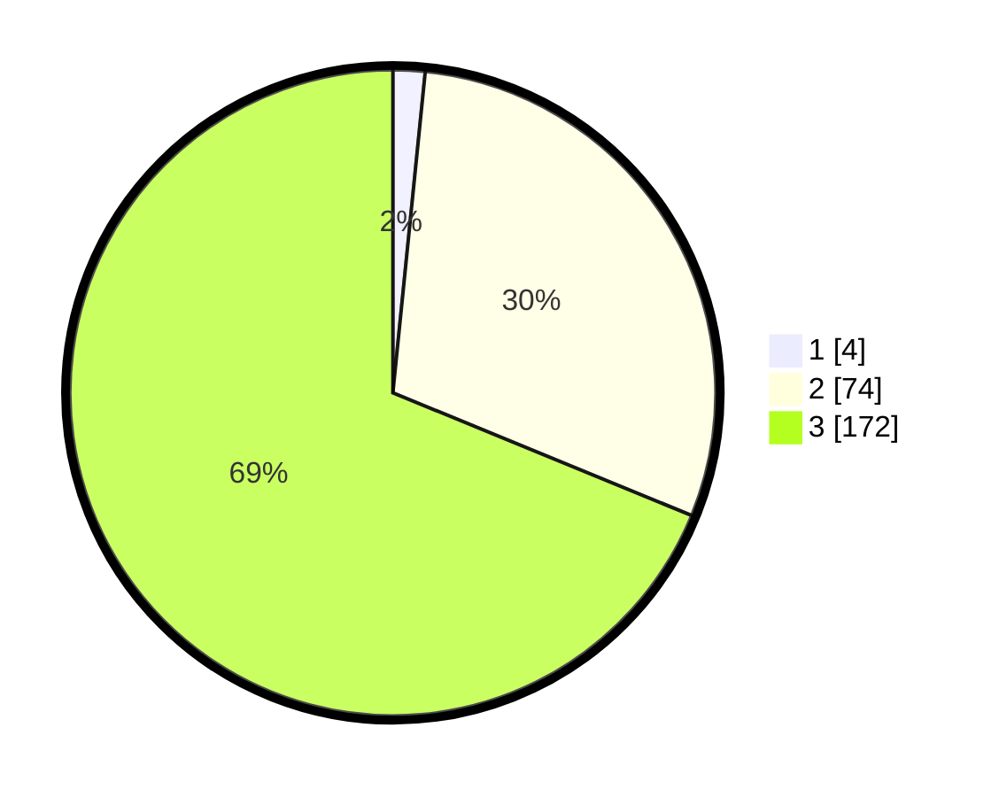

# Hasil

## Grafik

## Tabel

| No. | Nama Paslon    | Suara | Suara (raw) | Persentase |
|:--- |:-------------- | -----:| -----------:| ----------:|
| 1   | ANIES MUHAIMIN | 4     | [4][p-1]    | 1,60       |
| 2   | PRABOWO GIBRAN | 74    | [74][p-2]   | 29,60      |
| 3   | GANJAR MAHFUD  | 172   | [172][p-3]  | 68,80      |

[p-1]: https://github.com/gigit-pemilu/pemilu-2024-51-bali/blob/main/pilpres/hitung-suara/sub/51-bali/sub/02-tabanan/sub/01-selemadeg/sub/2001-bajera/sub/002-tps/sub/paslon-1.txt
[p-2]: https://github.com/gigit-pemilu/pemilu-2024-51-bali/blob/main/pilpres/hitung-suara/sub/51-bali/sub/02-tabanan/sub/01-selemadeg/sub/2001-bajera/sub/002-tps/sub/paslon-2.txt
[p-3]: https://github.com/gigit-pemilu/pemilu-2024-51-bali/blob/main/pilpres/hitung-suara/sub/51-bali/sub/02-tabanan/sub/01-selemadeg/sub/2001-bajera/sub/002-tps/sub/paslon-3.txt

## Foto C Plano

https://sirekap-obj-formc.kpu.go.id/ff84/pemilu/ppwp/51/02/01/20/01/5102012001002-20240215-004014--6a58f9db-ea7b-4085-95a0-3c1722bd02f1.jpg

https://sirekap-obj-formc.kpu.go.id/ff84/pemilu/ppwp/51/02/01/20/01/5102012001002-20240215-004021--d8dd0a04-84d7-4515-bac4-4973f996b3d6.jpg

https://sirekap-obj-formc.kpu.go.id/ff84/pemilu/ppwp/51/02/01/20/01/5102012001002-20240215-004028--a094d206-04c7-4fd2-b76f-bcda9d4a2aa6.jpg

## Metadata

| Key        | Value               |
| ---------- | ------------------- |
| Time Stamp | 2024-02-15 21:30:27 |

