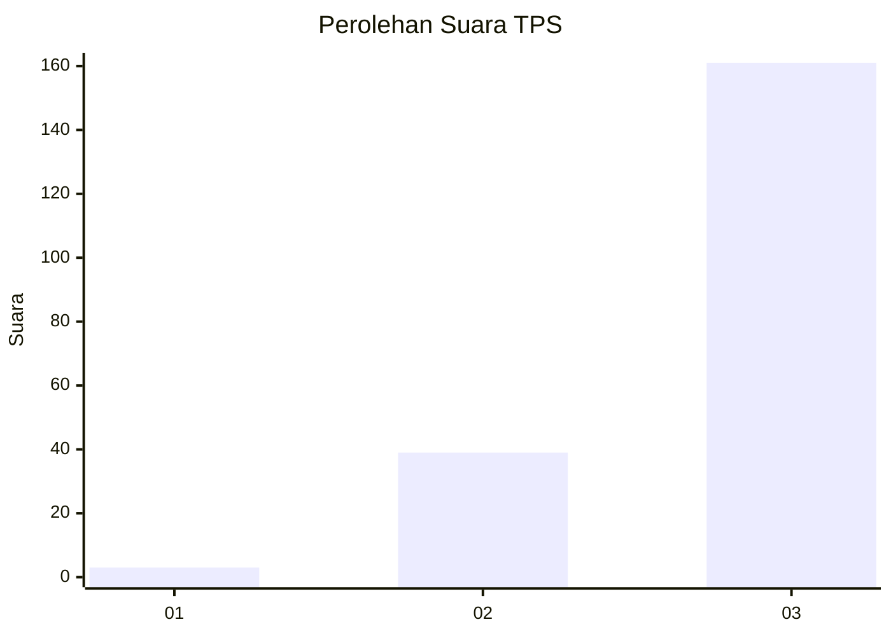
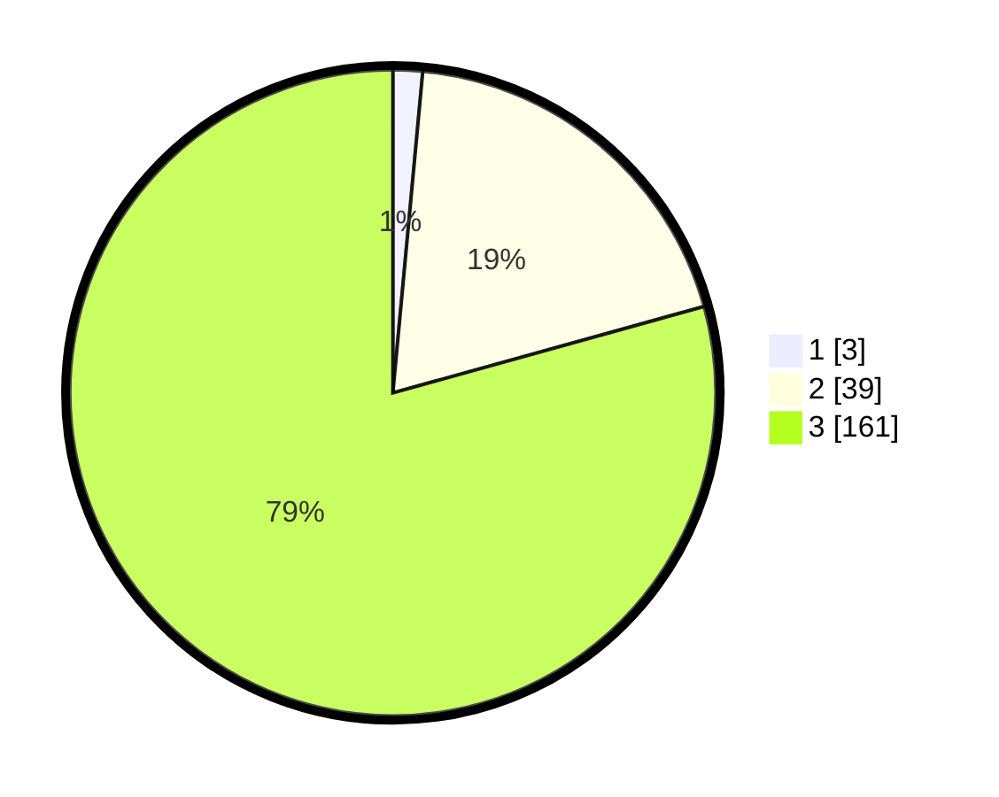

# Hasil

## Grafik

## Tabel

| No. | Nama Paslon    | Suara | Suara (raw) | Persentase |
|:--- |:-------------- | -----:| -----------:| ----------:|
| 1   | ANIES MUHAIMIN | 3     | [3][p-1]    | 1,48       |
| 2   | PRABOWO GIBRAN | 39    | [39][p-2]   | 19,21      |
| 3   | GANJAR MAHFUD  | 161   | [161][p-3]  | 79,31      |

[p-1]: https://github.com/gigit-pemilu/pemilu-2024-51-bali/blob/main/pilpres/hitung-suara/sub/51-bali/sub/02-tabanan/sub/01-selemadeg/sub/2001-bajera/sub/003-tps/sub/paslon-1.txt
[p-2]: https://github.com/gigit-pemilu/pemilu-2024-51-bali/blob/main/pilpres/hitung-suara/sub/51-bali/sub/02-tabanan/sub/01-selemadeg/sub/2001-bajera/sub/003-tps/sub/paslon-2.txt
[p-3]: https://github.com/gigit-pemilu/pemilu-2024-51-bali/blob/main/pilpres/hitung-suara/sub/51-bali/sub/02-tabanan/sub/01-selemadeg/sub/2001-bajera/sub/003-tps/sub/paslon-3.txt

## Foto C Plano

https://sirekap-obj-formc.kpu.go.id/ac74/pemilu/ppwp/51/02/01/20/01/5102012001003-20240216-154234--8de49d36-73e0-4247-a6a1-f6b26d148186.jpg

https://sirekap-obj-formc.kpu.go.id/ac74/pemilu/ppwp/51/02/01/20/01/5102012001003-20240216-154236--0a6b35f1-34e8-403b-9a1b-4079fce862e5.jpg

https://sirekap-obj-formc.kpu.go.id/ac74/pemilu/ppwp/51/02/01/20/01/5102012001003-20240216-154235--4410233e-dd90-4fda-8747-325d23c09612.jpg

## Metadata

| Key        | Value               |
| ---------- | ------------------- |
| Time Stamp | 2024-02-16 16:25:10 |

## DATA PEMILIH TETAP

Jumlah pemilih dalam DPT: **229**.
 * L: **114**.
 * P: **115**.

## DATA PENGGUNA HAK PILIH

Jumlah pengguna hak pilih dalam DPT: **0**.
 * L: **0**.
 * P: **0**.

Jumlah pengguna hak pilih dalam DPTb: **0**.
 * L: **0**.
 * P: **0**.

Jumlah pengguna hak pilih dalam DPK: **0**.
 * L: **0**.
 * P: **0**.

Jumlah pengguna hak pilih: **0**.
 * L: **0**.
 * P: **0**.

## JUMLAH SUARA SAH DAN TIDAK SAH

JUMLAH SELURUH SUARA SAH: **203**.

JUMLAH SUARA TIDAK SAH: **4**.

JUMLAH SELURUH SUARA SAH DAN SUARA TIDAK SAH: **207**.

