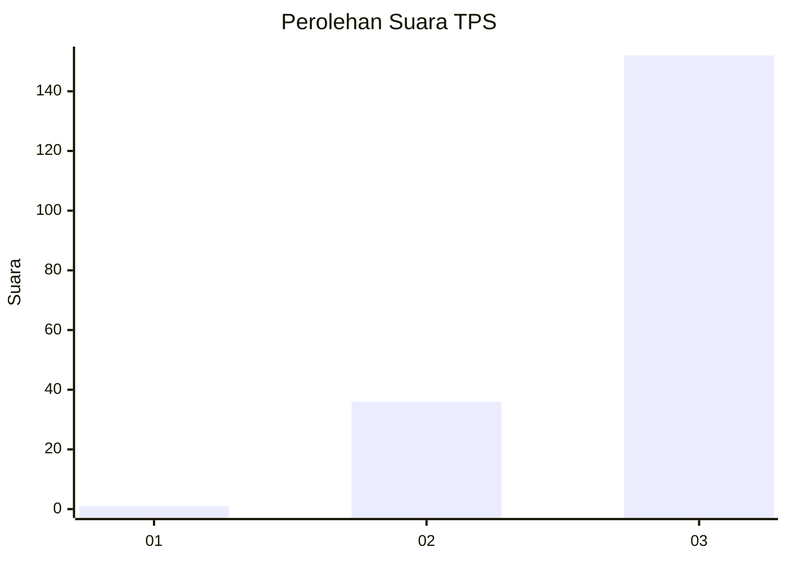
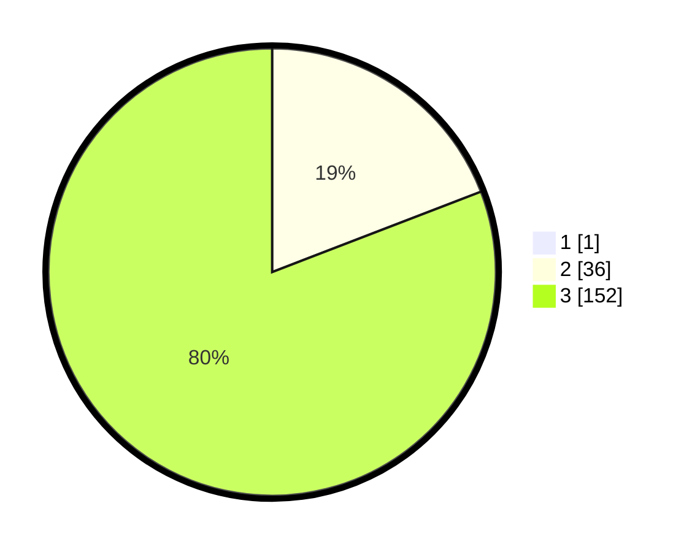

# Hasil

## Grafik

## Tabel

| No. | Nama Paslon    | Suara | Suara (raw) | Persentase |
|:--- |:-------------- | -----:| -----------:| ----------:|
| 1   | ANIES MUHAIMIN | 1     | [1][p-1]    | 0,53       |
| 2   | PRABOWO GIBRAN | 36    | [36][p-2]   | 19,05      |
| 3   | GANJAR MAHFUD  | 152   | [152][p-3]  | 80,42      |

[p-1]: https://github.com/gigit-pemilu/pemilu-2024-51-bali/blob/main/pilpres/hitung-suara/sub/51-bali/sub/02-tabanan/sub/01-selemadeg/sub/2001-bajera/sub/004-tps/sub/paslon-1.txt
[p-2]: https://github.com/gigit-pemilu/pemilu-2024-51-bali/blob/main/pilpres/hitung-suara/sub/51-bali/sub/02-tabanan/sub/01-selemadeg/sub/2001-bajera/sub/004-tps/sub/paslon-2.txt
[p-3]: https://github.com/gigit-pemilu/pemilu-2024-51-bali/blob/main/pilpres/hitung-suara/sub/51-bali/sub/02-tabanan/sub/01-selemadeg/sub/2001-bajera/sub/004-tps/sub/paslon-3.txt

## Foto C Plano

https://sirekap-obj-formc.kpu.go.id/9b95/pemilu/ppwp/51/02/01/20/01/5102012001004-20240214-140935--64aa7d39-4722-4b99-bb96-01ea17c6f376.jpg

https://sirekap-obj-formc.kpu.go.id/9b95/pemilu/ppwp/51/02/01/20/01/5102012001004-20240214-221224--bf5c9804-32f6-4484-8133-4421df0e09ce.jpg

https://sirekap-obj-formc.kpu.go.id/9b95/pemilu/ppwp/51/02/01/20/01/5102012001004-20240214-141723--4c86216f-7c43-4862-aa8f-3497ae25c024.jpg

## Metadata

| Key        | Value               |
| ---------- | ------------------- |
| Time Stamp | 2024-02-15 22:40:13 |

## DATA PEMILIH TETAP

Jumlah pemilih dalam DPT: **214**.
 * L: **103**.
 * P: **111**.

## DATA PENGGUNA HAK PILIH

Jumlah pengguna hak pilih dalam DPT: **192**.
 * L: **88**.
 * P: **104**.

Jumlah pengguna hak pilih dalam DPTb: **0**.
 * L: **0**.
 * P: **0**.

Jumlah pengguna hak pilih dalam DPK: **0**.
 * L: **0**.
 * P: **0**.

Jumlah pengguna hak pilih: **192**.
 * L: **88**.
 * P: **104**.

## JUMLAH SUARA SAH DAN TIDAK SAH

JUMLAH SELURUH SUARA SAH: **189**.

JUMLAH SUARA TIDAK SAH: **3**.

JUMLAH SELURUH SUARA SAH DAN SUARA TIDAK SAH: **192**.

