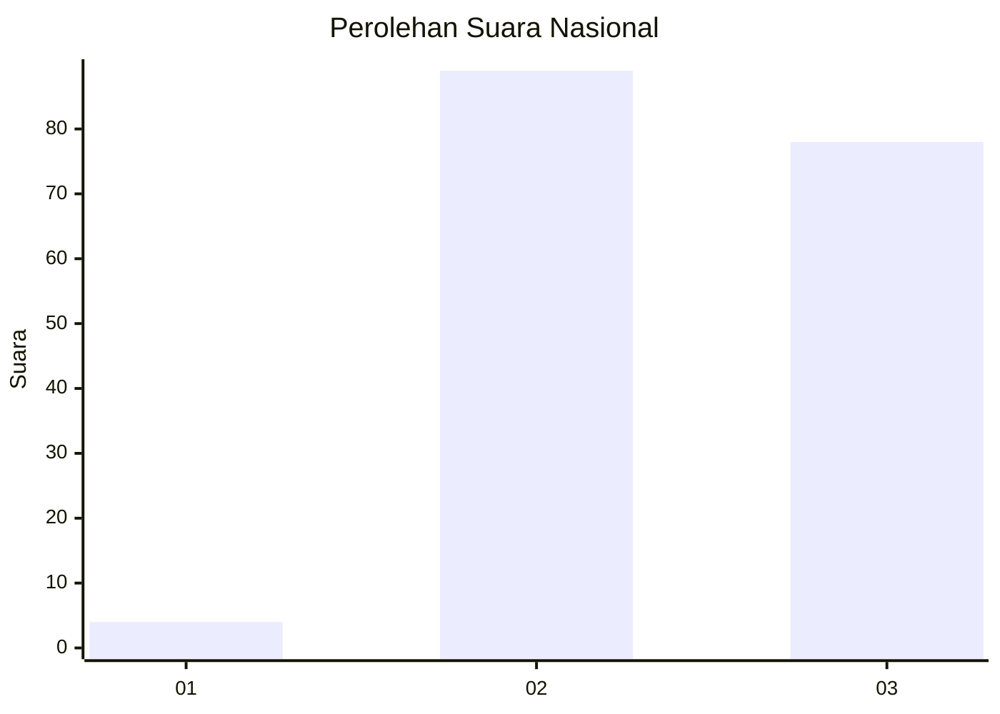
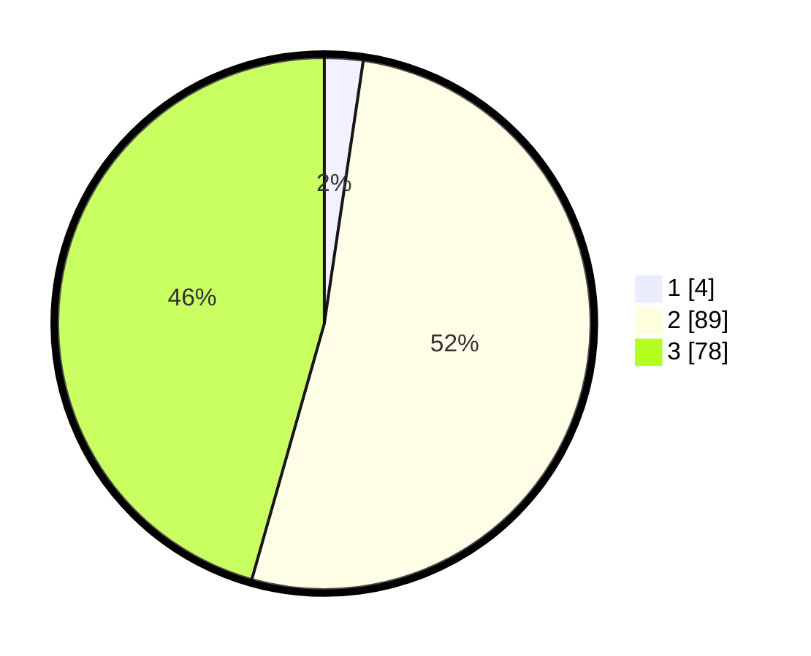

# Hasil

## Grafik

## Tabel

| No. | Nama Paslon    | Suara | Suara (raw) | Persentase |
|:--- |:-------------- | -----:| -----------:| ----------:|
| 1   | ANIES MUHAIMIN | 4     | [4][p-1]    | 2,34       |
| 2   | PRABOWO GIBRAN | 89    | [89][p-2]   | 52,05      |
| 3   | GANJAR MAHFUD  | 78    | [78][p-3]   | 45,61      |

[p-1]: https://github.com/gigit-pemilu/pemilu-2024/blob/main/pilpres/hitung-suara/sub/51-bali/sub/02-tabanan/sub/01-selemadeg/sub/2001-bajera/sub/005-tps/sub/paslon-1.txt
[p-2]: https://github.com/gigit-pemilu/pemilu-2024/blob/main/pilpres/hitung-suara/sub/51-bali/sub/02-tabanan/sub/01-selemadeg/sub/2001-bajera/sub/005-tps/sub/paslon-2.txt
[p-3]: https://github.com/gigit-pemilu/pemilu-2024/blob/main/pilpres/hitung-suara/sub/51-bali/sub/02-tabanan/sub/01-selemadeg/sub/2001-bajera/sub/005-tps/sub/paslon-3.txt

## Foto C Plano

https://sirekap-obj-formc.kpu.go.id/1061/pemilu/ppwp/51/02/01/20/01/5102012001005-20240214-140931--1aadfced-86c3-4be6-a25f-fef6ddf51bd3.jpg

https://sirekap-obj-formc.kpu.go.id/1061/pemilu/ppwp/51/02/01/20/01/5102012001005-20240214-213839--4b0248c0-1122-4dbb-97ba-7e3908d2735f.jpg

## Metadata

| Key        | Value               |
| ---------- | ------------------- |
| Time Stamp | 2024-02-15 07:00:44 |

