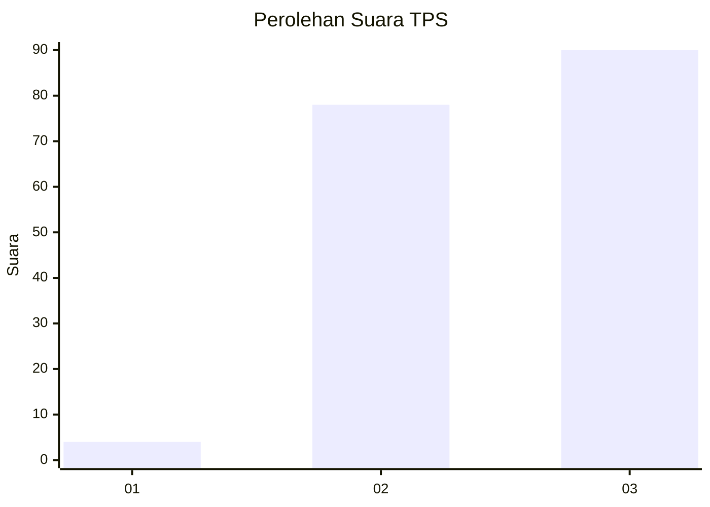
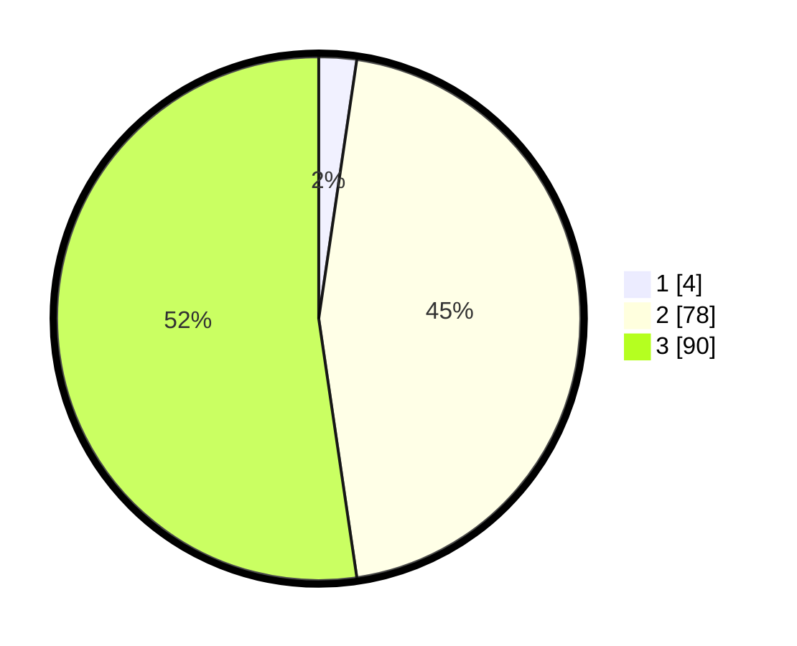

# Hasil

## Grafik

## Tabel

| No. | Nama Paslon    | Suara | Suara (raw) | Persentase |
|:--- |:-------------- | -----:| -----------:| ----------:|
| 1   | ANIES MUHAIMIN | 4     | [4][p-1]    | 2,33       |
| 2   | PRABOWO GIBRAN | 78    | [78][p-2]   | 45,35      |
| 3   | GANJAR MAHFUD  | 90    | [90][p-3]   | 52,33      |

[p-1]: https://github.com/gigit-pemilu/pemilu-2024-51-bali/blob/main/pilpres/hitung-suara/sub/51-bali/sub/02-tabanan/sub/01-selemadeg/sub/2001-bajera/sub/006-tps/sub/paslon-1.txt
[p-2]: https://github.com/gigit-pemilu/pemilu-2024-51-bali/blob/main/pilpres/hitung-suara/sub/51-bali/sub/02-tabanan/sub/01-selemadeg/sub/2001-bajera/sub/006-tps/sub/paslon-2.txt
[p-3]: https://github.com/gigit-pemilu/pemilu-2024-51-bali/blob/main/pilpres/hitung-suara/sub/51-bali/sub/02-tabanan/sub/01-selemadeg/sub/2001-bajera/sub/006-tps/sub/paslon-3.txt

## Foto C Plano

https://sirekap-obj-formc.kpu.go.id/cd2d/pemilu/ppwp/51/02/01/20/01/5102012001006-20240214-141036--3fb59380-e50d-4325-b224-f95e838b3915.jpg

https://sirekap-obj-formc.kpu.go.id/cd2d/pemilu/ppwp/51/02/01/20/01/5102012001006-20240214-193136--09e0461d-3108-4bc3-b1a1-c7d491993963.jpg

https://sirekap-obj-formc.kpu.go.id/cd2d/pemilu/ppwp/51/02/01/20/01/5102012001006-20240214-141054--9c3d134b-1f56-44a5-8874-c67eb92e0d3d.jpg

## Metadata

| Key        | Value               |
| ---------- | ------------------- |
| Time Stamp | 2024-02-15 21:30:27 |

## DATA PEMILIH TETAP

Jumlah pemilih dalam DPT: **237**.
 * L: **125**.
 * P: **112**.

## DATA PENGGUNA HAK PILIH

Jumlah pengguna hak pilih dalam DPT: **175**.
 * L: **92**.
 * P: **83**.

Jumlah pengguna hak pilih dalam DPTb: **0**.
 * L: **0**.
 * P: **0**.

Jumlah pengguna hak pilih dalam DPK: **1**.
 * L: **0**.
 * P: **1**.

Jumlah pengguna hak pilih: **176**.
 * L: **92**.
 * P: **84**.

## JUMLAH SUARA SAH DAN TIDAK SAH

JUMLAH SELURUH SUARA SAH: **172**.

JUMLAH SUARA TIDAK SAH: **4**.

JUMLAH SELURUH SUARA SAH DAN SUARA TIDAK SAH: **176**.

