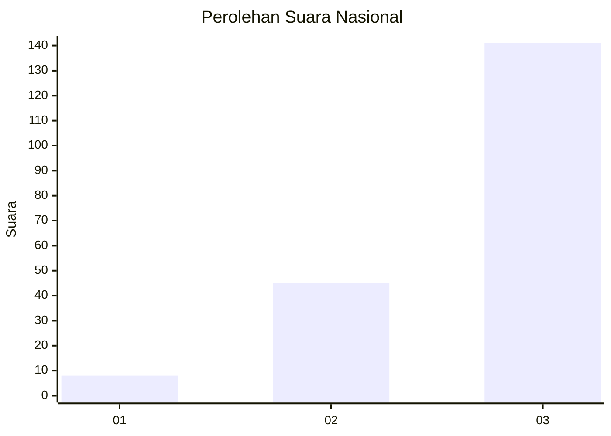
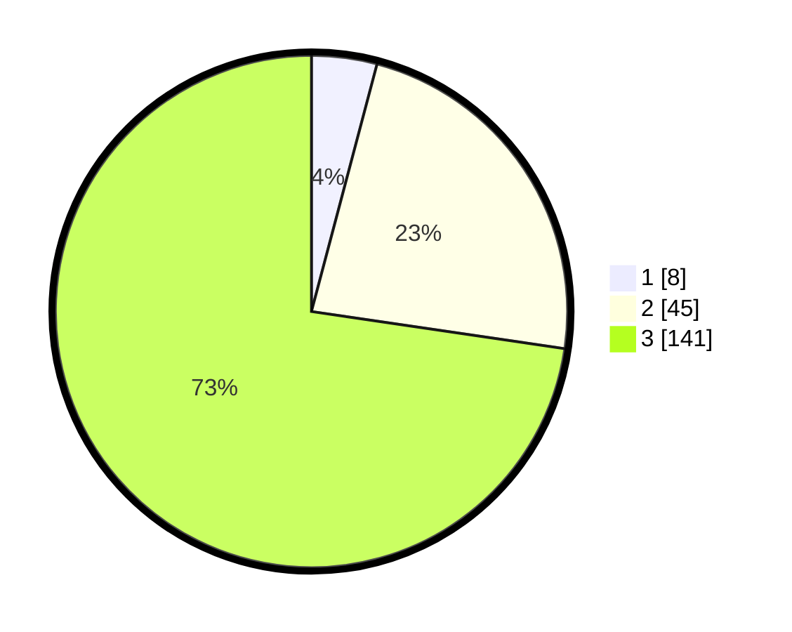

# Hasil

## Grafik

## Tabel

| No. | Nama Paslon    | Suara | Suara (raw) | Persentase |
|:--- |:-------------- | -----:| -----------:| ----------:|
| 1   | ANIES MUHAIMIN | 8     | [8][p-1]    | 4,12       |
| 2   | PRABOWO GIBRAN | 45    | [45][p-2]   | 23,20      |
| 3   | GANJAR MAHFUD  | 141   | [141][p-3]  | 72,68      |

[p-1]: https://github.com/gigit-pemilu/pemilu-2024/blob/main/pilpres/hitung-suara/sub/51-bali/sub/02-tabanan/sub/01-selemadeg/sub/2001-bajera/sub/007-tps/sub/paslon-1.txt
[p-2]: https://github.com/gigit-pemilu/pemilu-2024/blob/main/pilpres/hitung-suara/sub/51-bali/sub/02-tabanan/sub/01-selemadeg/sub/2001-bajera/sub/007-tps/sub/paslon-2.txt
[p-3]: https://github.com/gigit-pemilu/pemilu-2024/blob/main/pilpres/hitung-suara/sub/51-bali/sub/02-tabanan/sub/01-selemadeg/sub/2001-bajera/sub/007-tps/sub/paslon-3.txt

## Foto C Plano

https://sirekap-obj-formc.kpu.go.id/f34f/pemilu/ppwp/51/02/01/20/01/5102012001007-20240215-014424--e2992d29-a237-47d0-a0e8-758b10b30adb.jpg

https://sirekap-obj-formc.kpu.go.id/f34f/pemilu/ppwp/51/02/01/20/01/5102012001007-20240214-233630--b90aa106-9567-42f8-b77b-4b8a91bf1395.jpg

https://sirekap-obj-formc.kpu.go.id/f34f/pemilu/ppwp/51/02/01/20/01/5102012001007-20240215-014334--c3806af6-48f5-4f3b-a31f-9cb151186a18.jpg

## Metadata

| Key        | Value               |
| ---------- | ------------------- |
| Time Stamp | 2024-02-15 21:30:27 |

## DATA PEMILIH TETAP

Jumlah pemilih dalam DPT: **241**.
 * L: **124**.
 * P: **117**.

## DATA PENGGUNA HAK PILIH

Jumlah pengguna hak pilih dalam DPT: **201**.
 * L: **104**.
 * P: **97**.

Jumlah pengguna hak pilih dalam DPTb: **0**.
 * L: **0**.
 * P: **0**.

Jumlah pengguna hak pilih dalam DPK: **0**.
 * L: **0**.
 * P: **0**.

Jumlah pengguna hak pilih: **201**.
 * L: **104**.
 * P: **97**.

## JUMLAH SUARA SAH DAN TIDAK SAH

JUMLAH SELURUH SUARA SAH: **194**.

JUMLAH SUARA TIDAK SAH: **7**.

JUMLAH SELURUH SUARA SAH DAN SUARA TIDAK SAH: **201**.

