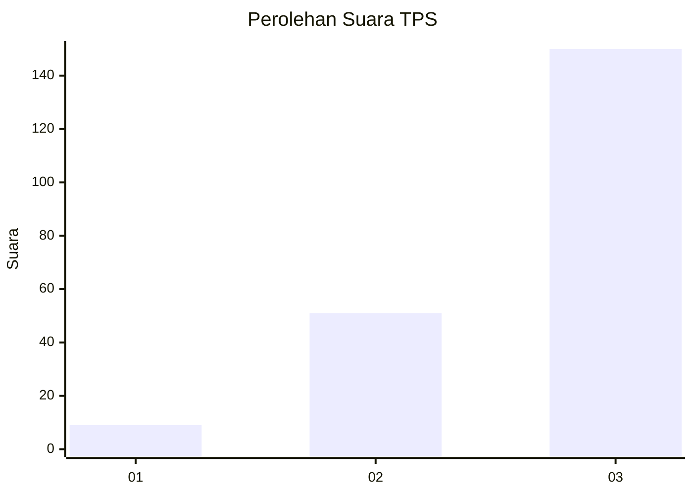
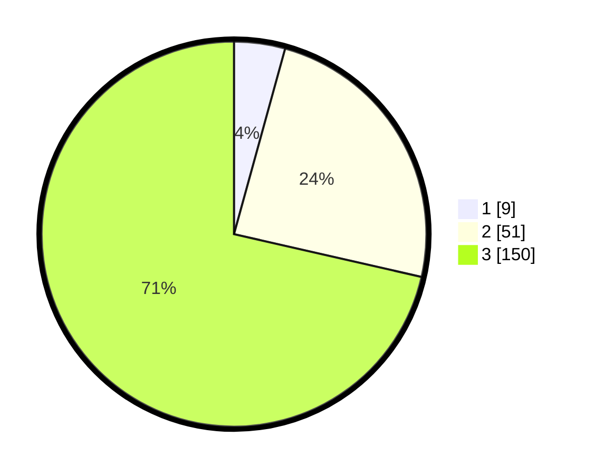

# Hasil

## Grafik

## Tabel

| No. | Nama Paslon    | Suara | Suara (raw) | Persentase |
|:--- |:-------------- | -----:| -----------:| ----------:|
| 1   | ANIES MUHAIMIN | 9     | [9][p-1]    | 4,29       |
| 2   | PRABOWO GIBRAN | 51    | [51][p-2]   | 24,29      |
| 3   | GANJAR MAHFUD  | 150   | [150][p-3]  | 71,43      |

[p-1]: https://github.com/gigit-pemilu/pemilu-2024-51-bali/blob/main/pilpres/hitung-suara/sub/51-bali/sub/02-tabanan/sub/01-selemadeg/sub/2001-bajera/sub/008-tps/sub/paslon-1.txt
[p-2]: https://github.com/gigit-pemilu/pemilu-2024-51-bali/blob/main/pilpres/hitung-suara/sub/51-bali/sub/02-tabanan/sub/01-selemadeg/sub/2001-bajera/sub/008-tps/sub/paslon-2.txt
[p-3]: https://github.com/gigit-pemilu/pemilu-2024-51-bali/blob/main/pilpres/hitung-suara/sub/51-bali/sub/02-tabanan/sub/01-selemadeg/sub/2001-bajera/sub/008-tps/sub/paslon-3.txt

## Foto C Plano

https://sirekap-obj-formc.kpu.go.id/3ebf/pemilu/ppwp/51/02/01/20/01/5102012001008-20240216-135652--bb1f3718-a5df-4cd7-8d3f-3bd159d19f78.jpg

https://sirekap-obj-formc.kpu.go.id/3ebf/pemilu/ppwp/51/02/01/20/01/5102012001008-20240214-141942--b59e40d8-4c55-4445-b942-aa5e24c4da61.jpg

https://sirekap-obj-formc.kpu.go.id/3ebf/pemilu/ppwp/51/02/01/20/01/5102012001008-20240216-135653--20505010-c35c-41e8-ab91-9cae4d87cc89.jpg

## Metadata

| Key        | Value               |
| ---------- | ------------------- |
| Time Stamp | 2024-02-16 14:00:34 |

## DATA PEMILIH TETAP

Jumlah pemilih dalam DPT: **249**.
 * L: **128**.
 * P: **121**.

## DATA PENGGUNA HAK PILIH

Jumlah pengguna hak pilih dalam DPT: **214**.
 * L: **103**.
 * P: **111**.

Jumlah pengguna hak pilih dalam DPTb: **0**.
 * L: **0**.
 * P: **0**.

Jumlah pengguna hak pilih dalam DPK: **0**.
 * L: **0**.
 * P: **0**.

Jumlah pengguna hak pilih: **214**.
 * L: **103**.
 * P: **111**.

## JUMLAH SUARA SAH DAN TIDAK SAH

JUMLAH SELURUH SUARA SAH: **210**.

JUMLAH SUARA TIDAK SAH: **4**.

JUMLAH SELURUH SUARA SAH DAN SUARA TIDAK SAH: **214**.

