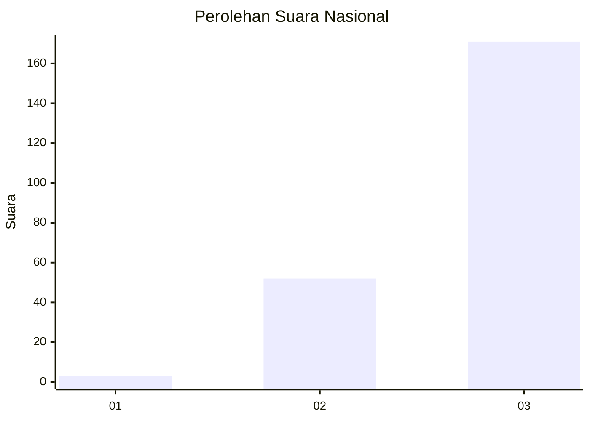
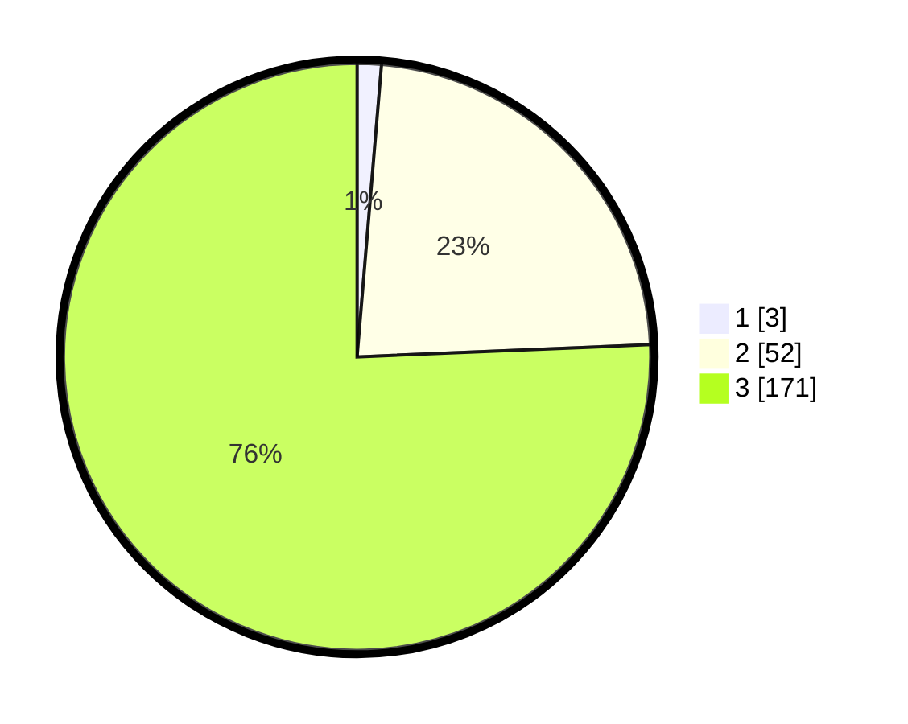

# Hasil

## Grafik

## Tabel

| No. | Nama Paslon    | Suara | Suara (raw) | Persentase |
|:--- |:-------------- | -----:| -----------:| ----------:|
| 1   | ANIES MUHAIMIN | 3     | [3][p-1]    | 1,33       |
| 2   | PRABOWO GIBRAN | 52    | [52][p-2]   | 23,01      |
| 3   | GANJAR MAHFUD  | 171   | [171][p-3]  | 75,66      |

[p-1]: https://github.com/gigit-pemilu/pemilu-2024/blob/main/pilpres/hitung-suara/sub/51-bali/sub/02-tabanan/sub/01-selemadeg/sub/2001-bajera/sub/009-tps/sub/paslon-1.txt
[p-2]: https://github.com/gigit-pemilu/pemilu-2024/blob/main/pilpres/hitung-suara/sub/51-bali/sub/02-tabanan/sub/01-selemadeg/sub/2001-bajera/sub/009-tps/sub/paslon-2.txt
[p-3]: https://github.com/gigit-pemilu/pemilu-2024/blob/main/pilpres/hitung-suara/sub/51-bali/sub/02-tabanan/sub/01-selemadeg/sub/2001-bajera/sub/009-tps/sub/paslon-3.txt

## Foto C Plano

https://sirekap-obj-formc.kpu.go.id/059a/pemilu/ppwp/51/02/01/20/01/5102012001009-20240214-190521--f83323e1-6f64-4cef-a57c-4a1033099873.jpg

https://sirekap-obj-formc.kpu.go.id/059a/pemilu/ppwp/51/02/01/20/01/5102012001009-20240214-192212--7735ab47-8d56-41f5-8be7-ee7422b77233.jpg

https://sirekap-obj-formc.kpu.go.id/059a/pemilu/ppwp/51/02/01/20/01/5102012001009-20240214-192125--fa8aef0b-fa00-454d-b64c-d2744c5906d7.jpg

## Metadata

| Key        | Value               |
| ---------- | ------------------- |
| Time Stamp | 2024-02-15 21:30:27 |

## DATA PEMILIH TETAP

Jumlah pemilih dalam DPT: **271**.
 * L: **139**.
 * P: **132**.

## DATA PENGGUNA HAK PILIH

Jumlah pengguna hak pilih dalam DPT: **225**.
 * L: **116**.
 * P: **109**.

Jumlah pengguna hak pilih dalam DPTb: **0**.
 * L: **0**.
 * P: **0**.

Jumlah pengguna hak pilih dalam DPK: **5**.
 * L: **3**.
 * P: **2**.

Jumlah pengguna hak pilih: **230**.
 * L: **119**.
 * P: **111**.

## JUMLAH SUARA SAH DAN TIDAK SAH

JUMLAH SELURUH SUARA SAH: **226**.

JUMLAH SUARA TIDAK SAH: **4**.

JUMLAH SELURUH SUARA SAH DAN SUARA TIDAK SAH: **230**.

