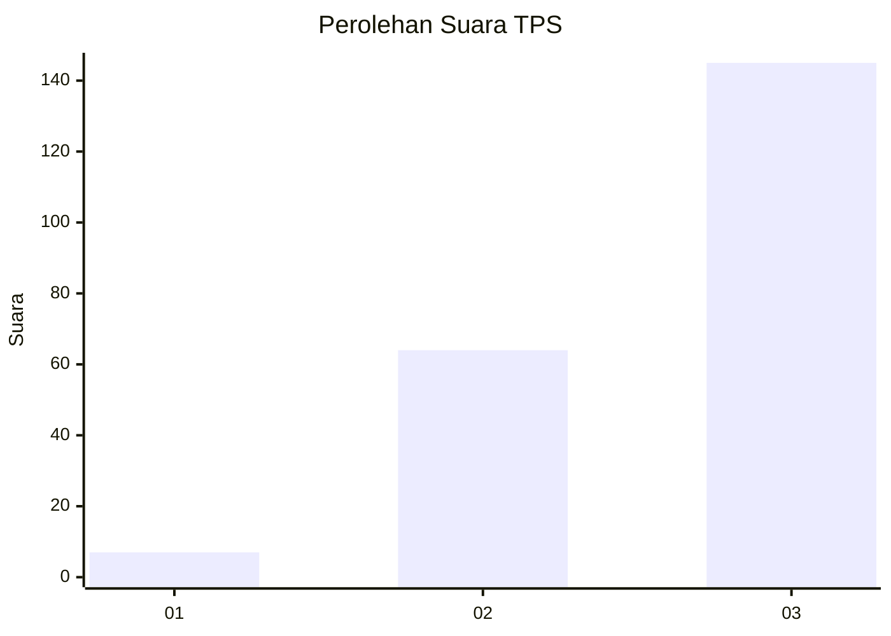
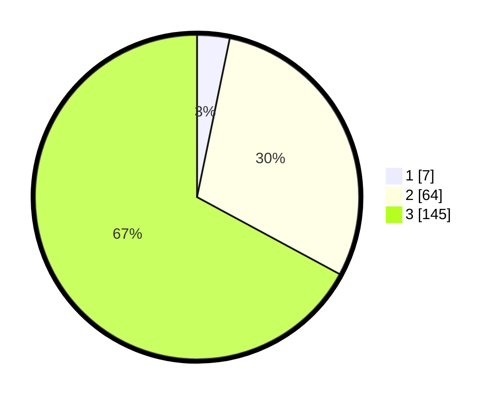

# Hasil

## Grafik

## Tabel

| No. | Nama Paslon    | Suara | Suara (raw) | Persentase |
|:--- |:-------------- | -----:| -----------:| ----------:|
| 1   | ANIES MUHAIMIN | 7     | [7][p-1]    | 3,24       |
| 2   | PRABOWO GIBRAN | 64    | [64][p-2]   | 29,63      |
| 3   | GANJAR MAHFUD  | 145   | [145][p-3]  | 67,13      |

[p-1]: https://github.com/gigit-pemilu/pemilu-2024-51-bali/blob/main/pilpres/hitung-suara/sub/51-bali/sub/02-tabanan/sub/01-selemadeg/sub/2001-bajera/sub/010-tps/sub/paslon-1.txt
[p-2]: https://github.com/gigit-pemilu/pemilu-2024-51-bali/blob/main/pilpres/hitung-suara/sub/51-bali/sub/02-tabanan/sub/01-selemadeg/sub/2001-bajera/sub/010-tps/sub/paslon-2.txt
[p-3]: https://github.com/gigit-pemilu/pemilu-2024-51-bali/blob/main/pilpres/hitung-suara/sub/51-bali/sub/02-tabanan/sub/01-selemadeg/sub/2001-bajera/sub/010-tps/sub/paslon-3.txt

## Foto C Plano

https://sirekap-obj-formc.kpu.go.id/5f86/pemilu/ppwp/51/02/01/20/01/5102012001010-20240214-155035--e70a9357-6da9-4dfa-a3f8-d1b1ff04e4c8.jpg

https://sirekap-obj-formc.kpu.go.id/5f86/pemilu/ppwp/51/02/01/20/01/5102012001010-20240214-155039--bf7550e4-2487-41ca-a1f0-780e121fe532.jpg

https://sirekap-obj-formc.kpu.go.id/5f86/pemilu/ppwp/51/02/01/20/01/5102012001010-20240214-155043--c6f603d4-4c83-468a-b8ce-c5aa5b7b606b.jpg

## Metadata

| Key        | Value               |
| ---------- | ------------------- |
| Time Stamp | 2024-02-15 04:00:24 |

