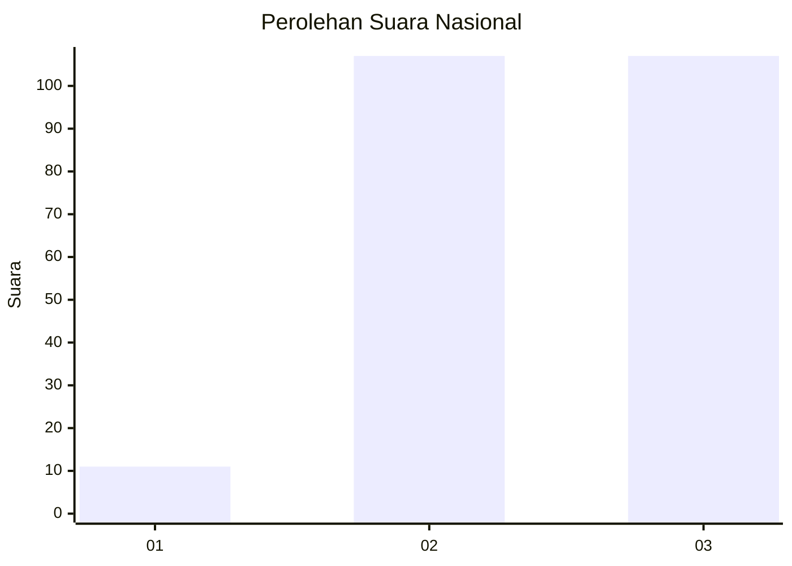
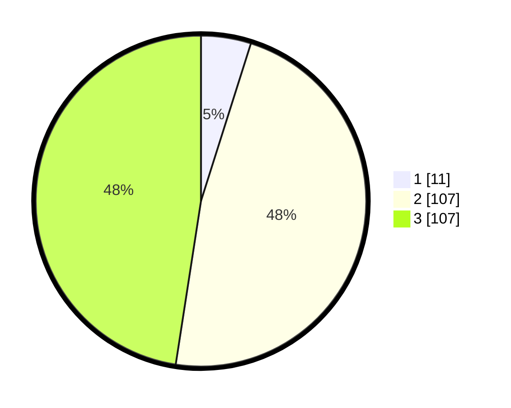

# Hasil

## Grafik

## Tabel

| No. | Nama Paslon    | Suara | Suara (raw) | Persentase |
|:--- |:-------------- | -----:| -----------:| ----------:|
| 1   | ANIES MUHAIMIN | 11    | [11][p-1]   | 4,89       |
| 2   | PRABOWO GIBRAN | 107   | [107][p-2]  | 47,56      |
| 3   | GANJAR MAHFUD  | 107   | [107][p-3]  | 47,56      |

[p-1]: https://github.com/gigit-pemilu/pemilu-2024/blob/main/pilpres/hitung-suara/sub/51-bali/sub/02-tabanan/sub/01-selemadeg/sub/2001-bajera/sub/011-tps/sub/paslon-1.txt
[p-2]: https://github.com/gigit-pemilu/pemilu-2024/blob/main/pilpres/hitung-suara/sub/51-bali/sub/02-tabanan/sub/01-selemadeg/sub/2001-bajera/sub/011-tps/sub/paslon-2.txt
[p-3]: https://github.com/gigit-pemilu/pemilu-2024/blob/main/pilpres/hitung-suara/sub/51-bali/sub/02-tabanan/sub/01-selemadeg/sub/2001-bajera/sub/011-tps/sub/paslon-3.txt

## Foto C Plano

https://sirekap-obj-formc.kpu.go.id/bfe0/pemilu/ppwp/51/02/01/20/01/5102012001011-20240214-231947--6ed3a07a-ab6b-42c7-9c5c-7e604c81e8c7.jpg

https://sirekap-obj-formc.kpu.go.id/bfe0/pemilu/ppwp/51/02/01/20/01/5102012001011-20240214-232136--3f97d39e-896f-4dd0-afcd-cac8c3894fc0.jpg

https://sirekap-obj-formc.kpu.go.id/bfe0/pemilu/ppwp/51/02/01/20/01/5102012001011-20240214-232159--02bb8eec-78f8-4154-8cca-07725dd9978c.jpg

## Metadata

| Key        | Value               |
| ---------- | ------------------- |
| Time Stamp | 2024-02-15 21:30:27 |

## DATA PEMILIH TETAP

Jumlah pemilih dalam DPT: **282**.
 * L: **132**.
 * P: **150**.

## DATA PENGGUNA HAK PILIH

Jumlah pengguna hak pilih dalam DPT: **227**.
 * L: **110**.
 * P: **117**.

Jumlah pengguna hak pilih dalam DPTb: **2**.
 * L: **1**.
 * P: **1**.

Jumlah pengguna hak pilih dalam DPK: **1**.
 * L: **1**.
 * P: **0**.

Jumlah pengguna hak pilih: **230**.
 * L: **112**.
 * P: **118**.

## JUMLAH SUARA SAH DAN TIDAK SAH

JUMLAH SELURUH SUARA SAH: **225**.

JUMLAH SUARA TIDAK SAH: **5**.

JUMLAH SELURUH SUARA SAH DAN SUARA TIDAK SAH: **230**.

