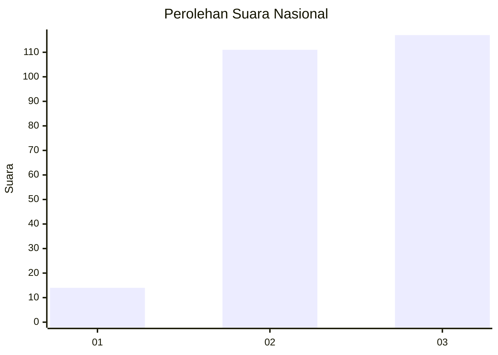
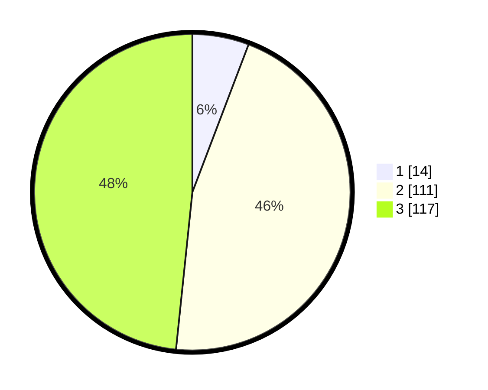

# Hasil

## Grafik

## Tabel

| No. | Nama Paslon    | Suara | Suara (raw) | Persentase |
|:--- |:-------------- | -----:| -----------:| ----------:|
| 1   | ANIES MUHAIMIN | 14    | [14][p-1]   | 5,79       |
| 2   | PRABOWO GIBRAN | 111   | [111][p-2]  | 45,87      |
| 3   | GANJAR MAHFUD  | 117   | [117][p-3]  | 48,35      |

[p-1]: https://github.com/gigit-pemilu/pemilu-2024/blob/main/pilpres/hitung-suara/sub/51-bali/sub/02-tabanan/sub/01-selemadeg/sub/2001-bajera/sub/012-tps/sub/paslon-1.txt
[p-2]: https://github.com/gigit-pemilu/pemilu-2024/blob/main/pilpres/hitung-suara/sub/51-bali/sub/02-tabanan/sub/01-selemadeg/sub/2001-bajera/sub/012-tps/sub/paslon-2.txt
[p-3]: https://github.com/gigit-pemilu/pemilu-2024/blob/main/pilpres/hitung-suara/sub/51-bali/sub/02-tabanan/sub/01-selemadeg/sub/2001-bajera/sub/012-tps/sub/paslon-3.txt

## Foto C Plano

https://sirekap-obj-formc.kpu.go.id/6f13/pemilu/ppwp/51/02/01/20/01/5102012001012-20240214-203858--8d246828-ddd8-487f-bf19-107186bbcdcf.jpg

https://sirekap-obj-formc.kpu.go.id/6f13/pemilu/ppwp/51/02/01/20/01/5102012001012-20240214-203915--633795ee-6331-4f41-94eb-f5c78598e5ad.jpg

https://sirekap-obj-formc.kpu.go.id/6f13/pemilu/ppwp/51/02/01/20/01/5102012001012-20240214-203926--f7298666-a305-4490-920f-fd70e4c3941a.jpg

## Metadata

| Key        | Value               |
| ---------- | ------------------- |
| Time Stamp | 2024-02-15 21:30:27 |

## DATA PEMILIH TETAP

Jumlah pemilih dalam DPT: **289**.
 * L: **152**.
 * P: **137**.

## DATA PENGGUNA HAK PILIH

Jumlah pengguna hak pilih dalam DPT: **247**.
 * L: **135**.
 * P: **112**.

Jumlah pengguna hak pilih dalam DPTb: **0**.
 * L: **0**.
 * P: **0**.

Jumlah pengguna hak pilih dalam DPK: **2**.
 * L: **1**.
 * P: **1**.

Jumlah pengguna hak pilih: **249**.
 * L: **136**.
 * P: **113**.

## JUMLAH SUARA SAH DAN TIDAK SAH

JUMLAH SELURUH SUARA SAH: **242**.

JUMLAH SUARA TIDAK SAH: **7**.

JUMLAH SELURUH SUARA SAH DAN SUARA TIDAK SAH: **249**.

