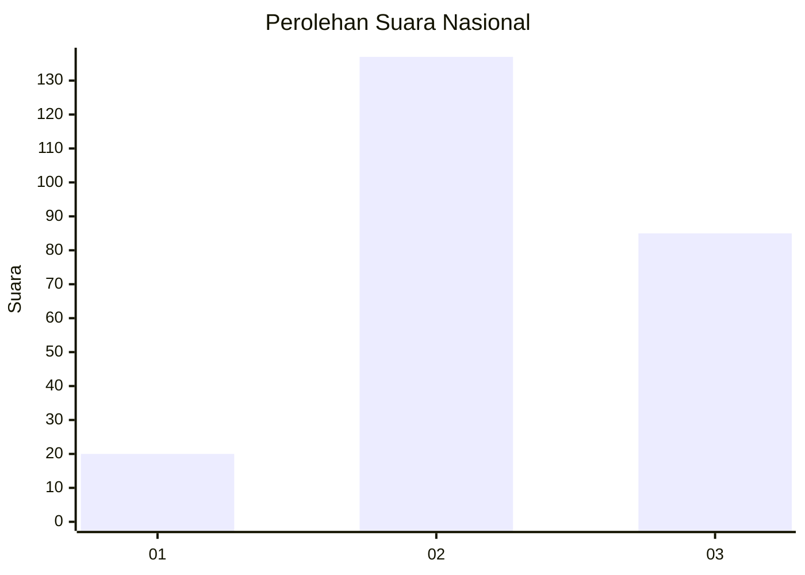
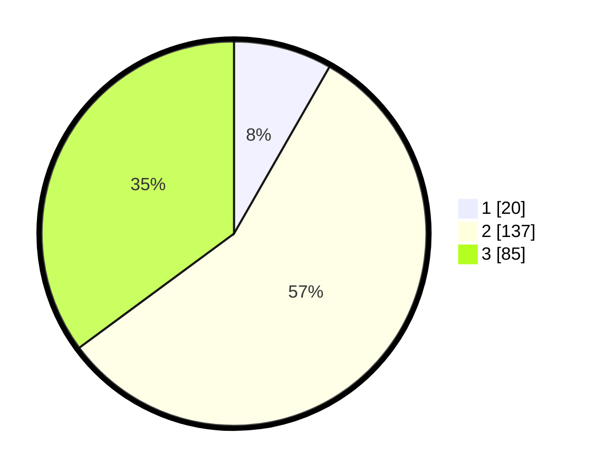

# Hasil

## Grafik

## Tabel

| No. | Nama Paslon    | Suara | Suara (raw) | Persentase |
|:--- |:-------------- | -----:| -----------:| ----------:|
| 1   | ANIES MUHAIMIN | 20    | [20][p-1]   | 8,26       |
| 2   | PRABOWO GIBRAN | 137   | [137][p-2]  | 56,61      |
| 3   | GANJAR MAHFUD  | 85    | [85][p-3]   | 35,12      |

[p-1]: https://github.com/gigit-pemilu/pemilu-2024/blob/main/pilpres/hitung-suara/sub/51-bali/sub/02-tabanan/sub/01-selemadeg/sub/2001-bajera/sub/013-tps/sub/paslon-1.txt
[p-2]: https://github.com/gigit-pemilu/pemilu-2024/blob/main/pilpres/hitung-suara/sub/51-bali/sub/02-tabanan/sub/01-selemadeg/sub/2001-bajera/sub/013-tps/sub/paslon-2.txt
[p-3]: https://github.com/gigit-pemilu/pemilu-2024/blob/main/pilpres/hitung-suara/sub/51-bali/sub/02-tabanan/sub/01-selemadeg/sub/2001-bajera/sub/013-tps/sub/paslon-3.txt

## Foto C Plano

https://sirekap-obj-formc.kpu.go.id/2fca/pemilu/ppwp/51/02/01/20/01/5102012001013-20240214-191008--57cac547-3de4-4d9d-b302-d7293dfaecb7.jpg

https://sirekap-obj-formc.kpu.go.id/2fca/pemilu/ppwp/51/02/01/20/01/5102012001013-20240214-190251--c15eac46-1a42-41c8-b922-8e1c6050e3e2.jpg

https://sirekap-obj-formc.kpu.go.id/2fca/pemilu/ppwp/51/02/01/20/01/5102012001013-20240214-191405--635fcdb0-4911-44e4-8ad2-82986cd7b607.jpg

## Metadata

| Key        | Value               |
| ---------- | ------------------- |
| Time Stamp | 2024-02-15 21:30:27 |

