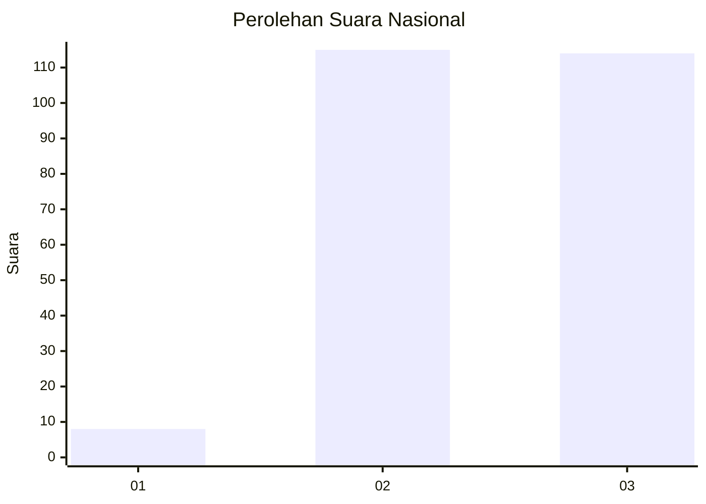
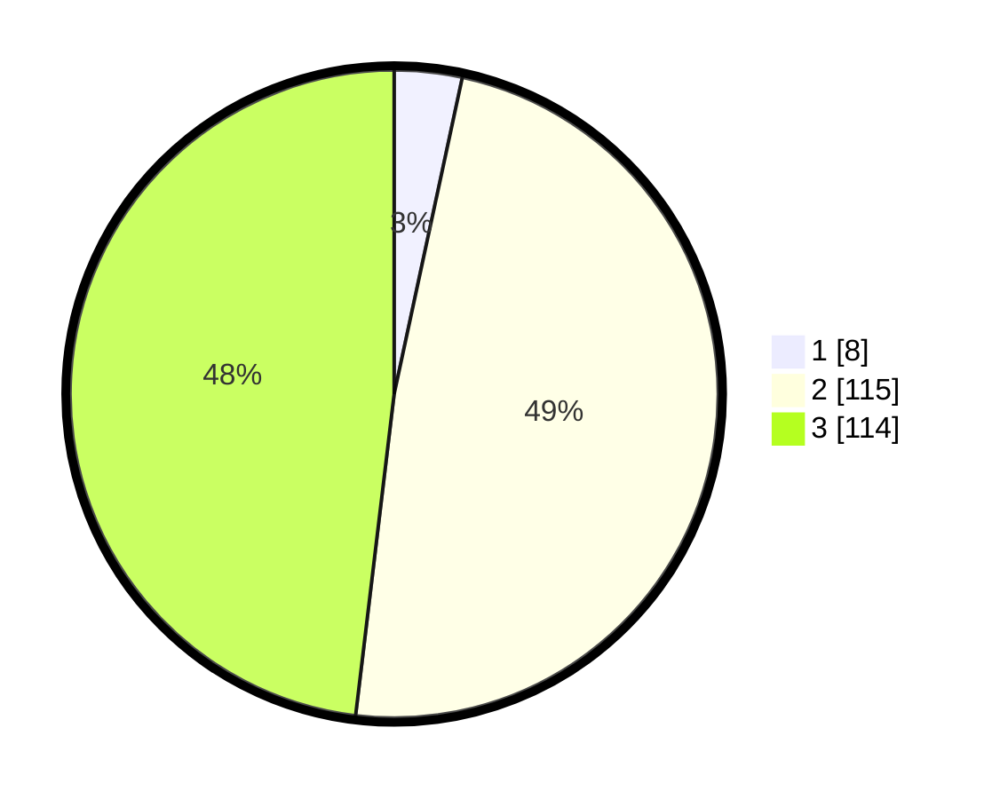

# Hasil

## Grafik

## Tabel

| No. | Nama Paslon    | Suara | Suara (raw) | Persentase |
|:--- |:-------------- | -----:| -----------:| ----------:|
| 1   | ANIES MUHAIMIN | 8     | [8][p-1]    | 3,38       |
| 2   | PRABOWO GIBRAN | 115   | [115][p-2]  | 48,52      |
| 3   | GANJAR MAHFUD  | 114   | [114][p-3]  | 48,10      |

[p-1]: https://github.com/gigit-pemilu/pemilu-2024/blob/main/pilpres/hitung-suara/sub/51-bali/sub/02-tabanan/sub/01-selemadeg/sub/2001-bajera/sub/014-tps/sub/paslon-1.txt
[p-2]: https://github.com/gigit-pemilu/pemilu-2024/blob/main/pilpres/hitung-suara/sub/51-bali/sub/02-tabanan/sub/01-selemadeg/sub/2001-bajera/sub/014-tps/sub/paslon-2.txt
[p-3]: https://github.com/gigit-pemilu/pemilu-2024/blob/main/pilpres/hitung-suara/sub/51-bali/sub/02-tabanan/sub/01-selemadeg/sub/2001-bajera/sub/014-tps/sub/paslon-3.txt

## Foto C Plano

https://sirekap-obj-formc.kpu.go.id/2631/pemilu/ppwp/51/02/01/20/01/5102012001014-20240214-233040--0b6268c9-dd5f-47d2-b6a9-7c7f1f3886e1.jpg

https://sirekap-obj-formc.kpu.go.id/2631/pemilu/ppwp/51/02/01/20/01/5102012001014-20240214-233114--674e7009-a3a0-4a38-8906-4f9d140e3c0d.jpg

https://sirekap-obj-formc.kpu.go.id/2631/pemilu/ppwp/51/02/01/20/01/5102012001014-20240214-233121--306db7c1-6643-46ff-a612-3888d0e190ec.jpg

## Metadata

| Key        | Value               |
| ---------- | ------------------- |
| Time Stamp | 2024-02-15 15:00:29 |

## DATA PEMILIH TETAP

Jumlah pemilih dalam DPT: **291**.
 * L: **129**.
 * P: **162**.

## DATA PENGGUNA HAK PILIH

Jumlah pengguna hak pilih dalam DPT: **240**.
 * L: **111**.
 * P: **129**.

Jumlah pengguna hak pilih dalam DPTb: **0**.
 * L: **0**.
 * P: **0**.

Jumlah pengguna hak pilih dalam DPK: **1**.
 * L: **1**.
 * P: **0**.

Jumlah pengguna hak pilih: **241**.
 * L: **112**.
 * P: **129**.

## JUMLAH SUARA SAH DAN TIDAK SAH

JUMLAH SELURUH SUARA SAH: **237**.

JUMLAH SUARA TIDAK SAH: **4**.

JUMLAH SELURUH SUARA SAH DAN SUARA TIDAK SAH: **241**.

