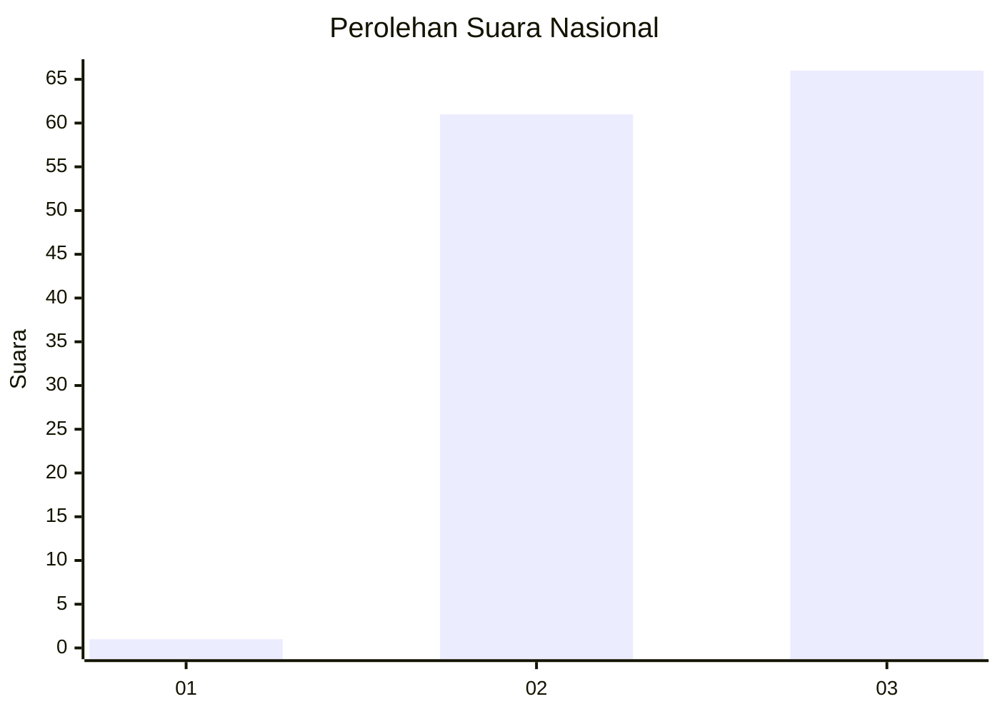
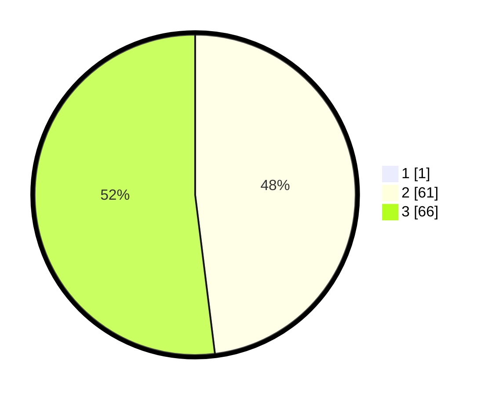

# Hasil

## Grafik

## Tabel

| No. | Nama Paslon    | Suara | Suara (raw) | Persentase |
|:--- |:-------------- | -----:| -----------:| ----------:|
| 1   | ANIES MUHAIMIN | 1     | [1][p-1]    | 0,78       |
| 2   | PRABOWO GIBRAN | 61    | [61][p-2]   | 47,66      |
| 3   | GANJAR MAHFUD  | 66    | [66][p-3]   | 51,56      |

[p-1]: https://github.com/gigit-pemilu/pemilu-2024/blob/main/pilpres/hitung-suara/sub/51-bali/sub/02-tabanan/sub/01-selemadeg/sub/2002-wanagiri/sub/003-tps/sub/paslon-1.txt
[p-2]: https://github.com/gigit-pemilu/pemilu-2024/blob/main/pilpres/hitung-suara/sub/51-bali/sub/02-tabanan/sub/01-selemadeg/sub/2002-wanagiri/sub/003-tps/sub/paslon-2.txt
[p-3]: https://github.com/gigit-pemilu/pemilu-2024/blob/main/pilpres/hitung-suara/sub/51-bali/sub/02-tabanan/sub/01-selemadeg/sub/2002-wanagiri/sub/003-tps/sub/paslon-3.txt

## Foto C Plano

https://sirekap-obj-formc.kpu.go.id/bc72/pemilu/ppwp/51/02/01/20/02/5102012002003-20240216-033824--96357639-fd18-4967-aa65-05eea422a618.jpg

https://sirekap-obj-formc.kpu.go.id/bc72/pemilu/ppwp/51/02/01/20/02/5102012002003-20240216-033826--6074351a-fbb9-480e-b0d7-80d7f52c02c2.jpg

https://sirekap-obj-formc.kpu.go.id/bc72/pemilu/ppwp/51/02/01/20/02/5102012002003-20240216-033825--cc159e28-7c8e-4060-8b0a-a49c9ca019e7.jpg

## Metadata

| Key        | Value               |
| ---------- | ------------------- |
| Time Stamp | 2024-02-16 09:30:28 |

## DATA PEMILIH TETAP

Jumlah pemilih dalam DPT: **173**.
 * L: **93**.
 * P: **80**.

## DATA PENGGUNA HAK PILIH

Jumlah pengguna hak pilih dalam DPT: **130**.
 * L: **72**.
 * P: **58**.

Jumlah pengguna hak pilih dalam DPTb: **0**.
 * L: **0**.
 * P: **0**.

Jumlah pengguna hak pilih dalam DPK: **2**.
 * L: **2**.
 * P: **0**.

Jumlah pengguna hak pilih: **132**.
 * L: **74**.
 * P: **58**.

## JUMLAH SUARA SAH DAN TIDAK SAH

JUMLAH SELURUH SUARA SAH: **128**.

JUMLAH SUARA TIDAK SAH: **4**.

JUMLAH SELURUH SUARA SAH DAN SUARA TIDAK SAH: **132**.

