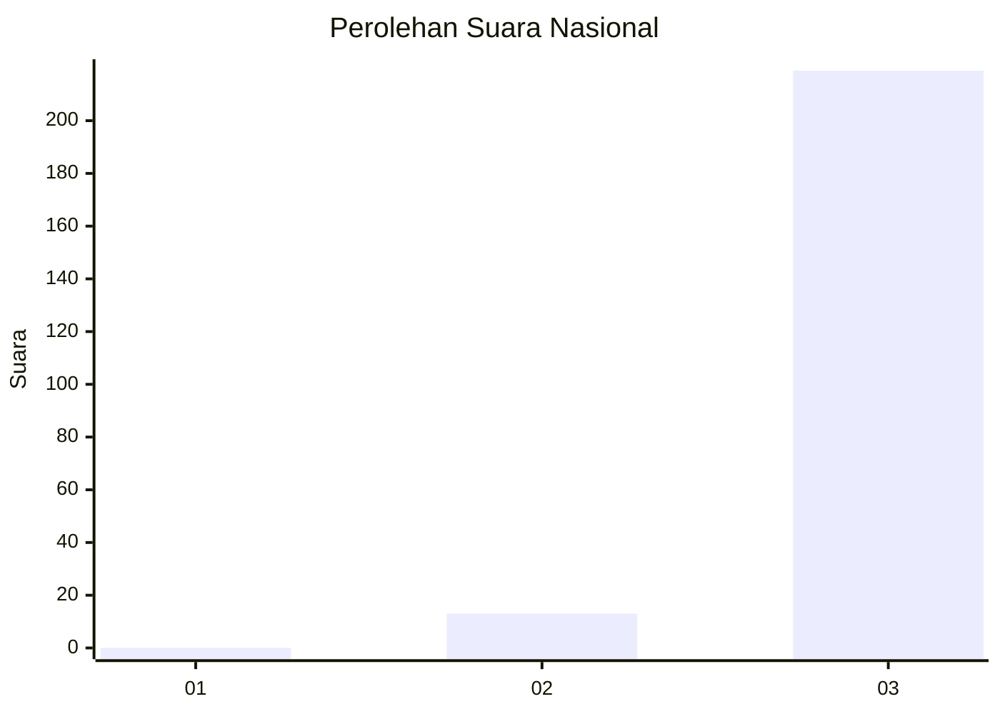
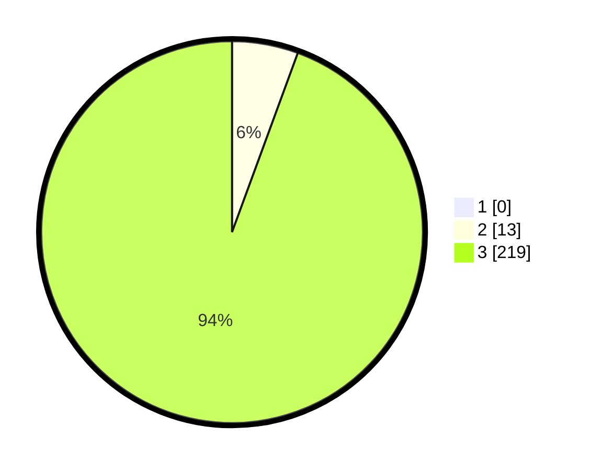

# Hasil

## Grafik

## Tabel

| No. | Nama Paslon    | Suara | Suara (raw) | Persentase |
|:--- |:-------------- | -----:| -----------:| ----------:|
| 1   | ANIES MUHAIMIN | 0     | [0][p-1]    | 0,00       |
| 2   | PRABOWO GIBRAN | 13    | [13][p-2]   | 5,60       |
| 3   | GANJAR MAHFUD  | 219   | [219][p-3]  | 94,40      |

[p-1]: https://github.com/gigit-pemilu/pemilu-2024/blob/main/pilpres/hitung-suara/sub/51-bali/sub/02-tabanan/sub/01-selemadeg/sub/2002-wanagiri/sub/004-tps/sub/paslon-1.txt
[p-2]: https://github.com/gigit-pemilu/pemilu-2024/blob/main/pilpres/hitung-suara/sub/51-bali/sub/02-tabanan/sub/01-selemadeg/sub/2002-wanagiri/sub/004-tps/sub/paslon-2.txt
[p-3]: https://github.com/gigit-pemilu/pemilu-2024/blob/main/pilpres/hitung-suara/sub/51-bali/sub/02-tabanan/sub/01-selemadeg/sub/2002-wanagiri/sub/004-tps/sub/paslon-3.txt

## Foto C Plano

https://sirekap-obj-formc.kpu.go.id/168a/pemilu/ppwp/51/02/01/20/02/5102012002004-20240216-021003--f472b838-0326-46b6-ac15-37bcfb4a5ed9.jpg

https://sirekap-obj-formc.kpu.go.id/168a/pemilu/ppwp/51/02/01/20/02/5102012002004-20240216-021004--57e37602-3fe3-4813-ad75-5a43e250bd98.jpg

https://sirekap-obj-formc.kpu.go.id/168a/pemilu/ppwp/51/02/01/20/02/5102012002004-20240216-021003--d15cbaa2-d2ee-40ff-8418-9ccbc5100d77.jpg

## Metadata

| Key        | Value               |
| ---------- | ------------------- |
| Time Stamp | 2024-02-16 09:30:28 |

## DATA PEMILIH TETAP

Jumlah pemilih dalam DPT: **291**.
 * L: **142**.
 * P: **149**.

## DATA PENGGUNA HAK PILIH

Jumlah pengguna hak pilih dalam DPT: **234**.
 * L: **116**.
 * P: **118**.

Jumlah pengguna hak pilih dalam DPTb: **0**.
 * L: **0**.
 * P: **0**.

Jumlah pengguna hak pilih dalam DPK: **0**.
 * L: **0**.
 * P: **0**.

Jumlah pengguna hak pilih: **234**.
 * L: **116**.
 * P: **118**.

## JUMLAH SUARA SAH DAN TIDAK SAH

JUMLAH SELURUH SUARA SAH: **232**.

JUMLAH SUARA TIDAK SAH: **2**.

JUMLAH SELURUH SUARA SAH DAN SUARA TIDAK SAH: **234**.

