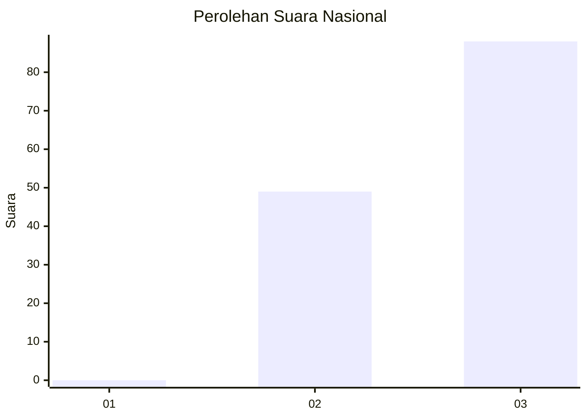
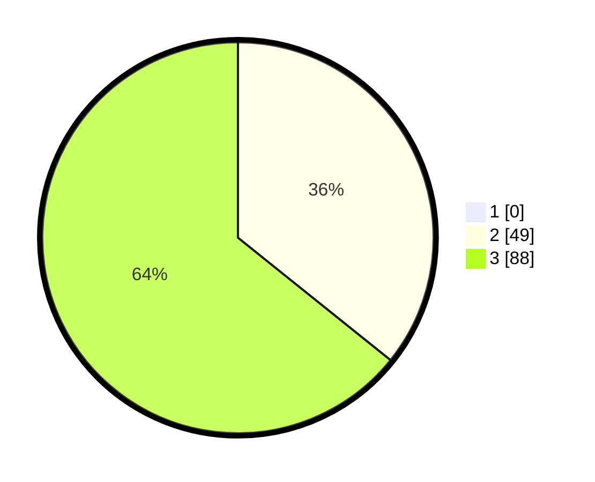

# Hasil

## Grafik

## Tabel

| No. | Nama Paslon    | Suara | Suara (raw) | Persentase |
|:--- |:-------------- | -----:| -----------:| ----------:|
| 1   | ANIES MUHAIMIN | 0     | [0][p-1]    | 0,00       |
| 2   | PRABOWO GIBRAN | 49    | [49][p-2]   | 35,77      |
| 3   | GANJAR MAHFUD  | 88    | [88][p-3]   | 64,23      |

[p-1]: https://github.com/gigit-pemilu/pemilu-2024/blob/main/pilpres/hitung-suara/sub/51-bali/sub/02-tabanan/sub/01-selemadeg/sub/2002-wanagiri/sub/006-tps/sub/paslon-1.txt
[p-2]: https://github.com/gigit-pemilu/pemilu-2024/blob/main/pilpres/hitung-suara/sub/51-bali/sub/02-tabanan/sub/01-selemadeg/sub/2002-wanagiri/sub/006-tps/sub/paslon-2.txt
[p-3]: https://github.com/gigit-pemilu/pemilu-2024/blob/main/pilpres/hitung-suara/sub/51-bali/sub/02-tabanan/sub/01-selemadeg/sub/2002-wanagiri/sub/006-tps/sub/paslon-3.txt

## Foto C Plano

https://sirekap-obj-formc.kpu.go.id/f171/pemilu/ppwp/51/02/01/20/02/5102012002006-20240215-221346--35e30f89-0ab0-4dc6-8c39-e46fe38dee11.jpg

https://sirekap-obj-formc.kpu.go.id/f171/pemilu/ppwp/51/02/01/20/02/5102012002006-20240215-221348--615495b6-59e6-46c0-b4ae-cab285c0160c.jpg

https://sirekap-obj-formc.kpu.go.id/f171/pemilu/ppwp/51/02/01/20/02/5102012002006-20240215-221347--ebaae559-2240-4f7a-8d0f-9c2652853767.jpg

## Metadata

| Key        | Value               |
| ---------- | ------------------- |
| Time Stamp | 2024-02-15 23:29:50 |

## DATA PEMILIH TETAP

Jumlah pemilih dalam DPT: **194**.
 * L: **102**.
 * P: **92**.

## DATA PENGGUNA HAK PILIH

Jumlah pengguna hak pilih dalam DPT: **141**.
 * L: **76**.
 * P: **65**.

Jumlah pengguna hak pilih dalam DPTb: **0**.
 * L: **0**.
 * P: **0**.

Jumlah pengguna hak pilih dalam DPK: **0**.
 * L: **0**.
 * P: **0**.

Jumlah pengguna hak pilih: **141**.
 * L: **76**.
 * P: **65**.

## JUMLAH SUARA SAH DAN TIDAK SAH

JUMLAH SELURUH SUARA SAH: **137**.

JUMLAH SUARA TIDAK SAH: **4**.

JUMLAH SELURUH SUARA SAH DAN SUARA TIDAK SAH: **141**.

