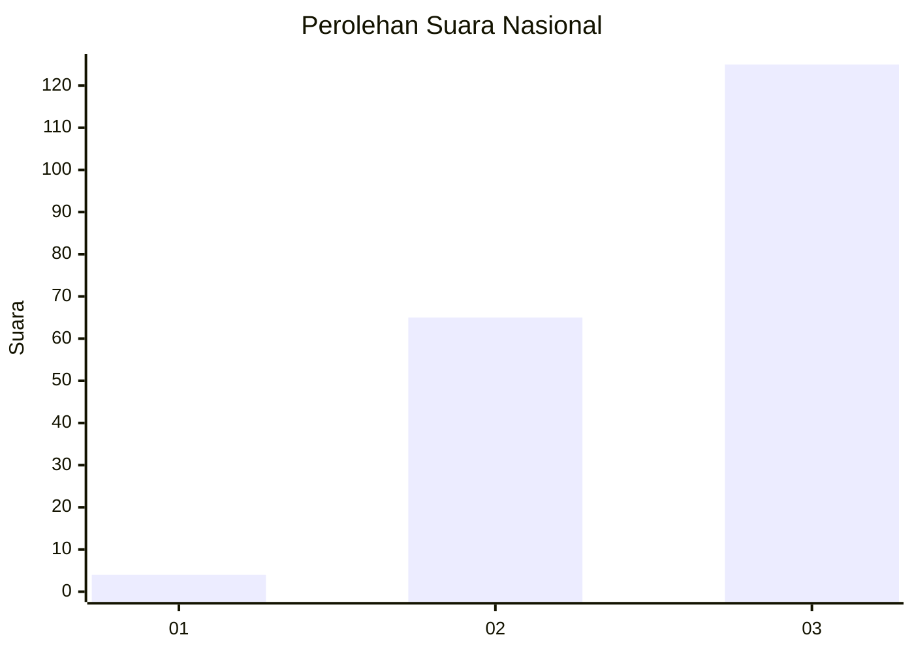
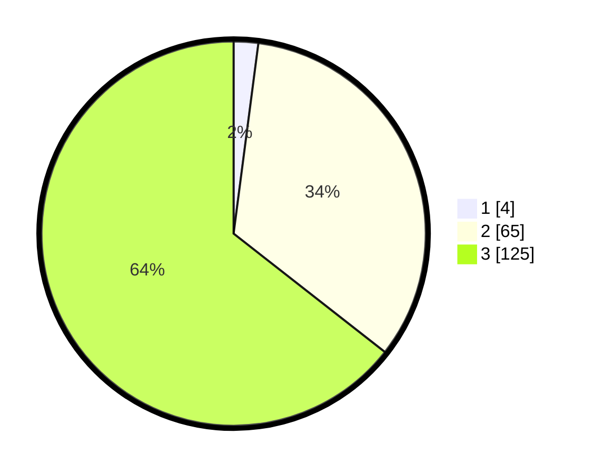

# Hasil

## Grafik

## Tabel

| No. | Nama Paslon    | Suara | Suara (raw) | Persentase |
|:--- |:-------------- | -----:| -----------:| ----------:|
| 1   | ANIES MUHAIMIN | 4     | [4][p-1]    | 2,06       |
| 2   | PRABOWO GIBRAN | 65    | [65][p-2]   | 33,51      |
| 3   | GANJAR MAHFUD  | 125   | [125][p-3]  | 64,43      |

[p-1]: https://github.com/gigit-pemilu/pemilu-2024/blob/main/pilpres/hitung-suara/sub/51-bali/sub/02-tabanan/sub/01-selemadeg/sub/2002-wanagiri/sub/008-tps/sub/paslon-1.txt
[p-2]: https://github.com/gigit-pemilu/pemilu-2024/blob/main/pilpres/hitung-suara/sub/51-bali/sub/02-tabanan/sub/01-selemadeg/sub/2002-wanagiri/sub/008-tps/sub/paslon-2.txt
[p-3]: https://github.com/gigit-pemilu/pemilu-2024/blob/main/pilpres/hitung-suara/sub/51-bali/sub/02-tabanan/sub/01-selemadeg/sub/2002-wanagiri/sub/008-tps/sub/paslon-3.txt

## Foto C Plano

https://sirekap-obj-formc.kpu.go.id/01b3/pemilu/ppwp/51/02/01/20/02/5102012002008-20240216-170939--ab8c003c-1e1a-4107-84f8-ac820be36a3f.jpg

https://sirekap-obj-formc.kpu.go.id/01b3/pemilu/ppwp/51/02/01/20/02/5102012002008-20240216-170940--5e658fa7-63da-4aaa-9046-77ccb1bb6e14.jpg

https://sirekap-obj-formc.kpu.go.id/01b3/pemilu/ppwp/51/02/01/20/02/5102012002008-20240216-170939--4afccc96-c165-4206-b07d-b87efa6964be.jpg

## Metadata

| Key        | Value               |
| ---------- | ------------------- |
| Time Stamp | 2024-02-19 06:16:00 |

## DATA PEMILIH TETAP

Jumlah pemilih dalam DPT: **245**.
 * L: **123**.
 * P: **122**.

## DATA PENGGUNA HAK PILIH

Jumlah pengguna hak pilih dalam DPT: **199**.
 * L: **102**.
 * P: **97**.

Jumlah pengguna hak pilih dalam DPTb: **0**.
 * L: **0**.
 * P: **0**.

Jumlah pengguna hak pilih dalam DPK: **1**.
 * L: **1**.
 * P: **0**.

Jumlah pengguna hak pilih: **200**.
 * L: **103**.
 * P: **97**.

## JUMLAH SUARA SAH DAN TIDAK SAH

JUMLAH SELURUH SUARA SAH: **194**.

JUMLAH SUARA TIDAK SAH: **6**.

JUMLAH SELURUH SUARA SAH DAN SUARA TIDAK SAH: **200**.

