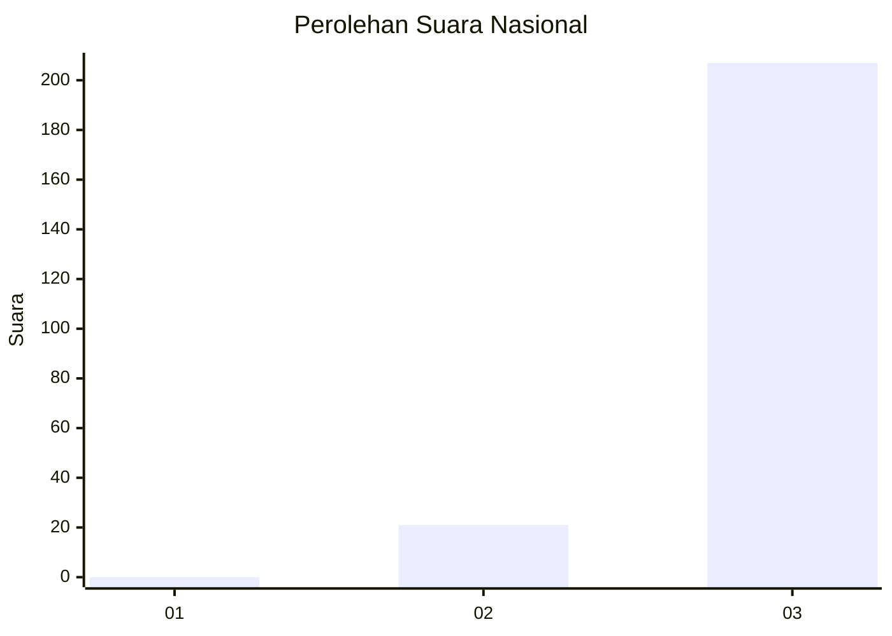
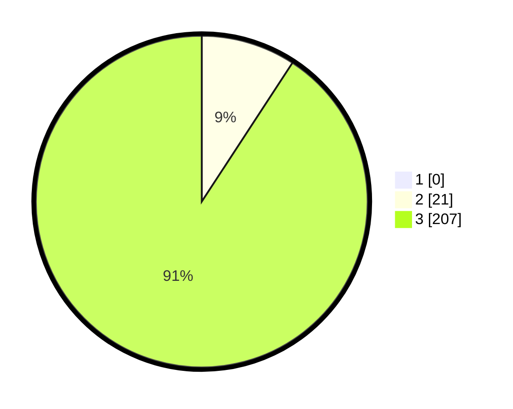

# Hasil

## Grafik

## Tabel

| No. | Nama Paslon    | Suara | Suara (raw) | Persentase |
|:--- |:-------------- | -----:| -----------:| ----------:|
| 1   | ANIES MUHAIMIN | 0     | [0][p-1]    | 0,00       |
| 2   | PRABOWO GIBRAN | 21    | [21][p-2]   | 9,21       |
| 3   | GANJAR MAHFUD  | 207   | [207][p-3]  | 90,79      |

[p-1]: https://github.com/gigit-pemilu/pemilu-2024/blob/main/pilpres/hitung-suara/sub/51-bali/sub/02-tabanan/sub/01-selemadeg/sub/2002-wanagiri/sub/009-tps/sub/paslon-1.txt
[p-2]: https://github.com/gigit-pemilu/pemilu-2024/blob/main/pilpres/hitung-suara/sub/51-bali/sub/02-tabanan/sub/01-selemadeg/sub/2002-wanagiri/sub/009-tps/sub/paslon-2.txt
[p-3]: https://github.com/gigit-pemilu/pemilu-2024/blob/main/pilpres/hitung-suara/sub/51-bali/sub/02-tabanan/sub/01-selemadeg/sub/2002-wanagiri/sub/009-tps/sub/paslon-3.txt

## Foto C Plano

https://sirekap-obj-formc.kpu.go.id/509d/pemilu/ppwp/51/02/01/20/02/5102012002009-20240216-224711--48b1dd42-3feb-43fd-bcf5-10419318f8b9.jpg

https://sirekap-obj-formc.kpu.go.id/509d/pemilu/ppwp/51/02/01/20/02/5102012002009-20240216-224712--b34b62a0-d37c-4be0-9d68-7d5f7479ff34.jpg

https://sirekap-obj-formc.kpu.go.id/509d/pemilu/ppwp/51/02/01/20/02/5102012002009-20240216-224712--a683602f-c1f8-48d1-9b26-db71a1caa8d3.jpg

## Metadata

| Key        | Value               |
| ---------- | ------------------- |
| Time Stamp | 2024-02-20 23:00:00 |

## DATA PEMILIH TETAP

Jumlah pemilih dalam DPT: **0**.
 * L: **0**.
 * P: **0**.

## DATA PENGGUNA HAK PILIH

Jumlah pengguna hak pilih dalam DPT: **0**.
 * L: **0**.
 * P: **0**.

Jumlah pengguna hak pilih dalam DPTb: **0**.
 * L: **0**.
 * P: **0**.

Jumlah pengguna hak pilih dalam DPK: **0**.
 * L: **0**.
 * P: **0**.

Jumlah pengguna hak pilih: **0**.
 * L: **0**.
 * P: **0**.

## JUMLAH SUARA SAH DAN TIDAK SAH

JUMLAH SELURUH SUARA SAH: **228**.

JUMLAH SUARA TIDAK SAH: **1**.

JUMLAH SELURUH SUARA SAH DAN SUARA TIDAK SAH: **229**.

