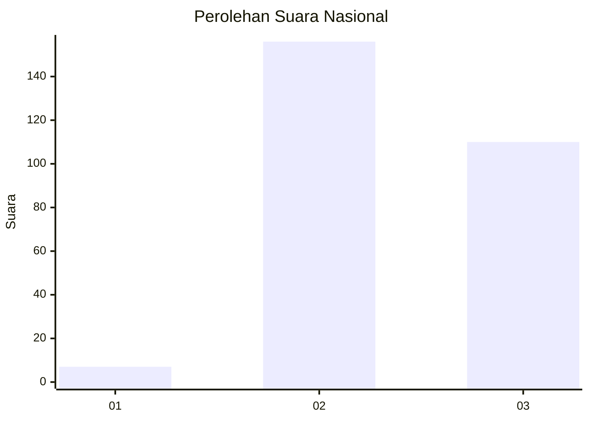
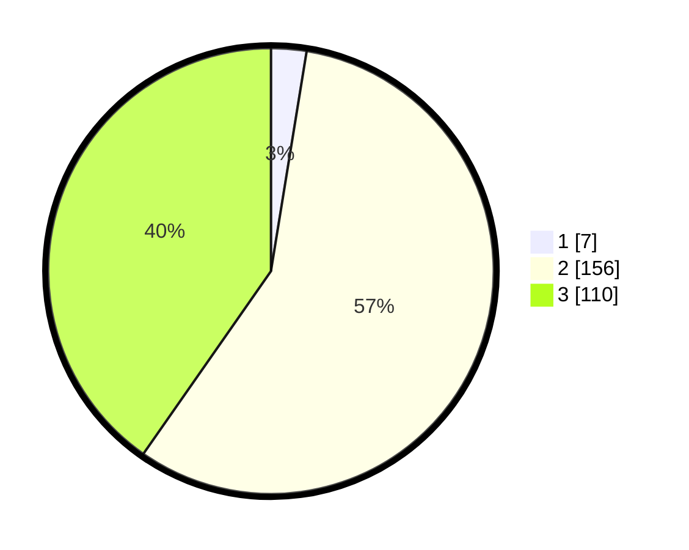

# Hasil

## Grafik

## Tabel

| No. | Nama Paslon    | Suara | Suara (raw) | Persentase |
|:--- |:-------------- | -----:| -----------:| ----------:|
| 1   | ANIES MUHAIMIN | 7     | [7][p-1]    | 2,56       |
| 2   | PRABOWO GIBRAN | 156   | [156][p-2]  | 57,14      |
| 3   | GANJAR MAHFUD  | 110   | [110][p-3]  | 40,29      |

[p-1]: https://github.com/gigit-pemilu/pemilu-2024/blob/main/pilpres/hitung-suara/sub/51-bali/sub/02-tabanan/sub/01-selemadeg/sub/2003-pupuan-sawah/sub/001-tps/sub/paslon-1.txt
[p-2]: https://github.com/gigit-pemilu/pemilu-2024/blob/main/pilpres/hitung-suara/sub/51-bali/sub/02-tabanan/sub/01-selemadeg/sub/2003-pupuan-sawah/sub/001-tps/sub/paslon-2.txt
[p-3]: https://github.com/gigit-pemilu/pemilu-2024/blob/main/pilpres/hitung-suara/sub/51-bali/sub/02-tabanan/sub/01-selemadeg/sub/2003-pupuan-sawah/sub/001-tps/sub/paslon-3.txt

## Foto C Plano

https://sirekap-obj-formc.kpu.go.id/aa7f/pemilu/ppwp/51/02/01/20/03/5102012003001-20240214-192838--b8f505fd-be6d-4ad3-b0da-0d78763ec7dc.jpg

https://sirekap-obj-formc.kpu.go.id/aa7f/pemilu/ppwp/51/02/01/20/03/5102012003001-20240214-155805--9f49f9c8-f9c7-4645-9238-a682c7b04ec0.jpg

https://sirekap-obj-formc.kpu.go.id/aa7f/pemilu/ppwp/51/02/01/20/03/5102012003001-20240214-155800--e5fed528-da47-4852-8a92-49fdb0fac6a1.jpg

## Metadata

| Key        | Value               |
| ---------- | ------------------- |
| Time Stamp | 2024-02-14 21:46:01 |

## DATA PEMILIH TETAP

Jumlah pemilih dalam DPT: **292**.
 * L: **140**.
 * P: **152**.

## DATA PENGGUNA HAK PILIH

Jumlah pengguna hak pilih dalam DPT: **277**.
 * L: **131**.
 * P: **146**.

Jumlah pengguna hak pilih dalam DPTb: **0**.
 * L: **0**.
 * P: **0**.

Jumlah pengguna hak pilih dalam DPK: **0**.
 * L: **0**.
 * P: **0**.

Jumlah pengguna hak pilih: **277**.
 * L: **131**.
 * P: **146**.

## JUMLAH SUARA SAH DAN TIDAK SAH

JUMLAH SELURUH SUARA SAH: **273**.

JUMLAH SUARA TIDAK SAH: **4**.

JUMLAH SELURUH SUARA SAH DAN SUARA TIDAK SAH: **277**.

