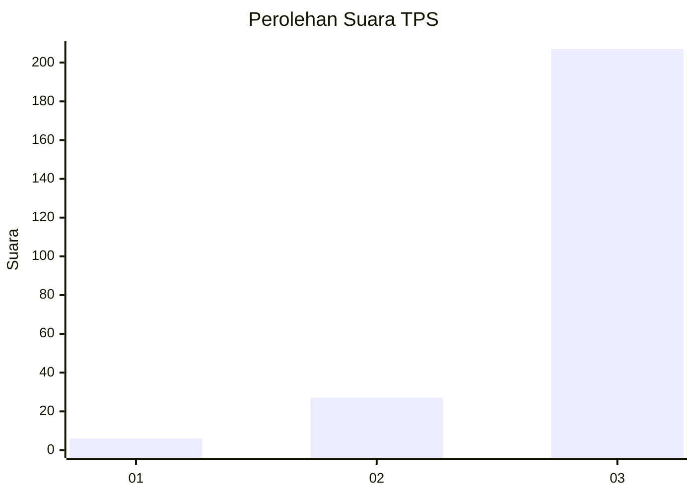
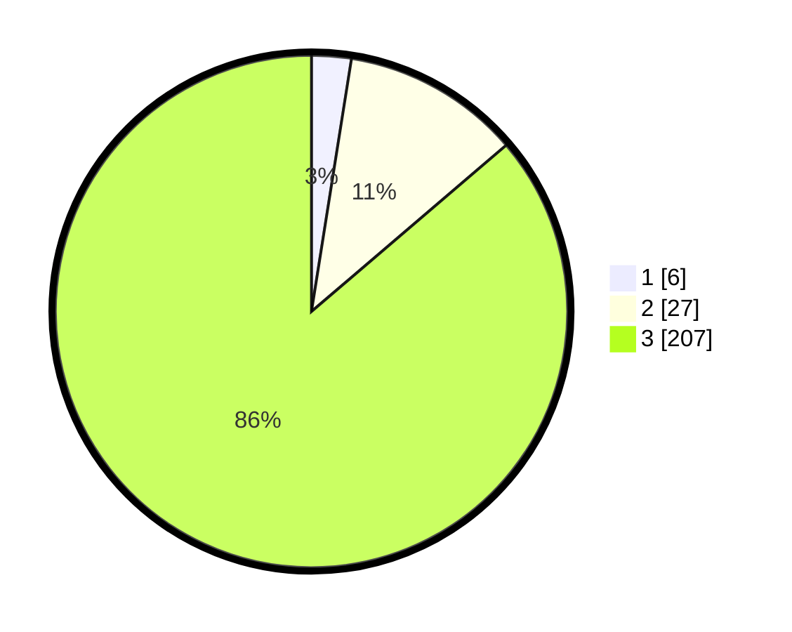

# Hasil

## Grafik

## Tabel

| No. | Nama Paslon    | Suara | Suara (raw) | Persentase |
|:--- |:-------------- | -----:| -----------:| ----------:|
| 1   | ANIES MUHAIMIN | 6     | [6][p-1]    | 2,50       |
| 2   | PRABOWO GIBRAN | 27    | [27][p-2]   | 11,25      |
| 3   | GANJAR MAHFUD  | 207   | [207][p-3]  | 86,25      |

[p-1]: https://github.com/gigit-pemilu/pemilu-2024-51-bali/blob/main/pilpres/hitung-suara/sub/51-bali/sub/02-tabanan/sub/01-selemadeg/sub/2003-pupuan-sawah/sub/002-tps/sub/paslon-1.txt
[p-2]: https://github.com/gigit-pemilu/pemilu-2024-51-bali/blob/main/pilpres/hitung-suara/sub/51-bali/sub/02-tabanan/sub/01-selemadeg/sub/2003-pupuan-sawah/sub/002-tps/sub/paslon-2.txt
[p-3]: https://github.com/gigit-pemilu/pemilu-2024-51-bali/blob/main/pilpres/hitung-suara/sub/51-bali/sub/02-tabanan/sub/01-selemadeg/sub/2003-pupuan-sawah/sub/002-tps/sub/paslon-3.txt

## Foto C Plano

https://sirekap-obj-formc.kpu.go.id/c9cc/pemilu/ppwp/51/02/01/20/03/5102012003002-20240215-030710--99f7a2d2-8458-4a88-a521-788cff78be2e.jpg

https://sirekap-obj-formc.kpu.go.id/c9cc/pemilu/ppwp/51/02/01/20/03/5102012003002-20240215-030912--d940c51b-8918-4678-973e-5001c73640a1.jpg

https://sirekap-obj-formc.kpu.go.id/c9cc/pemilu/ppwp/51/02/01/20/03/5102012003002-20240215-031017--00914b37-4d0f-484f-acbf-07ff2d9487ba.jpg

## Metadata

| Key        | Value               |
| ---------- | ------------------- |
| Time Stamp | 2024-02-15 05:00:24 |

