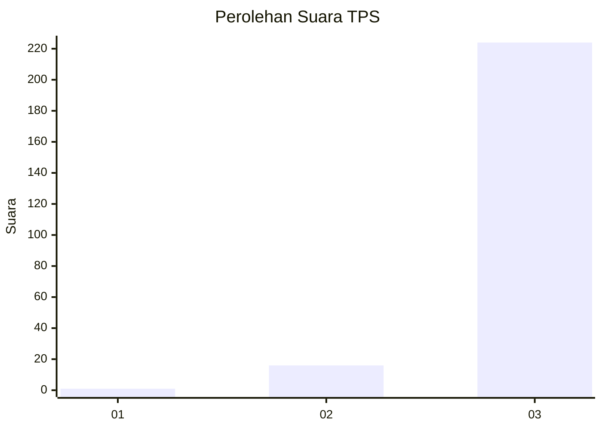
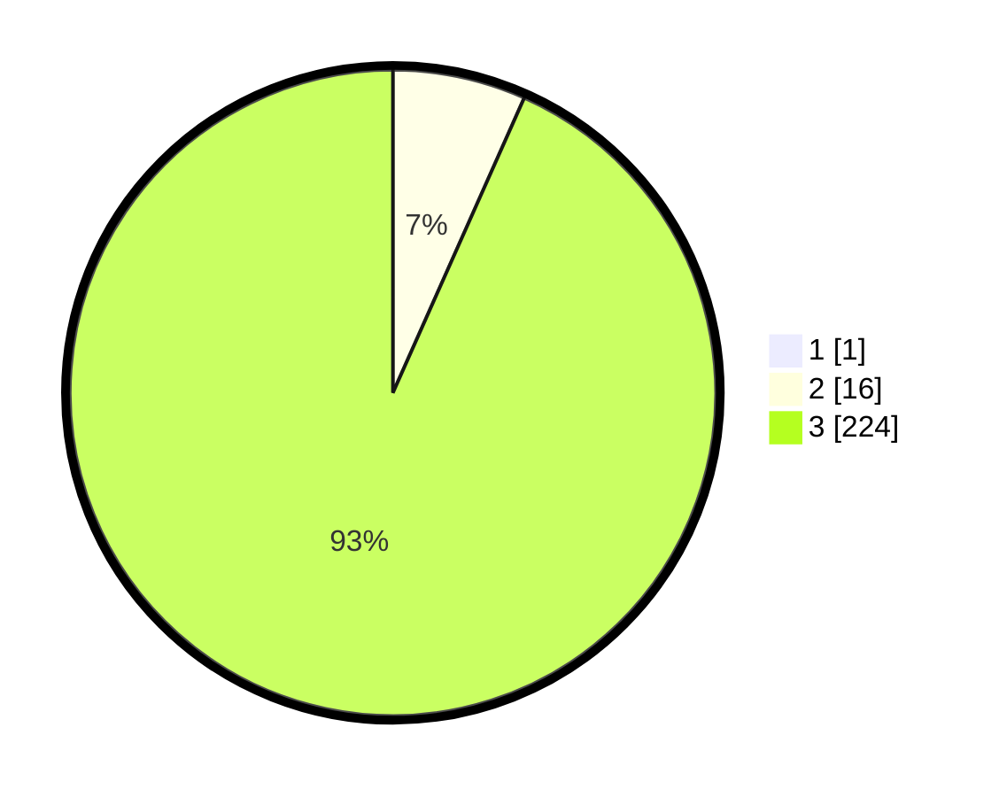

# Hasil

## Grafik

## Tabel

| No. | Nama Paslon    | Suara | Suara (raw) | Persentase |
|:--- |:-------------- | -----:| -----------:| ----------:|
| 1   | ANIES MUHAIMIN | 1     | [1][p-1]    | 0,41       |
| 2   | PRABOWO GIBRAN | 16    | [16][p-2]   | 6,64       |
| 3   | GANJAR MAHFUD  | 224   | [224][p-3]  | 92,95      |

[p-1]: https://github.com/gigit-pemilu/pemilu-2024-51-bali/blob/main/pilpres/hitung-suara/sub/51-bali/sub/02-tabanan/sub/01-selemadeg/sub/2003-pupuan-sawah/sub/003-tps/sub/paslon-1.txt
[p-2]: https://github.com/gigit-pemilu/pemilu-2024-51-bali/blob/main/pilpres/hitung-suara/sub/51-bali/sub/02-tabanan/sub/01-selemadeg/sub/2003-pupuan-sawah/sub/003-tps/sub/paslon-2.txt
[p-3]: https://github.com/gigit-pemilu/pemilu-2024-51-bali/blob/main/pilpres/hitung-suara/sub/51-bali/sub/02-tabanan/sub/01-selemadeg/sub/2003-pupuan-sawah/sub/003-tps/sub/paslon-3.txt

## Foto C Plano

https://sirekap-obj-formc.kpu.go.id/7238/pemilu/ppwp/51/02/01/20/03/5102012003003-20240214-233559--8804b03f-f953-42e2-9cc5-03c6fe7a917c.jpg

https://sirekap-obj-formc.kpu.go.id/7238/pemilu/ppwp/51/02/01/20/03/5102012003003-20240214-221219--721d210a-a4b1-48cb-bd44-8c4d6b191f39.jpg

https://sirekap-obj-formc.kpu.go.id/7238/pemilu/ppwp/51/02/01/20/03/5102012003003-20240214-221224--27381e7f-c663-4556-af7e-eeee2420ef04.jpg

## Metadata

| Key        | Value               |
| ---------- | ------------------- |
| Time Stamp | 2024-02-15 21:30:27 |

