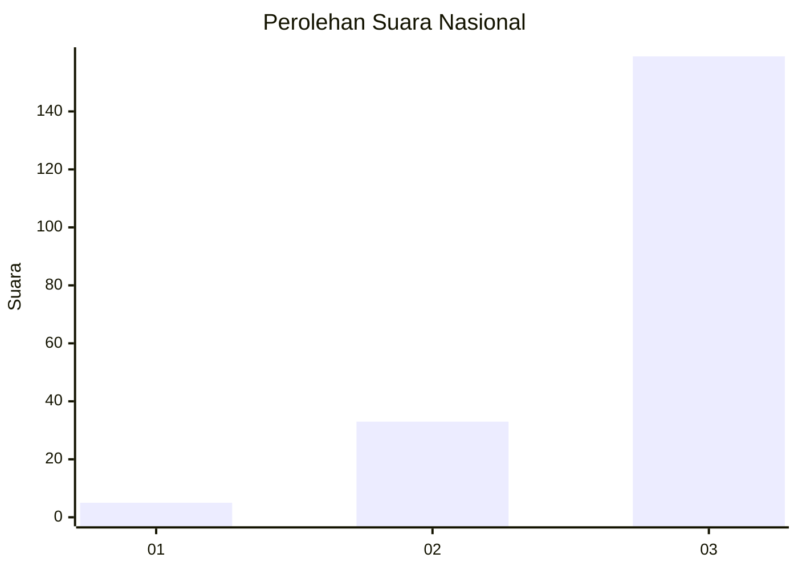
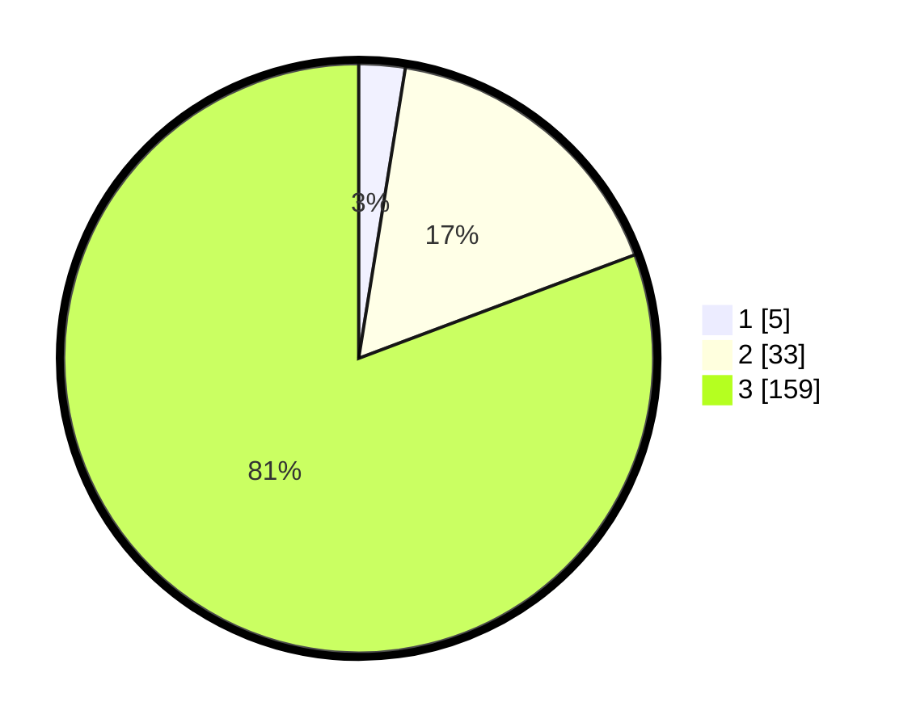

# Hasil

## Grafik

## Tabel

| No. | Nama Paslon    | Suara | Suara (raw) | Persentase |
|:--- |:-------------- | -----:| -----------:| ----------:|
| 1   | ANIES MUHAIMIN | 5     | [5][p-1]    | 2,54       |
| 2   | PRABOWO GIBRAN | 33    | [33][p-2]   | 16,75      |
| 3   | GANJAR MAHFUD  | 159   | [159][p-3]  | 80,71      |

[p-1]: https://github.com/gigit-pemilu/pemilu-2024/blob/main/pilpres/hitung-suara/sub/51-bali/sub/02-tabanan/sub/01-selemadeg/sub/2004-berembeng/sub/001-tps/sub/paslon-1.txt
[p-2]: https://github.com/gigit-pemilu/pemilu-2024/blob/main/pilpres/hitung-suara/sub/51-bali/sub/02-tabanan/sub/01-selemadeg/sub/2004-berembeng/sub/001-tps/sub/paslon-2.txt
[p-3]: https://github.com/gigit-pemilu/pemilu-2024/blob/main/pilpres/hitung-suara/sub/51-bali/sub/02-tabanan/sub/01-selemadeg/sub/2004-berembeng/sub/001-tps/sub/paslon-3.txt

## Foto C Plano

https://sirekap-obj-formc.kpu.go.id/4f95/pemilu/ppwp/51/02/01/20/04/5102012004001-20240214-232754--0e23aa59-b9c9-4f1a-82ed-9ebf6b1627a0.jpg

https://sirekap-obj-formc.kpu.go.id/4f95/pemilu/ppwp/51/02/01/20/04/5102012004001-20240214-233114--d244489e-2fe4-478b-bdc5-81a89b654b6b.jpg

https://sirekap-obj-formc.kpu.go.id/4f95/pemilu/ppwp/51/02/01/20/04/5102012004001-20240214-233308--38e6eca1-d020-4e98-8105-96f40fbb557f.jpg

## Metadata

| Key        | Value               |
| ---------- | ------------------- |
| Time Stamp | 2024-02-15 21:30:27 |

## DATA PEMILIH TETAP

Jumlah pemilih dalam DPT: **233**.
 * L: **114**.
 * P: **119**.

## DATA PENGGUNA HAK PILIH

Jumlah pengguna hak pilih dalam DPT: **194**.
 * L: **96**.
 * P: **98**.

Jumlah pengguna hak pilih dalam DPTb: **1**.
 * L: **0**.
 * P: **1**.

Jumlah pengguna hak pilih dalam DPK: **5**.
 * L: **1**.
 * P: **4**.

Jumlah pengguna hak pilih: **200**.
 * L: **97**.
 * P: **103**.

## JUMLAH SUARA SAH DAN TIDAK SAH

JUMLAH SELURUH SUARA SAH: **197**.

JUMLAH SUARA TIDAK SAH: **3**.

JUMLAH SELURUH SUARA SAH DAN SUARA TIDAK SAH: **200**.

