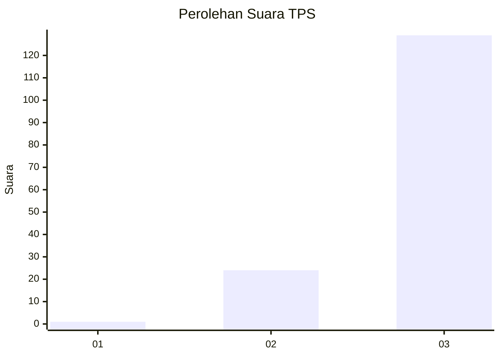
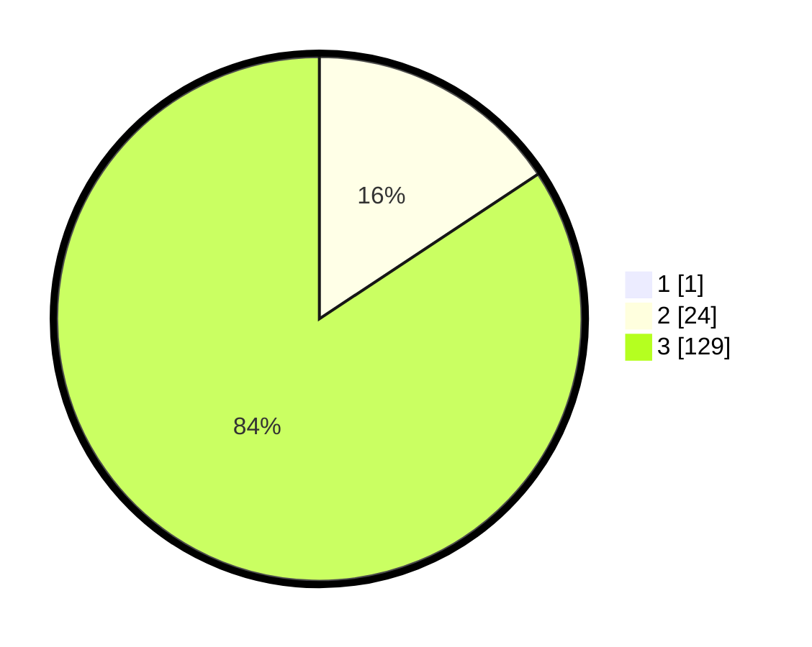

# Hasil

## Grafik

## Tabel

| No. | Nama Paslon    | Suara | Suara (raw) | Persentase |
|:--- |:-------------- | -----:| -----------:| ----------:|
| 1   | ANIES MUHAIMIN | 1     | [1][p-1]    | 0,65       |
| 2   | PRABOWO GIBRAN | 24    | [24][p-2]   | 15,58      |
| 3   | GANJAR MAHFUD  | 129   | [129][p-3]  | 83,77      |

[p-1]: https://github.com/gigit-pemilu/pemilu-2024-51-bali/blob/main/pilpres/hitung-suara/sub/51-bali/sub/02-tabanan/sub/01-selemadeg/sub/2004-berembeng/sub/002-tps/sub/paslon-1.txt
[p-2]: https://github.com/gigit-pemilu/pemilu-2024-51-bali/blob/main/pilpres/hitung-suara/sub/51-bali/sub/02-tabanan/sub/01-selemadeg/sub/2004-berembeng/sub/002-tps/sub/paslon-2.txt
[p-3]: https://github.com/gigit-pemilu/pemilu-2024-51-bali/blob/main/pilpres/hitung-suara/sub/51-bali/sub/02-tabanan/sub/01-selemadeg/sub/2004-berembeng/sub/002-tps/sub/paslon-3.txt

## Foto C Plano

https://sirekap-obj-formc.kpu.go.id/d455/pemilu/ppwp/51/02/01/20/04/5102012004002-20240214-132825--8444cbde-335b-43ac-a5b4-5657dafd3ce6.jpg

https://sirekap-obj-formc.kpu.go.id/d455/pemilu/ppwp/51/02/01/20/04/5102012004002-20240214-132005--d7a1820c-03de-4459-8d72-2d9ba587f03a.jpg

https://sirekap-obj-formc.kpu.go.id/d455/pemilu/ppwp/51/02/01/20/04/5102012004002-20240214-141050--b7191bab-2f17-40d5-94e8-c182f91d2194.jpg

## Metadata

| Key        | Value               |
| ---------- | ------------------- |
| Time Stamp | 2024-02-15 21:30:27 |

## DATA PEMILIH TETAP

Jumlah pemilih dalam DPT: **176**.
 * L: **81**.
 * P: **95**.

## DATA PENGGUNA HAK PILIH

Jumlah pengguna hak pilih dalam DPT: **154**.
 * L: **75**.
 * P: **79**.

Jumlah pengguna hak pilih dalam DPTb: **0**.
 * L: **0**.
 * P: **0**.

Jumlah pengguna hak pilih dalam DPK: **0**.
 * L: **0**.
 * P: **0**.

Jumlah pengguna hak pilih: **154**.
 * L: **75**.
 * P: **79**.

## JUMLAH SUARA SAH DAN TIDAK SAH

JUMLAH SELURUH SUARA SAH: **154**.

JUMLAH SUARA TIDAK SAH: **0**.

JUMLAH SELURUH SUARA SAH DAN SUARA TIDAK SAH: **154**.

