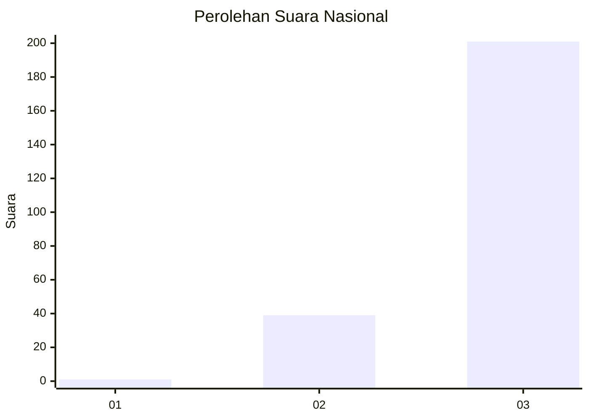
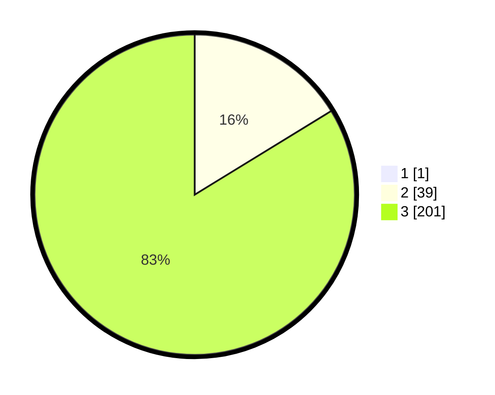

# Hasil

## Grafik

## Tabel

| No. | Nama Paslon    | Suara | Suara (raw) | Persentase |
|:--- |:-------------- | -----:| -----------:| ----------:|
| 1   | ANIES MUHAIMIN | 1     | [1][p-1]    | 0,41       |
| 2   | PRABOWO GIBRAN | 39    | [39][p-2]   | 16,18      |
| 3   | GANJAR MAHFUD  | 201   | [201][p-3]  | 83,40      |

[p-1]: https://github.com/gigit-pemilu/pemilu-2024/blob/main/pilpres/hitung-suara/sub/51-bali/sub/02-tabanan/sub/01-selemadeg/sub/2004-berembeng/sub/003-tps/sub/paslon-1.txt
[p-2]: https://github.com/gigit-pemilu/pemilu-2024/blob/main/pilpres/hitung-suara/sub/51-bali/sub/02-tabanan/sub/01-selemadeg/sub/2004-berembeng/sub/003-tps/sub/paslon-2.txt
[p-3]: https://github.com/gigit-pemilu/pemilu-2024/blob/main/pilpres/hitung-suara/sub/51-bali/sub/02-tabanan/sub/01-selemadeg/sub/2004-berembeng/sub/003-tps/sub/paslon-3.txt

## Foto C Plano

https://sirekap-obj-formc.kpu.go.id/0bfc/pemilu/ppwp/51/02/01/20/04/5102012004003-20240215-011317--097efccb-3041-4340-b381-a800b94915b1.jpg

https://sirekap-obj-formc.kpu.go.id/0bfc/pemilu/ppwp/51/02/01/20/04/5102012004003-20240215-021948--1008ec77-c789-4844-af5e-57f972e43cfe.jpg

https://sirekap-obj-formc.kpu.go.id/0bfc/pemilu/ppwp/51/02/01/20/04/5102012004003-20240215-061738--e345e488-d284-4923-b069-5465c66a5110.jpg

## Metadata

| Key        | Value               |
| ---------- | ------------------- |
| Time Stamp | 2024-02-15 21:30:27 |

