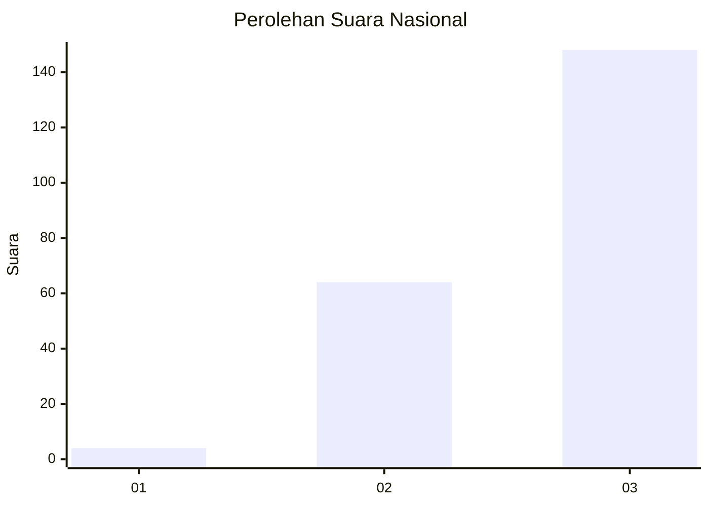
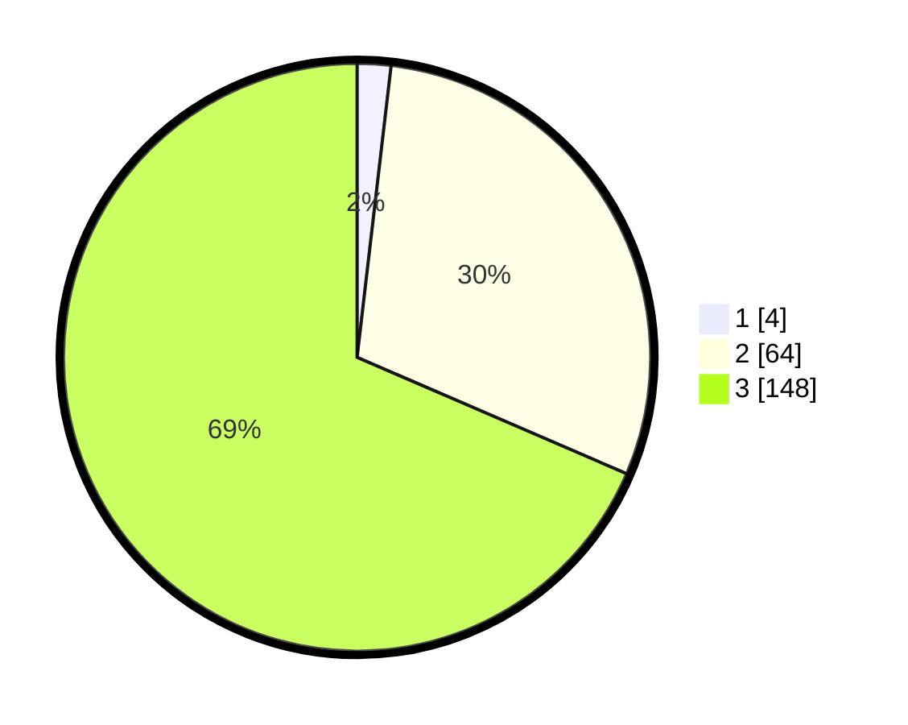

# Hasil

## Grafik

## Tabel

| No. | Nama Paslon    | Suara | Suara (raw) | Persentase |
|:--- |:-------------- | -----:| -----------:| ----------:|
| 1   | ANIES MUHAIMIN | 4     | [4][p-1]    | 1,85       |
| 2   | PRABOWO GIBRAN | 64    | [64][p-2]   | 29,63      |
| 3   | GANJAR MAHFUD  | 148   | [148][p-3]  | 68,52      |

[p-1]: https://github.com/gigit-pemilu/pemilu-2024/blob/main/pilpres/hitung-suara/sub/51-bali/sub/02-tabanan/sub/01-selemadeg/sub/2004-berembeng/sub/005-tps/sub/paslon-1.txt
[p-2]: https://github.com/gigit-pemilu/pemilu-2024/blob/main/pilpres/hitung-suara/sub/51-bali/sub/02-tabanan/sub/01-selemadeg/sub/2004-berembeng/sub/005-tps/sub/paslon-2.txt
[p-3]: https://github.com/gigit-pemilu/pemilu-2024/blob/main/pilpres/hitung-suara/sub/51-bali/sub/02-tabanan/sub/01-selemadeg/sub/2004-berembeng/sub/005-tps/sub/paslon-3.txt

## Foto C Plano

https://sirekap-obj-formc.kpu.go.id/7f68/pemilu/ppwp/51/02/01/20/04/5102012004005-20240214-210941--658527aa-2557-4ef0-8fdb-8202921f2b26.jpg

https://sirekap-obj-formc.kpu.go.id/7f68/pemilu/ppwp/51/02/01/20/04/5102012004005-20240214-211045--3b6a7588-394d-40f3-a82a-2ec0909955be.jpg

https://sirekap-obj-formc.kpu.go.id/7f68/pemilu/ppwp/51/02/01/20/04/5102012004005-20240214-211135--9f30bab6-7578-4d09-bc43-50f558190398.jpg

## Metadata

| Key        | Value               |
| ---------- | ------------------- |
| Time Stamp | 2024-02-15 21:30:27 |

## DATA PEMILIH TETAP

Jumlah pemilih dalam DPT: **264**.
 * L: **122**.
 * P: **142**.

## DATA PENGGUNA HAK PILIH

Jumlah pengguna hak pilih dalam DPT: **217**.
 * L: **107**.
 * P: **110**.

Jumlah pengguna hak pilih dalam DPTb: **0**.
 * L: **0**.
 * P: **0**.

Jumlah pengguna hak pilih dalam DPK: **2**.
 * L: **2**.
 * P: **0**.

Jumlah pengguna hak pilih: **219**.
 * L: **109**.
 * P: **110**.

## JUMLAH SUARA SAH DAN TIDAK SAH

JUMLAH SELURUH SUARA SAH: **216**.

JUMLAH SUARA TIDAK SAH: **3**.

JUMLAH SELURUH SUARA SAH DAN SUARA TIDAK SAH: **219**.

