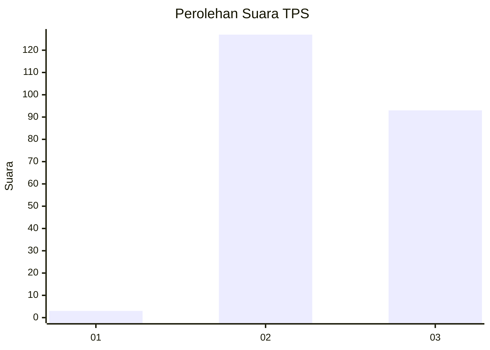
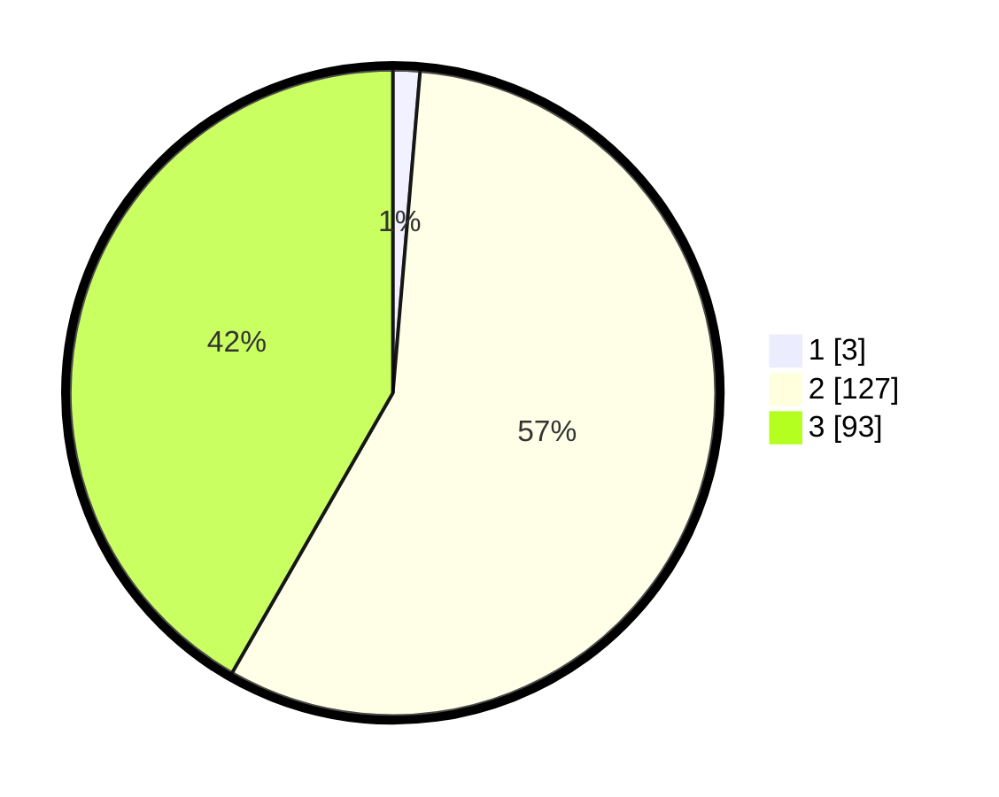

# Hasil

## Grafik

## Tabel

| No. | Nama Paslon    | Suara | Suara (raw) | Persentase |
|:--- |:-------------- | -----:| -----------:| ----------:|
| 1   | ANIES MUHAIMIN | 3     | [3][p-1]    | 1,35       |
| 2   | PRABOWO GIBRAN | 127   | [127][p-2]  | 56,95      |
| 3   | GANJAR MAHFUD  | 93    | [93][p-3]   | 41,70      |

[p-1]: https://github.com/gigit-pemilu/pemilu-2024-51-bali/blob/main/pilpres/hitung-suara/sub/51-bali/sub/02-tabanan/sub/01-selemadeg/sub/2004-berembeng/sub/006-tps/sub/paslon-1.txt
[p-2]: https://github.com/gigit-pemilu/pemilu-2024-51-bali/blob/main/pilpres/hitung-suara/sub/51-bali/sub/02-tabanan/sub/01-selemadeg/sub/2004-berembeng/sub/006-tps/sub/paslon-2.txt
[p-3]: https://github.com/gigit-pemilu/pemilu-2024-51-bali/blob/main/pilpres/hitung-suara/sub/51-bali/sub/02-tabanan/sub/01-selemadeg/sub/2004-berembeng/sub/006-tps/sub/paslon-3.txt

## Foto C Plano

https://sirekap-obj-formc.kpu.go.id/fe60/pemilu/ppwp/51/02/01/20/04/5102012004006-20240216-155430--e88f22ea-ca2a-4fe1-a18c-b682157f0df3.jpg

https://sirekap-obj-formc.kpu.go.id/fe60/pemilu/ppwp/51/02/01/20/04/5102012004006-20240214-213547--af751bf6-c28e-4ee0-a951-223ea7a45d75.jpg

https://sirekap-obj-formc.kpu.go.id/fe60/pemilu/ppwp/51/02/01/20/04/5102012004006-20240216-155210--54d3261e-2912-49c8-8337-f2b0fde1aea2.jpg

## Metadata

| Key        | Value               |
| ---------- | ------------------- |
| Time Stamp | 2024-02-16 16:25:10 |

## DATA PEMILIH TETAP

Jumlah pemilih dalam DPT: **280**.
 * L: **136**.
 * P: **144**.

## DATA PENGGUNA HAK PILIH

Jumlah pengguna hak pilih dalam DPT: **226**.
 * L: **111**.
 * P: **115**.

Jumlah pengguna hak pilih dalam DPTb: **2**.
 * L: **0**.
 * P: **2**.

Jumlah pengguna hak pilih dalam DPK: **4**.
 * L: **2**.
 * P: **2**.

Jumlah pengguna hak pilih: **232**.
 * L: **113**.
 * P: **119**.

## JUMLAH SUARA SAH DAN TIDAK SAH

JUMLAH SELURUH SUARA SAH: **223**.

JUMLAH SUARA TIDAK SAH: **9**.

JUMLAH SELURUH SUARA SAH DAN SUARA TIDAK SAH: **232**.

