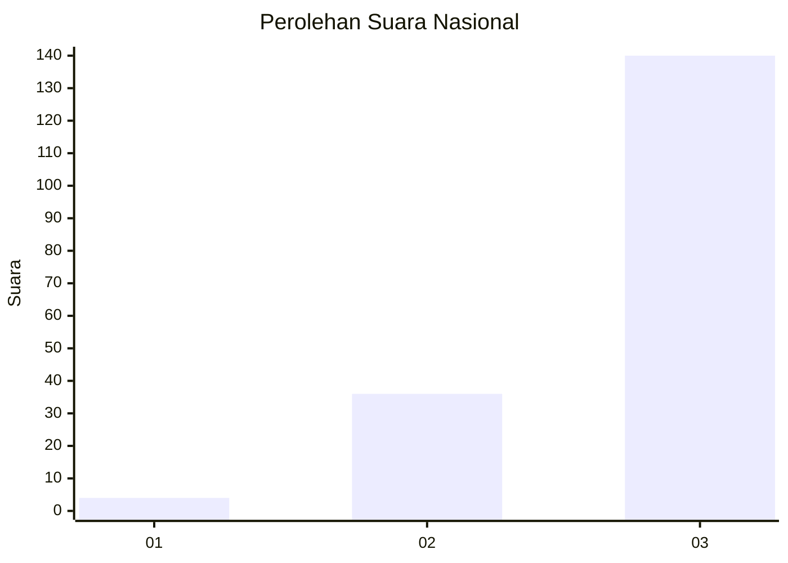
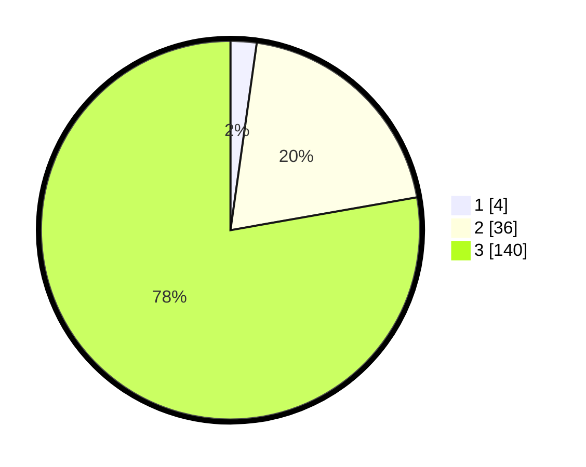

# Hasil

## Grafik

## Tabel

| No. | Nama Paslon    | Suara | Suara (raw) | Persentase |
|:--- |:-------------- | -----:| -----------:| ----------:|
| 1   | ANIES MUHAIMIN | 4     | [4][p-1]    | 2,22       |
| 2   | PRABOWO GIBRAN | 36    | [36][p-2]   | 20,00      |
| 3   | GANJAR MAHFUD  | 140   | [140][p-3]  | 77,78      |

[p-1]: https://github.com/gigit-pemilu/pemilu-2024/blob/main/pilpres/hitung-suara/sub/51-bali/sub/02-tabanan/sub/01-selemadeg/sub/2004-berembeng/sub/007-tps/sub/paslon-1.txt
[p-2]: https://github.com/gigit-pemilu/pemilu-2024/blob/main/pilpres/hitung-suara/sub/51-bali/sub/02-tabanan/sub/01-selemadeg/sub/2004-berembeng/sub/007-tps/sub/paslon-2.txt
[p-3]: https://github.com/gigit-pemilu/pemilu-2024/blob/main/pilpres/hitung-suara/sub/51-bali/sub/02-tabanan/sub/01-selemadeg/sub/2004-berembeng/sub/007-tps/sub/paslon-3.txt

## Foto C Plano

https://sirekap-obj-formc.kpu.go.id/94b7/pemilu/ppwp/51/02/01/20/04/5102012004007-20240215-033203--9e971fb4-771a-4fb6-856f-06d2c55ad2bc.jpg

https://sirekap-obj-formc.kpu.go.id/94b7/pemilu/ppwp/51/02/01/20/04/5102012004007-20240215-033226--69867773-b048-4f15-a2ec-579e0904dcc6.jpg

https://sirekap-obj-formc.kpu.go.id/94b7/pemilu/ppwp/51/02/01/20/04/5102012004007-20240215-033215--96317409-12d4-4c37-966d-87637fe2b2c2.jpg

## Metadata

| Key        | Value               |
| ---------- | ------------------- |
| Time Stamp | 2024-02-15 21:30:27 |

## DATA PEMILIH TETAP

Jumlah pemilih dalam DPT: **220**.
 * L: **106**.
 * P: **114**.

## DATA PENGGUNA HAK PILIH

Jumlah pengguna hak pilih dalam DPT: **187**.
 * L: **96**.
 * P: **91**.

Jumlah pengguna hak pilih dalam DPTb: **1**.
 * L: **0**.
 * P: **1**.

Jumlah pengguna hak pilih dalam DPK: **0**.
 * L: **0**.
 * P: **0**.

Jumlah pengguna hak pilih: **188**.
 * L: **96**.
 * P: **92**.

## JUMLAH SUARA SAH DAN TIDAK SAH

JUMLAH SELURUH SUARA SAH: **180**.

JUMLAH SUARA TIDAK SAH: **8**.

JUMLAH SELURUH SUARA SAH DAN SUARA TIDAK SAH: **188**.

