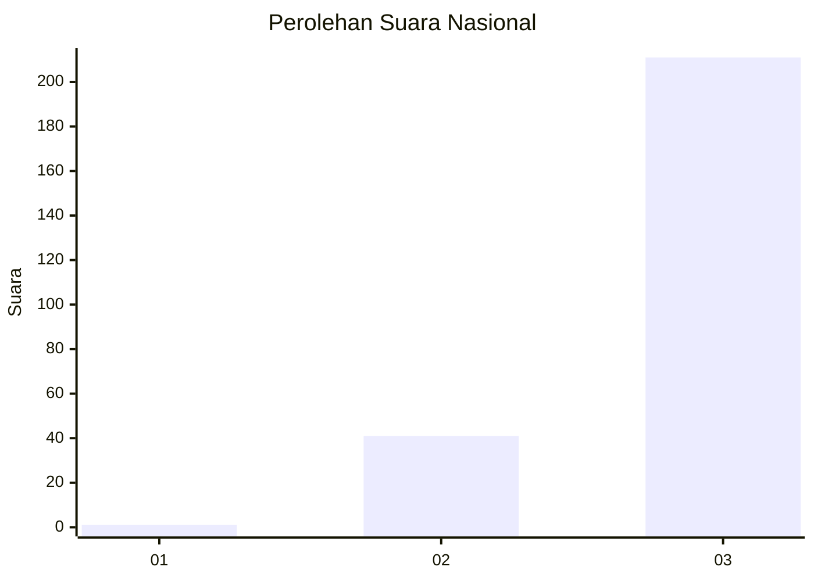
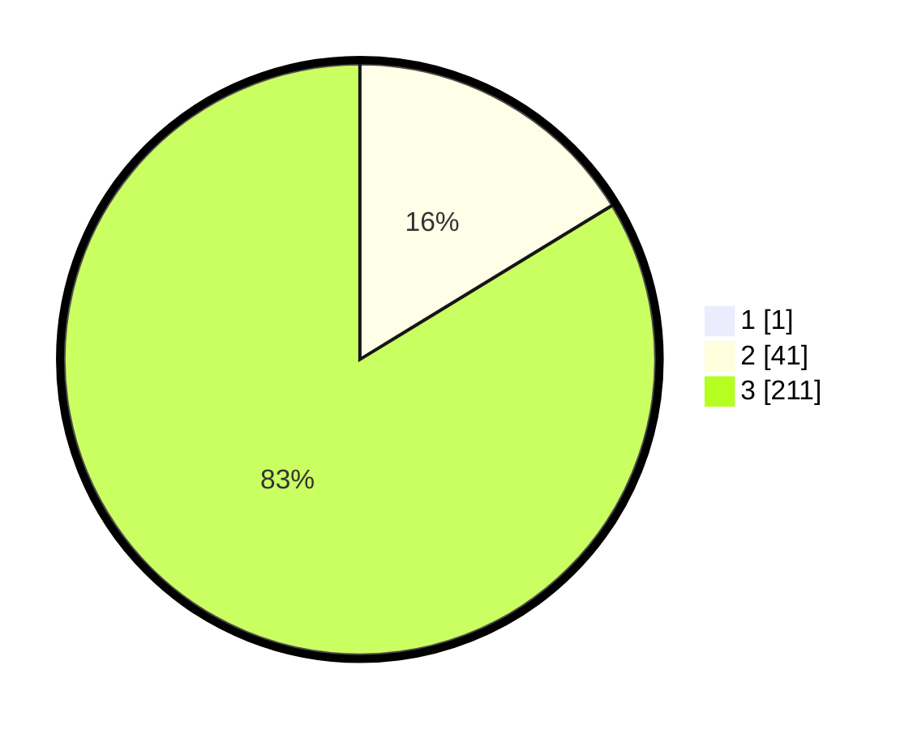

# Hasil

## Grafik

## Tabel

| No. | Nama Paslon    | Suara | Suara (raw) | Persentase |
|:--- |:-------------- | -----:| -----------:| ----------:|
| 1   | ANIES MUHAIMIN | 1     | [1][p-1]    | 0,40       |
| 2   | PRABOWO GIBRAN | 41    | [41][p-2]   | 16,21      |
| 3   | GANJAR MAHFUD  | 211   | [211][p-3]  | 83,40      |

[p-1]: https://github.com/gigit-pemilu/pemilu-2024/blob/main/pilpres/hitung-suara/sub/51-bali/sub/02-tabanan/sub/01-selemadeg/sub/2004-berembeng/sub/008-tps/sub/paslon-1.txt
[p-2]: https://github.com/gigit-pemilu/pemilu-2024/blob/main/pilpres/hitung-suara/sub/51-bali/sub/02-tabanan/sub/01-selemadeg/sub/2004-berembeng/sub/008-tps/sub/paslon-2.txt
[p-3]: https://github.com/gigit-pemilu/pemilu-2024/blob/main/pilpres/hitung-suara/sub/51-bali/sub/02-tabanan/sub/01-selemadeg/sub/2004-berembeng/sub/008-tps/sub/paslon-3.txt

## Foto C Plano

https://sirekap-obj-formc.kpu.go.id/fd00/pemilu/ppwp/51/02/01/20/04/5102012004008-20240214-141500--a4b1db8b-b076-4fe7-bb84-394ed3f0c7ed.jpg

https://sirekap-obj-formc.kpu.go.id/fd00/pemilu/ppwp/51/02/01/20/04/5102012004008-20240214-141601--1b61c0e8-e6e7-41f9-90e0-72cd389bd5e5.jpg

https://sirekap-obj-formc.kpu.go.id/fd00/pemilu/ppwp/51/02/01/20/04/5102012004008-20240216-120908--0e44b49f-629e-4d7b-9835-eed09622230e.jpg

## Metadata

| Key        | Value               |
| ---------- | ------------------- |
| Time Stamp | 2024-02-16 12:51:22 |

## DATA PEMILIH TETAP

Jumlah pemilih dalam DPT: **290**.
 * L: **139**.
 * P: **151**.

## DATA PENGGUNA HAK PILIH

Jumlah pengguna hak pilih dalam DPT: **257**.
 * L: **124**.
 * P: **133**.

Jumlah pengguna hak pilih dalam DPTb: **0**.
 * L: **0**.
 * P: **0**.

Jumlah pengguna hak pilih dalam DPK: **0**.
 * L: **0**.
 * P: **0**.

Jumlah pengguna hak pilih: **257**.
 * L: **124**.
 * P: **133**.

## JUMLAH SUARA SAH DAN TIDAK SAH

JUMLAH SELURUH SUARA SAH: **253**.

JUMLAH SUARA TIDAK SAH: **4**.

JUMLAH SELURUH SUARA SAH DAN SUARA TIDAK SAH: **257**.

