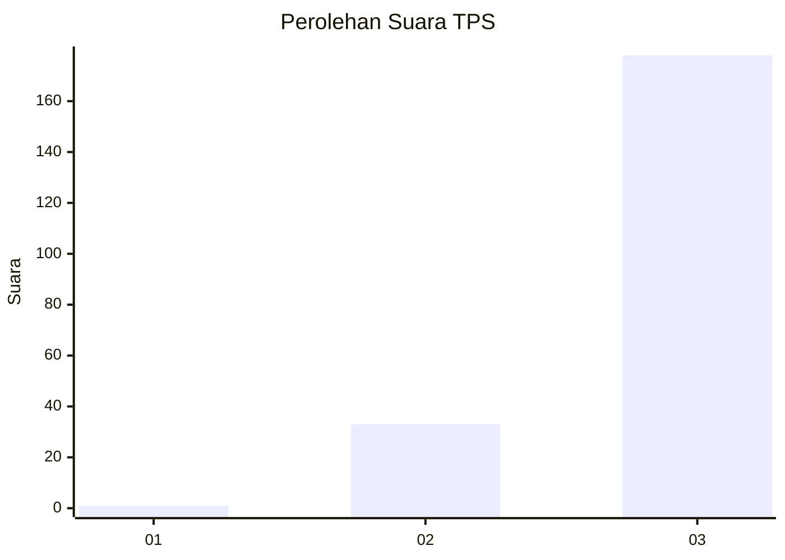
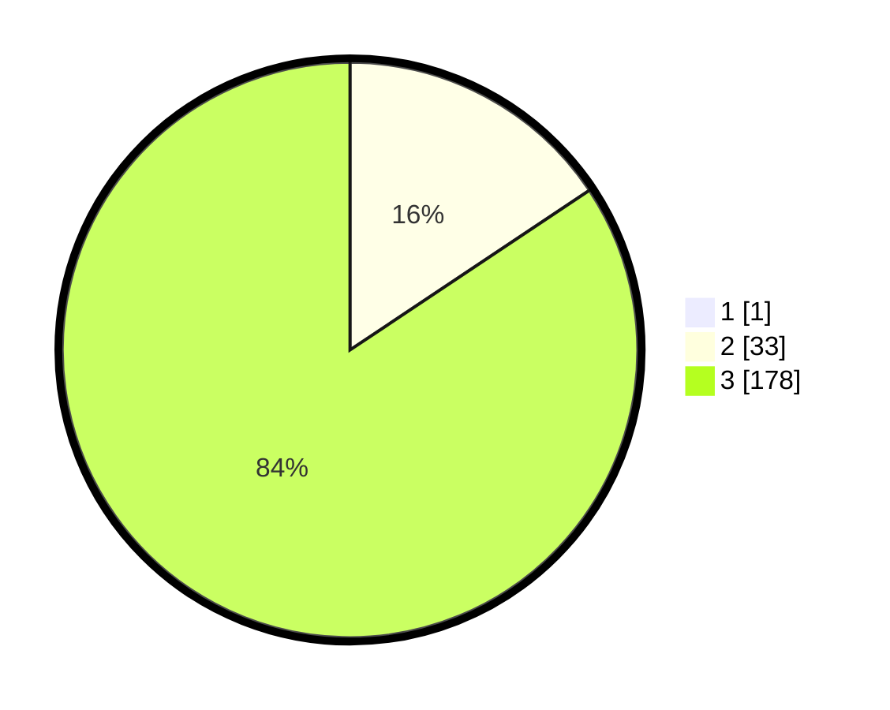

# Hasil

## Grafik

## Tabel

| No. | Nama Paslon    | Suara | Suara (raw) | Persentase |
|:--- |:-------------- | -----:| -----------:| ----------:|
| 1   | ANIES MUHAIMIN | 1     | [1][p-1]    | 0,47       |
| 2   | PRABOWO GIBRAN | 33    | [33][p-2]   | 15,57      |
| 3   | GANJAR MAHFUD  | 178   | [178][p-3]  | 83,96      |

[p-1]: https://github.com/gigit-pemilu/pemilu-2024-51-bali/blob/main/pilpres/hitung-suara/sub/51-bali/sub/02-tabanan/sub/01-selemadeg/sub/2005-selemadeg/sub/001-tps/sub/paslon-1.txt
[p-2]: https://github.com/gigit-pemilu/pemilu-2024-51-bali/blob/main/pilpres/hitung-suara/sub/51-bali/sub/02-tabanan/sub/01-selemadeg/sub/2005-selemadeg/sub/001-tps/sub/paslon-2.txt
[p-3]: https://github.com/gigit-pemilu/pemilu-2024-51-bali/blob/main/pilpres/hitung-suara/sub/51-bali/sub/02-tabanan/sub/01-selemadeg/sub/2005-selemadeg/sub/001-tps/sub/paslon-3.txt

## Foto C Plano

https://sirekap-obj-formc.kpu.go.id/208e/pemilu/ppwp/51/02/01/20/05/5102012005001-20240215-174122--c501900c-d0f9-4216-b569-1f52d7ae2739.jpg

https://sirekap-obj-formc.kpu.go.id/208e/pemilu/ppwp/51/02/01/20/05/5102012005001-20240215-174707--fa93ef2d-c1e4-4fda-9099-0352ec057d5c.jpg

https://sirekap-obj-formc.kpu.go.id/208e/pemilu/ppwp/51/02/01/20/05/5102012005001-20240215-174919--cc604c98-fe5b-4da9-8d05-3e4afaa2da6e.jpg

## Metadata

| Key        | Value               |
| ---------- | ------------------- |
| Time Stamp | 2024-02-15 22:40:13 |

