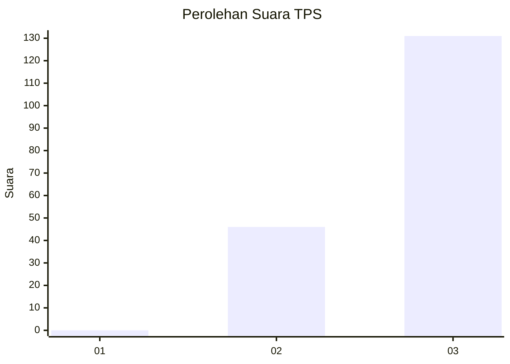
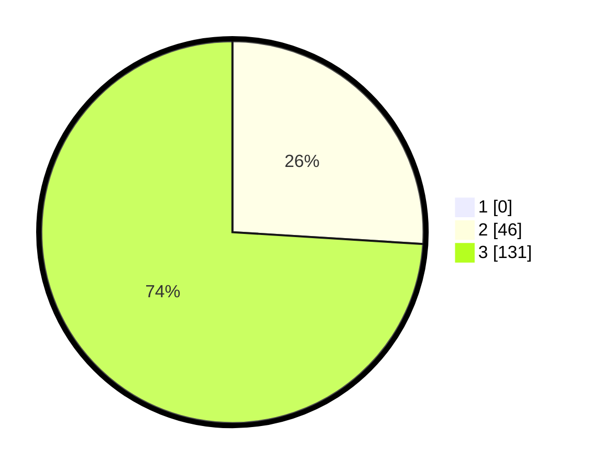

# Hasil

## Grafik

## Tabel

| No. | Nama Paslon    | Suara | Suara (raw) | Persentase |
|:--- |:-------------- | -----:| -----------:| ----------:|
| 1   | ANIES MUHAIMIN | 0     | [0][p-1]    | 0,00       |
| 2   | PRABOWO GIBRAN | 46    | [46][p-2]   | 25,99      |
| 3   | GANJAR MAHFUD  | 131   | [131][p-3]  | 74,01      |

[p-1]: https://github.com/gigit-pemilu/pemilu-2024-51-bali/blob/main/pilpres/hitung-suara/sub/51-bali/sub/02-tabanan/sub/01-selemadeg/sub/2005-selemadeg/sub/002-tps/sub/paslon-1.txt
[p-2]: https://github.com/gigit-pemilu/pemilu-2024-51-bali/blob/main/pilpres/hitung-suara/sub/51-bali/sub/02-tabanan/sub/01-selemadeg/sub/2005-selemadeg/sub/002-tps/sub/paslon-2.txt
[p-3]: https://github.com/gigit-pemilu/pemilu-2024-51-bali/blob/main/pilpres/hitung-suara/sub/51-bali/sub/02-tabanan/sub/01-selemadeg/sub/2005-selemadeg/sub/002-tps/sub/paslon-3.txt

## Foto C Plano

https://sirekap-obj-formc.kpu.go.id/5609/pemilu/ppwp/51/02/01/20/05/5102012005002-20240215-113607--f159e5be-3ffa-4505-a671-c9d7d8d539b0.jpg

https://sirekap-obj-formc.kpu.go.id/5609/pemilu/ppwp/51/02/01/20/05/5102012005002-20240215-070453--b5f4fcf4-d1a7-4ad7-b102-cc979a94f682.jpg

https://sirekap-obj-formc.kpu.go.id/5609/pemilu/ppwp/51/02/01/20/05/5102012005002-20240215-070624--46672453-00bf-44d5-b339-2c4a35ff7591.jpg

## Metadata

| Key        | Value               |
| ---------- | ------------------- |
| Time Stamp | 2024-02-15 21:30:27 |

## DATA PEMILIH TETAP

Jumlah pemilih dalam DPT: **212**.
 * L: **97**.
 * P: **115**.

## DATA PENGGUNA HAK PILIH

Jumlah pengguna hak pilih dalam DPT: **182**.
 * L: **88**.
 * P: **94**.

Jumlah pengguna hak pilih dalam DPTb: **0**.
 * L: **0**.
 * P: **0**.

Jumlah pengguna hak pilih dalam DPK: **0**.
 * L: **0**.
 * P: **0**.

Jumlah pengguna hak pilih: **182**.
 * L: **88**.
 * P: **94**.

## JUMLAH SUARA SAH DAN TIDAK SAH

JUMLAH SELURUH SUARA SAH: **177**.

JUMLAH SUARA TIDAK SAH: **5**.

JUMLAH SELURUH SUARA SAH DAN SUARA TIDAK SAH: **182**.

