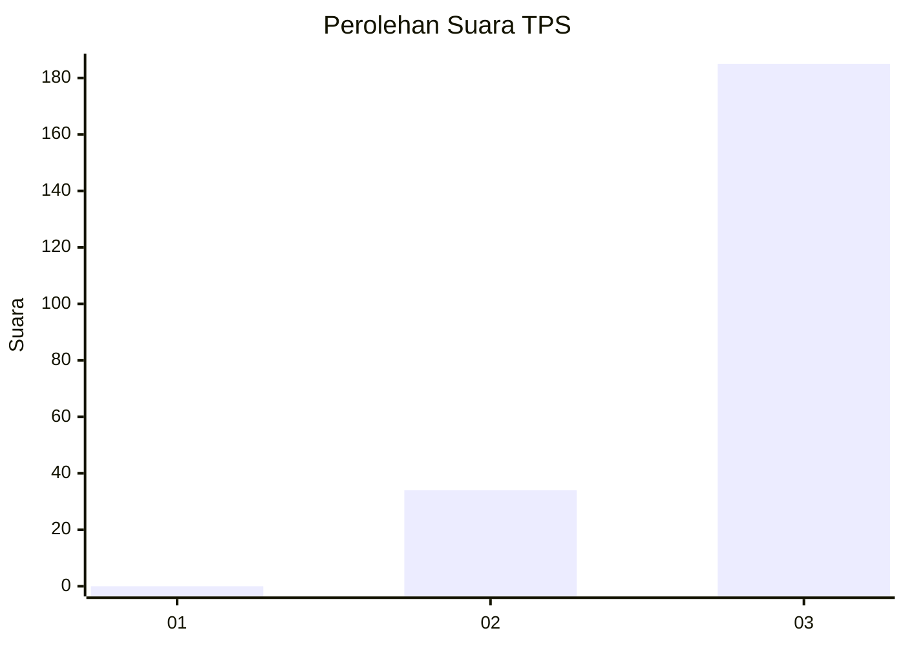
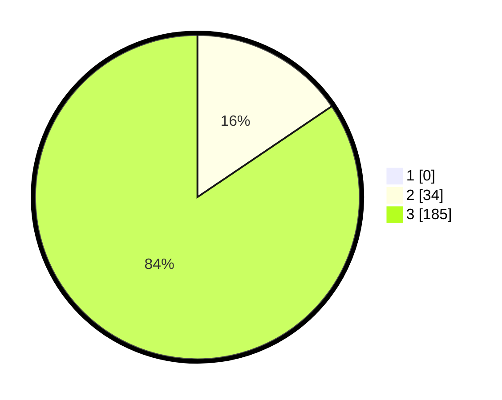

# Hasil

## Grafik

## Tabel

| No. | Nama Paslon    | Suara | Suara (raw) | Persentase |
|:--- |:-------------- | -----:| -----------:| ----------:|
| 1   | ANIES MUHAIMIN | 0     | [0][p-1]    | 0,00       |
| 2   | PRABOWO GIBRAN | 34    | [34][p-2]   | 15,53      |
| 3   | GANJAR MAHFUD  | 185   | [185][p-3]  | 84,47      |

[p-1]: https://github.com/gigit-pemilu/pemilu-2024-51-bali/blob/main/pilpres/hitung-suara/sub/51-bali/sub/02-tabanan/sub/01-selemadeg/sub/2005-selemadeg/sub/005-tps/sub/paslon-1.txt
[p-2]: https://github.com/gigit-pemilu/pemilu-2024-51-bali/blob/main/pilpres/hitung-suara/sub/51-bali/sub/02-tabanan/sub/01-selemadeg/sub/2005-selemadeg/sub/005-tps/sub/paslon-2.txt
[p-3]: https://github.com/gigit-pemilu/pemilu-2024-51-bali/blob/main/pilpres/hitung-suara/sub/51-bali/sub/02-tabanan/sub/01-selemadeg/sub/2005-selemadeg/sub/005-tps/sub/paslon-3.txt

## Foto C Plano

https://sirekap-obj-formc.kpu.go.id/5667/pemilu/ppwp/51/02/01/20/05/5102012005005-20240215-231433--2b704091-ed11-4e1f-a466-db092b3ad51f.jpg

https://sirekap-obj-formc.kpu.go.id/5667/pemilu/ppwp/51/02/01/20/05/5102012005005-20240215-233046--7b8b8796-8733-4867-9aed-a65621a1864f.jpg

https://sirekap-obj-formc.kpu.go.id/5667/pemilu/ppwp/51/02/01/20/05/5102012005005-20240215-233626--a7652a97-6d1a-44c6-bdaa-a4e0b97b86bd.jpg

## Metadata

| Key        | Value               |
| ---------- | ------------------- |
| Time Stamp | 2024-02-16 10:00:28 |

## DATA PEMILIH TETAP

Jumlah pemilih dalam DPT: **239**.
 * L: **120**.
 * P: **119**.

## DATA PENGGUNA HAK PILIH

Jumlah pengguna hak pilih dalam DPT: **219**.
 * L: **109**.
 * P: **110**.

Jumlah pengguna hak pilih dalam DPTb: **1**.
 * L: **0**.
 * P: **1**.

Jumlah pengguna hak pilih dalam DPK: **0**.
 * L: **0**.
 * P: **0**.

Jumlah pengguna hak pilih: **220**.
 * L: **109**.
 * P: **111**.

## JUMLAH SUARA SAH DAN TIDAK SAH

JUMLAH SELURUH SUARA SAH: **219**.

JUMLAH SUARA TIDAK SAH: **1**.

JUMLAH SELURUH SUARA SAH DAN SUARA TIDAK SAH: **220**.

