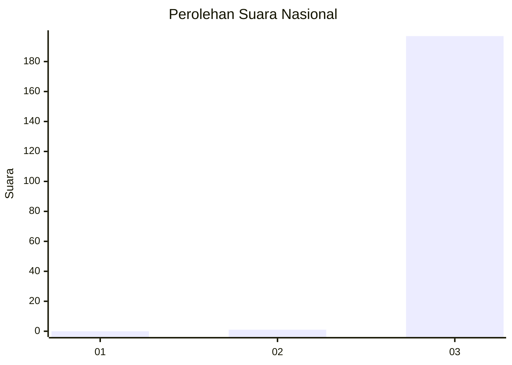
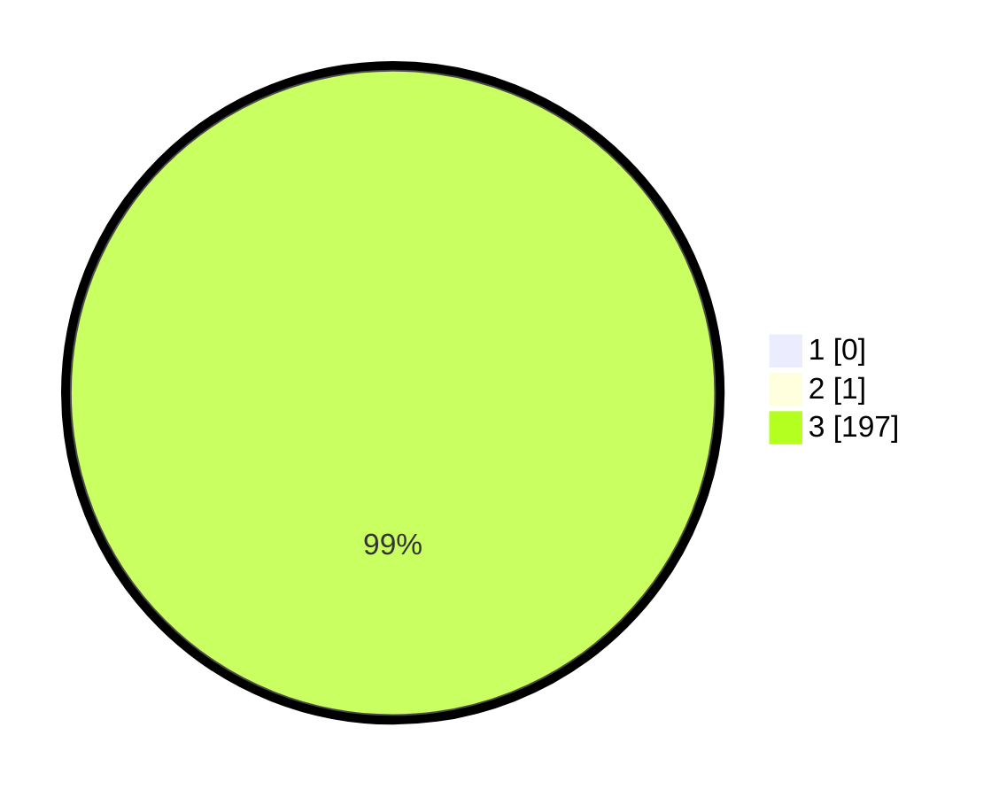

# Hasil

## Grafik

## Tabel

| No. | Nama Paslon    | Suara | Suara (raw) | Persentase |
|:--- |:-------------- | -----:| -----------:| ----------:|
| 1   | ANIES MUHAIMIN | 0     | [0][p-1]    | 0,00       |
| 2   | PRABOWO GIBRAN | 1     | [1][p-2]    | 0,51       |
| 3   | GANJAR MAHFUD  | 197   | [197][p-3]  | 99,49      |

[p-1]: https://github.com/gigit-pemilu/pemilu-2024/blob/main/pilpres/hitung-suara/sub/51-bali/sub/02-tabanan/sub/01-selemadeg/sub/2005-selemadeg/sub/008-tps/sub/paslon-1.txt
[p-2]: https://github.com/gigit-pemilu/pemilu-2024/blob/main/pilpres/hitung-suara/sub/51-bali/sub/02-tabanan/sub/01-selemadeg/sub/2005-selemadeg/sub/008-tps/sub/paslon-2.txt
[p-3]: https://github.com/gigit-pemilu/pemilu-2024/blob/main/pilpres/hitung-suara/sub/51-bali/sub/02-tabanan/sub/01-selemadeg/sub/2005-selemadeg/sub/008-tps/sub/paslon-3.txt

## Foto C Plano

https://sirekap-obj-formc.kpu.go.id/cbbf/pemilu/ppwp/51/02/01/20/05/5102012005008-20240214-210636--2f3f401f-b5b3-4d9c-a6d8-d5e052943331.jpg

https://sirekap-obj-formc.kpu.go.id/cbbf/pemilu/ppwp/51/02/01/20/05/5102012005008-20240214-212814--ac0eee34-3b8c-4ab4-9f0b-c4e4575b92c1.jpg

https://sirekap-obj-formc.kpu.go.id/cbbf/pemilu/ppwp/51/02/01/20/05/5102012005008-20240214-212901--2aa88060-f9c5-4c6b-83f3-f8351d89f01e.jpg

## Metadata

| Key        | Value               |
| ---------- | ------------------- |
| Time Stamp | 2024-02-15 21:30:27 |

