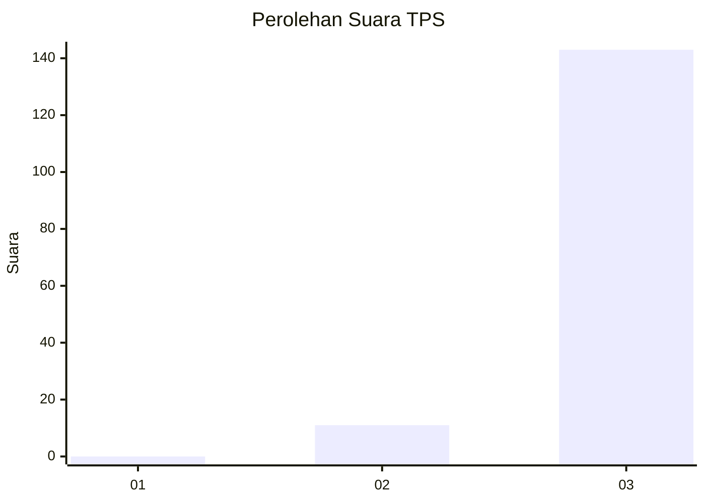
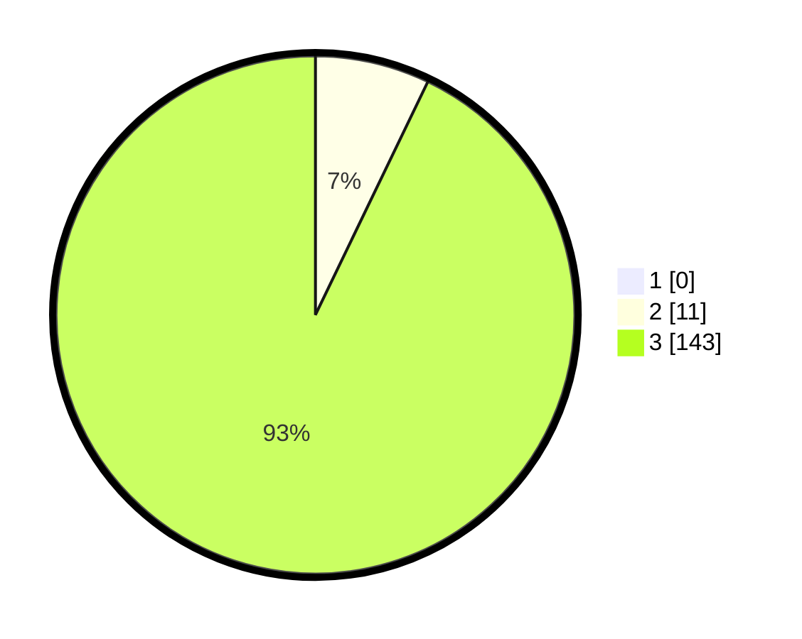

# Hasil

## Grafik

## Tabel

| No. | Nama Paslon    | Suara | Suara (raw) | Persentase |
|:--- |:-------------- | -----:| -----------:| ----------:|
| 1   | ANIES MUHAIMIN | 0     | [0][p-1]    | 0,00       |
| 2   | PRABOWO GIBRAN | 11    | [11][p-2]   | 7,14       |
| 3   | GANJAR MAHFUD  | 143   | [143][p-3]  | 92,86      |

[p-1]: https://github.com/gigit-pemilu/pemilu-2024-51-bali/blob/main/pilpres/hitung-suara/sub/51-bali/sub/02-tabanan/sub/01-selemadeg/sub/2005-selemadeg/sub/010-tps/sub/paslon-1.txt
[p-2]: https://github.com/gigit-pemilu/pemilu-2024-51-bali/blob/main/pilpres/hitung-suara/sub/51-bali/sub/02-tabanan/sub/01-selemadeg/sub/2005-selemadeg/sub/010-tps/sub/paslon-2.txt
[p-3]: https://github.com/gigit-pemilu/pemilu-2024-51-bali/blob/main/pilpres/hitung-suara/sub/51-bali/sub/02-tabanan/sub/01-selemadeg/sub/2005-selemadeg/sub/010-tps/sub/paslon-3.txt

## Foto C Plano

https://sirekap-obj-formc.kpu.go.id/a3da/pemilu/ppwp/51/02/01/20/05/5102012005010-20240217-061832--0f5b70be-f04e-44bd-8b60-c3b75cacdcaf.jpg

https://sirekap-obj-formc.kpu.go.id/a3da/pemilu/ppwp/51/02/01/20/05/5102012005010-20240216-175313--5c1643f1-00bb-45cf-b79f-ad3b7c109527.jpg

https://sirekap-obj-formc.kpu.go.id/a3da/pemilu/ppwp/51/02/01/20/05/5102012005010-20240216-180251--c276ae5d-927b-49df-a2ac-32766e9f63ec.jpg

## Metadata

| Key        | Value               |
| ---------- | ------------------- |
| Time Stamp | 2024-02-17 06:30:03 |

## DATA PEMILIH TETAP

Jumlah pemilih dalam DPT: **169**.
 * L: **84**.
 * P: **85**.

## DATA PENGGUNA HAK PILIH

Jumlah pengguna hak pilih dalam DPT: **163**.
 * L: **80**.
 * P: **83**.

Jumlah pengguna hak pilih dalam DPTb: **0**.
 * L: **0**.
 * P: **0**.

Jumlah pengguna hak pilih dalam DPK: **0**.
 * L: **0**.
 * P: **0**.

Jumlah pengguna hak pilih: **163**.
 * L: **80**.
 * P: **83**.

## JUMLAH SUARA SAH DAN TIDAK SAH

JUMLAH SELURUH SUARA SAH: **154**.

JUMLAH SUARA TIDAK SAH: **9**.

JUMLAH SELURUH SUARA SAH DAN SUARA TIDAK SAH: **163**.

